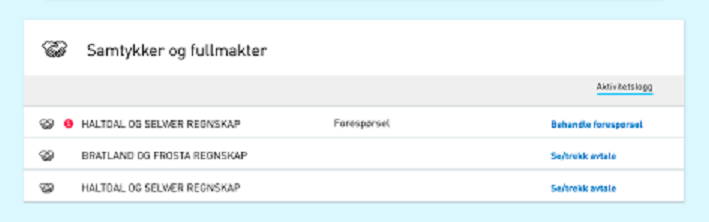
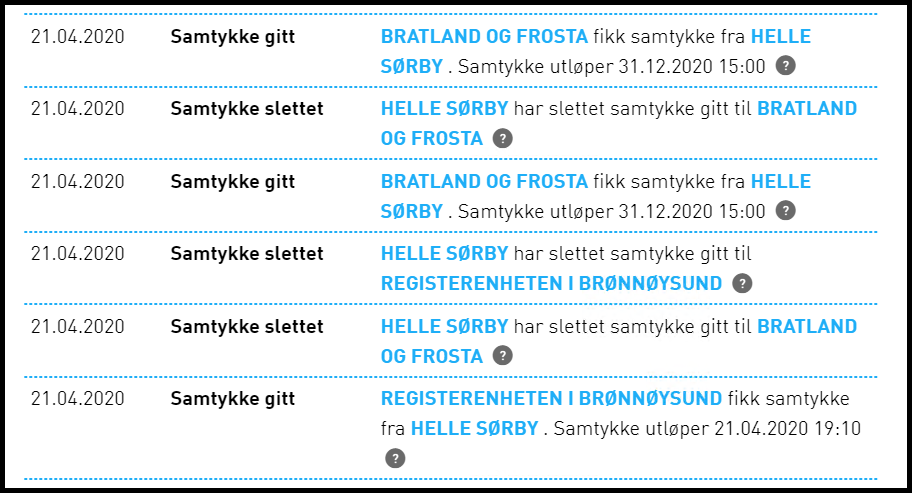

---
title: 20.5
description: Access for lenketjenester, mindre endringer og feilrettinger
weight: 90
type: releasenote
releasenote_info: Release 20.5, produksjonssatt 19. mai 2020
--- 

## Endringer i Portal

### Listevisning under "Samtykker og fullmakter" panelet

Som en videreføring av listevisning under “Andre med rettigheter” er det nå implementert listevisning for samtykkeforespørsler og aktive samtykker under panelet for samtykker.

## Endringer i Autorisasjon

### Ny generell tjenesteoperasjon: Access er nå mulig å ta i bruk for lenketjenester

Ettersom Altinn i større grad opptrer som en autorisasjonsløsning for eksterne tjenester eller API, er det ytret behov for å kunne fristille disse eksterne tjenestene fra dagens tjenesteoperasjoner i Altinn (Les, Skriv, Signer osv.) som i stor grad er knyttet til intern autorisering i Altinn. Da man ikke ønsker å bruke unødvendig mye tid på videreutvikling av TUL løsningen, nå som tjenester 3.0 som er på trappene, er dette løst uten å gjøre endringer i dagens tjenesteutviklingsløsning (TUL). Det er nå løst ved å introdusere en ny tjenesteoperasjon Access i Altinn autorisasjon, som i første omgang er mulig å ta i bruk for lenketjenester ved å oppgi denne spesifikke URLen: https​://schemas.altinn.no/authorization/administration/operation/access/2020/05/ for lenketjenesten i TUL. Tjenesten er da ikke mulig å instansiere i Altinn, men vil bare fungere som en representasjon av en ekstern ressurs for Altinn autorisasjon. TUL vil fortsatt kreve at hver av de eksisterende operasjonene (Les, Skriv, Signer osv.) er dekket av minst ett rollekrav, og den nye Access operasjonen vil ikke være synlig i TUL.
Når tjenesten migreres til SBL løsningen vil hver unike rolle som er knyttet til minst en operasjon i TUL, i stedet bare gi tilgang til den nye Access operasjonen. Ved delegering av tjenesten i Altinn vil det ikke være mulig å velge operasjoner, og visning av delegerte rettigheter for tjenesten vil heller ikke ha de vanlige operasjonsikonene.

## Diverse bugfix

### REST-API: HTTP Repsons 401 (Unauthorized) returnert ved feil i skjemavalidering av messages

Ved feil i skjemavalidering av messages ble HTTP Respons 401 returnert sammen med "Form validation failed, see the attached validation details". Dette er avvik fra REST-Arkitektur og har derfor blitt endret til Respons 400 (Bad Request) siden det indikerer at klient må endre sin request før data kan sendes på nytt. Endringen kan ha konsekvenser for eksisterende klienter som benytter dette REST-API-kallet, dersom deres feilhåndtering benytter responskoden som basis.

## Vedlegg til skjema ble ikke vist i PDF ved flere enn 67 filvedlegg

Hvis det ble lagt ved mer enn 67 filvedlegg til et skjema så var ikke alle vedlagte filvedleggene synlige på PDF-utskriften. Dette er nå rettet.

### Tilfeldig rekkefølge på fornavn og etternavn i Avtalelogg

Rekkefølgen varierte. Dette er nå rettet til at fornavn alltid vises først.

### Scrolling i visningen for å bekrefte varslingsadresse for virksomheten fungerte ikke

Dette er rettet slik at man nå kan scrolle ned.

### Ytelsesforbedring av samtykke

I forbindelse med ytelsestest av samtykke ble det utført forbedringer ved indeksering og optimalisering av prosedyrer.

### Ytelsesforbedring av Formidlingstjenesten

Prosedyren som benyttes av formidlingstjenesten veksler mellom å være nr1 og nr2 på lista over de prosedyrene som bruker mest ressurser i hele løsningen. Dette er nå løst ved å denormalisere datamodellen til formidlingstjenesten slik at de to hovedtabellene blir konsolidert til én tabell. Dette vil gjøre oppslag mot databasen langt mer effektivt.
