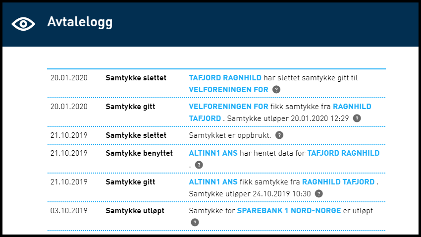

---
title: 20.5
description: Acess for lenketjenester, mindre endringer og feilrettinger
weight: 90
type: releasenote
releasenote_info: Release 20.5, produksjonssettes 18. mai 2020
--- 
**OBS: dette er en kommende versjon. Se [20.4](../20-4) for nyeste versjon**

## Endringer i Portal

### Listevisning under “Samtykker og fullmakter” panelet

Som en videreføring av listevisning under “Andre med rettigheter” er det nå implementert listevisning for samtykkeforespørsler og aktive samtykker under panelet for samtykker. Gjennom denne endringen ble det opprettet en felles shared komponent som nå brukes av både samtykkepanelet og andre med rettighetspanelet.

## Endringer i Autorisasjon

### Ny generell tjenesteoperasjon: Access mulig å ta i bruk for lenketjenester

Ettersom Altinn i større grad opptrer som en autorisasjonsløsning for eksterne tjenester eller API, er det ytret behov for å kunne fristille disse eksterne tjenestene fra dagens tjenesteoperasjoner i Altinn (Les, Skriv, Signer osv.) som i stor grad er knytt til intern autorisering i Altinn. Da man ikke ønsker å bruke unødvendig mye tid på videreutvikling av TUL løsningen, nå som tjenester 3.0 som er på trappene, er dette løst uten å gjøre endringer i dagens tjenesteutviklingsløsning (TUL). Det er nå løst ved å introdusere en ny tjenesteoperasjon Access i Altinn autorisasjon, som i første omgang er mulig å ta i bruk for lenketjenester ved å oppgi en spesifikk URL https://schemas.altinn.no/authorization/administration/operation/access/2020/05 for lenketjenesten i TUL. Tjenesten er da ikke mulig å instansiere i Altinn, men vil bare fungere som en representasjon av en ekstern ressurs for Altinn autorisasjon. TUL vil fortsatt kreve at hver at de eksisterende operasjonene (Les, Skriv, Signer osv.) er dekket av minst ett rollekrav, og den nye Access operasjonen vil ikke være synlig i TUL.
Når tjenesten migreres til SBL løsningen vil hver unike rolle som er knytt til minst en operasjon i TUL, i stedet bare gi tilgang til den nye Access operasjonen. Ved delegering av tjenesten i Altinn vil det ikke være mulig å velge operasjoner, og visning av delegerte rettigheter for tjenesten vil heller ikke ha de vanlige operasjonsikonene.

## Endringer i Sluttbrukerløsningen

### Optimalisering av formidlingstjenesten

Det er utført optimaliseringer i database. I tillegg har CheckIfAvailableFiles fått flere søkeparametre med filtre for service code og service edition code.

## Diverse bugfix

### HTTP Repsons 401 (Unauthorized) returnert ved feil i skjemavalidering av messages

Ved feil i skjemavalidering av messages ble HTTP Respons 401 returnert sammen med "Form validation failed, see the attached validation details". Dette er avvik fra REST-Arkitektur og har derfor blitt endret til Respons 400 (Bad Request) siden det indikerer at klient må endre sin request før data kan sendes på nytt. Endringen kan ha konsekvenser for eksisterende klienter som benytter dette REST-API-kallet, dersom deres feilhåndtering benytter responskoden som basis.

## Vedlegg til skjema i ble ikke vist i PDF ved flere enn 67 filvedlegg

Hvis det ble lagt ved mer enn 67 filvedlegg til et skjema så var ikke alle vedlagte filvedleggene synlige på pdf utskriften. Dette er fordi pdf generatoren i Altinn ikke har tok høyde for at det kunne være flere filvedlegg enn det er plass til på en pdf side. Dette er nå rettet ved at det legges inn en ny side for hvert 65 filvedlegg.

### Tilfeldig rekkefølge på fornavn og etternavn i Avtalelogg

Rekkefølgen varierte. Dette er rettet til at fornavn alltid vises først.

### Scrolling i visningen for å bekrefte varslingsadresse for virksomheten fungerte ikke

Dette er rettet slik at man nå kan scrolle ned.

### Ytelsesforbedring av samtykke

 I forbindelse med ytelsestest av samtykke ble det utført forbedringer ved indeksering og optimalisering av prosedyrer.
