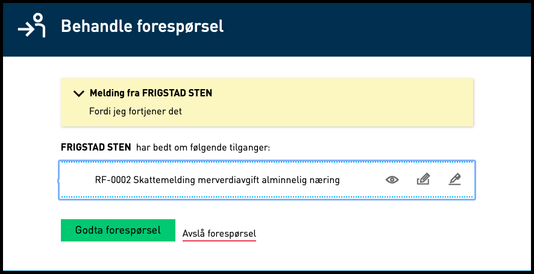

---
title: 20.6
description: Altinn 3 innføres. I tillegg leveres mindre endringer og feilrettinger.
weight: 80
type: releasenote
releasenote_info: Release 20.6, produksjonssatt 08. juni 2020
--- 

## Altinn 3 innføres

Med denne releasen innføres Altinn 3 som er en større endring. Se mer informasjon om Altinn 3 [her](../../../roadmap/2020/#altinn-3).

Se også:

- [Informasjon om hva som er mulig](https://altinndigital.no/altinn-studio/#possibilities).
- [Beskrivelse av hvordan man tar i bruk Altinn Studio som utviklingsverktøy](https://docs.altinn.studio/nb/app/getting-started/first-time-setup/).
- [Beskrivelse av hvordan man får tilgang til å produksjonssette en app](https://docs.altinn.studio/nb/app/deployment/).

## Endringer i REST-API i Altinn 2

### Opprinnelig referansen til elementet er nå tilgjengelig for arkiverte elementer i REST

Tidligere inneholdt ikke arkiverte elementer opprinnelig referanse. Dette gjorde at det ikke var noen
referansekobling mellom det arkiverte elementet og det aktive. Derfor er nå feltet "OriginalId" innført på arkiverte element slik at man nå har en kobling.

## Feilrettinger i Altinn 2

### Ved avvisning av samtykkeforespørsler manglet URL informasjon om hvilket samtykke avvisningen gjaldt

Dette er nå rettet opp slik at man får URL informasjon.

### Når en samtykkeforespørsel hadde utløpt dato fikk man tidligere ikke mulighet til å slette forespørselen

Dette er nå rettet slik at man i tillegg til feilmeldingen får opp knappene “Tilbake” og “Slett forespørsel”. Disse kan benyttes slik at man kan slette samtykkeforespørselen og gå tilbake eller bare gå tilbake uten å slette.

### Ny samtykkemal

En ny samtykkemal er innført, som er eksakt lik standard-malen, men som overstyrer `requestMessage` (tidligere `DelegationContext`) til å må være tom.

### Når tilgangsstyrer skulle godkjenne eller avslå forespørsler fungerte ikke tab og enter

Med denne versjonen kan man nå benytte tab for å navigere og enter til å ekspandere og lese innholdet.

