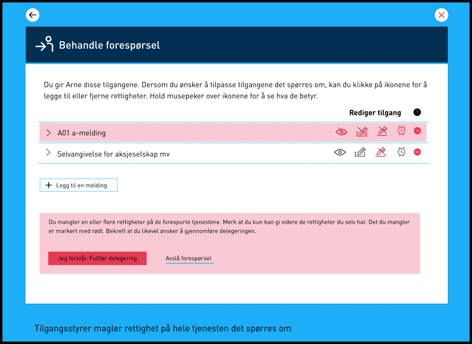
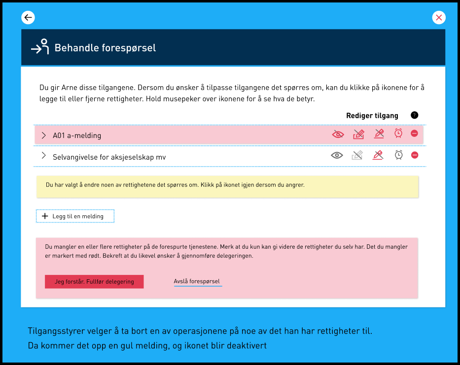
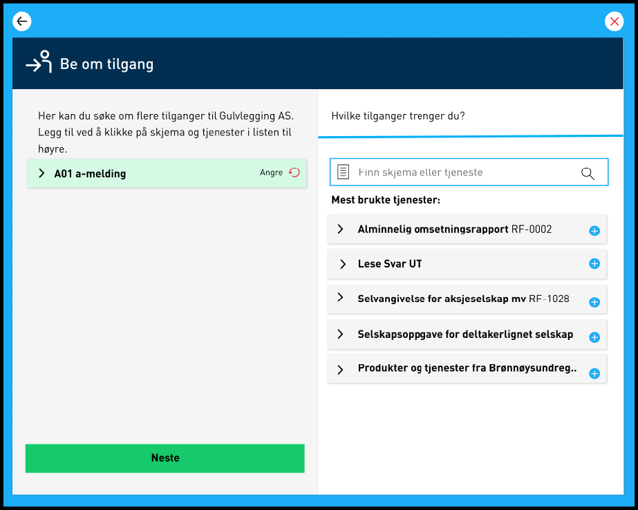

**Vi minner også om endringer i [Altinn 3.0.](https://github.com/Altinn/altinn-studio/releases)**

## Endringer i portal

### Oppdatert visning for tilgangsstyrer som mangler rettigheter for å behandle en tilgangsforespørsel

Selv om alle tilgangsstyrere vil kunne åpne og behandle en tilgangsforespørsel, er det ikke alle som har de tilgangene som etterspørres. Tilgangsstyrer kan etter denne endringen ved å åpne en tilgangsforespørsel kunne se hvilke av operasjonene eller tjenestene som er spesifisert i forespørselen vedkommende mangler. De operasjonene som ikke er tilgjengelig vil være markert ved et rødt ikon med en strek over. Disse vil ikke være delegerbare av denne tilgangsstyreren. Dersom vedkommende mangler tilgang til alle operasjonene på tjenesten, eller velger å fjerne alle operasjonene på en tjeneste, vil det aktuelle innslaget i listen over tjenestene bli markert med rødt.

### Implementert visning av utgående tilgangsforespørsler med mulighet for å trekke dem

I "Skjema og tjenester du har rettigheter til" er det nå en ny liste som viser alle tilgangsforespørslene brukeren har sendt. Hver forespørsel i lista kan utvides for å vise detaljer. Det er mulig å slette forespørslene.

### Tilgangsstyrere som mangler nødvendige tjenesterettigheter kan nå "Be om tilgang" fra samtykkesiden

Tilgangsstyrere som mangler nødvendige tjenesterettigheter for å kunne gi samtykke på vegne av tredjepart kan nå "Be om tilgang" fra samtykkesiden dersom samtykkeforespørselen er registrert gjennom REST APIet. Vi gjør oppmerksom på at dette ikke er støttet for gammel samtykkeløsning.

### Synkronisert aktørvalg mellom Altinn Apps og portalen

Dersom en bruker endret aktør i Altinn Apps (Altinn 3.0) ble ikke denne endringen synkronisert når man navigerte tilbake til portalen (Altinn 2.0). Nå er dette valget synkronisert slik at man vil returnere til portalen med samme aktør som skjemaet ble fylt ut på vegne av.

### Mulighet for tilgangssøker å søke opp og legge til flere tjenester på en tilgangsforespørsel

Ved initiering av "Be om tilgang"-prosessen med URL-parameter vil det nå være mulig for tilgangssøker å søke opp og legge til flere tjenester på tilgangsforespørselen. Dette er gjort ved at brukeren nå vil komme til en 2-kolonne-visning hvor det først er listet opp de mest populære tjenestene som finnes i løsningen, og med et søkefelt hvor man kan finne alle tilgjengelige tjenester som finnes i Altinn. Ved å kunne søke opp en vilkårlig tjeneste gir vi nå en større fleksibilitet og frihet til tilgangssøker om å tilpasse en forespørsel dersom denne skulle være mangelfull før den sendes. 2-kolonne-visningen vil vises på "stasjonære datamaskiner" som to parallelle kollonner, og vil være plassert ovenfor hverandre ved aksessering via en mobil enhet.

## Endringer i REST-API

## Valideringstjeneste for notification

Det er opprettet et nytt endepunkt for uthening av notifikasjons-informasjon for brukere eller organisasjoner For organisasjoner kan man også sjekke på oppgitt tjeneste. Den sjekker om brukeren har lagret kontaktinformasjon og om de har registert seg i reservasjons registeret. For organisasjoner så sjekkes det om det foreligger informasjon i KoFuVi, eller om enkeltpersoner har registrert seg for varsling av oppgitte tjeneste.

- Er innboksen til mottaker tilgjengelig? Her returneres “True” hvis organisasjonsnummeret er gyldig, eksisterer i Enhetsregisteret og ikke er merket som slettet.

- Kan mottaker få varsel på SMS? Her returneres “True” hvis innboksen er tilgjengelig OG virksomheten har registrert minst ett mobilnummer i Varslingsadresser for virksomheten, eller minst en rettighetshaver har mobilnummer i sin kontaktinformasjon for virksomheten.

- Kan mottaker få varsel på epost? Her returneres “True” hvis innboksen er tilgjengelig OG virksomheten har registrert minst en epostadresse i Varslingsadresser for virksomheten, eller minst en rettighetshaver har epostadresse i sin kontaktinformasjon for virksomheten.

Tilsvarende valideringer kan gjøres for privatpersoner med fnr/D-nr - da sjekkes det om det er registrert mobilnummer og/eller epostadresse i Kontakt- og reservasjonsregisteret.

### Valgfri begrunnelsestekst i Samtykkeforespørsler gjennom REST

Før måtte man oppgi begrunnelsestekst (RequestMessage) på minst ett språk for samtykke/fullmakts-forespørsler man registrerte gjennom REST APIet. Dette gjaldt selv om malen som ble brukt av tjenesten ikke krevde denne teksten. Dette er nå endret slik at det er valgfritt å oppgi begrunnelsestekst. Dette gjelder imidlertid ikke når mal benyttet av tjenesten krever/overskriver begrunnelsesteksten.

### Standard data format endret fra XML til JSON på spørringer med Accept: text/html (browser)

Altinn REST APIet støtter i hovedsak to data format i input og responser: application/hal+xml og application/hal+json. Dersom man åpner f.eks ett av de åpne metadata endepunktene i en nettleser får man XML i retur da de fleste browsere av default spesifiserer application/xml i tillegg til text/html.
Ikke alle endepunkter på REST APIet har oppsett for XML datamodell. Det er derfor gjort en endring slik at dersom spørringen inkluderer text/html som Accept verdi settes det som standard til JSON format. Man vil fortsatt få XML så lenge man bare etterspør application/xml eller application/hal+xml.

### Fjernet maskering av fødselsnummer i "/api/serviceowner/consentRequests"

GET-operasjoner på api/serviceowner/delegationRequests maskerte fødselsnummer pga. kodegjenbruk. Det ble med dette uforvarende introdusert maskering på fødselsnummer på oppføringer tilgjengelig for tjenesteeier på /api/serviceowner/delegationRequests. Maskeringen er nå fjernet.

## Feilrettinger

### Forespørsler kunne tidligere slettes selv om de allerede var slettet eller gitt

Dette er nå rettet.

### Feilmeldingen for ikke satt autentisert organisasjonsnummer i REST APIet var missvisende

Feilmeldingen man får når man ikke inkluderer et autentisert orgnr i request til REST-API er endret slik at det blir tydelig at det er manglende autentisering som er problemet.

### Teknisk feil ved sletting av element fra innboks når man manglet "Skriv tilgang"

Dette er nå rettet

### Forbedring av feilmelding - engelsk tekst

Det er gjort forbedring av språket i den engelske utgaven av feilmeldingen som oppstår når man forsøker å innvilge en DelegationRequest for en tilgang man selv ikke innehar.

### Delegering av rettigheter hvor det første rollekravet til tjenesten ikke er delegerbar

Hvis en tjeneste med mange rollekrav der noen av rollekravene ikke tillot brukeren å delegere operasjonen videre, ble det i noen tilfeller hentet opp rettigheter som ikke kunne delegeres videre. Dette medførte at personer som oppfylte alle kriterier for å kunne delegere tjenesten videre ikke fikk mulighet til dette. Denne feilen er nå rettet ved at vi i uthentingen av rettigheter ved en delegering nå prioriterer rettigheter som kan delegeres.

### Feil med mangelfull tilbakemelding i hendelsestyper for aksjonærregisteroppgaven (RF-1086)

Hvis det ble sendt inn skjema via sluttbrukersystem og det var angitt en bruker som hadde satt engelsk som språk i portalen kom ikke navnet på hendelsestypen fram i kvitteringen hvis det var feil i innsendingen.

Feilen førte til at samtykkesiden fikk teknisk feil dersom en tilgangsstyrer forsøkte å åpne en forhåndsregistrert samtykkeforespørsel hvor det var spesifisert at det bare var en gitt bruker (RequiredDelegator) som skulle kunne åpne og fullføre forespørselen.

### Samtykkesiden  gav teknisk feil for samtykkeforespørsel med RequiredDelegator hvis det ikke var RequiredDelegator som var innlogget

Feilen førte til at samtykkesiden fikk teknisk feil når en tilgangsstyrer forsøkte å åpne en forhåndsregistrert samtykkeforespørsel hvor det var spesifisert at det bare var en gitt bruker (RequiredDelegator) som skulle kunne åpne og fullføre forespørselen. Dette er nå rettet.

### Hovedadministrator (HADM) hadde ikke mulighet til å gi samtykke når vedkommende ikke hadde rettighet til tjenesten

Hovedadministrator kunne ikke gjennomføre samtykkedelegeringer uten å først å måtte delegere samtykketjenesten til seg selv. Dette er nå rettet.
