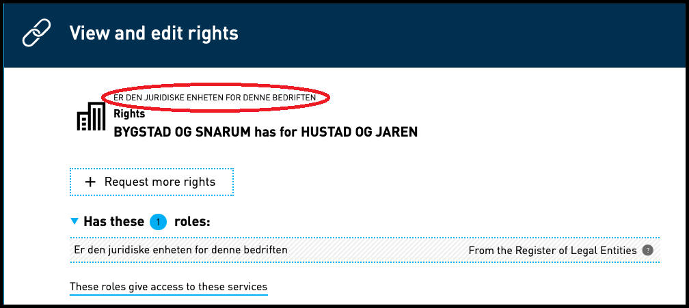

**Vi minner også om endringer i [Altinn 3.0.](https://github.com/Altinn/altinn-studio/releases)**

## Endringer i Portal

### Fjerne navn på knytning øverst over rettigheter i oversikt
I oversikten "Vis og rediger rettigheter" som fremkommer ved å velge dette valget under andre enheter enheten har rettigheter i vises rollen
som enheten har fra Enhetsregisteret om det finnes en slik øverst i oversikten. Denne er bestemt fjernet slik at det bare er
rettigheter og hvilke to enheter det gjelder som vises i oversikten.

I tillegg har vi begynt å oversette Enhetsregister-rollene og knyttingene slik at disse også følger valgt språk i løsningen.
Dette er derimot ikke versjon avhengig så det kommer ut omtrent med 21.11 versjonen selv om resten av endringen ikke kom før 21.12 versjonen.

## Endringer i REST

### Fjernet fallback til CORS whitelist i validering av redirectUrl i samtykke
For samtykketjenester som enten ikke bruker tjenesteeierstyrt rettighetsregister eller ikke har definert vilkår for redirectUrl i
TRR-regler, gjøres det ikke lengre en validering av oppgitt redirectUrl mot global CORS whitelist.

### Gjøre det mulig å bruke ReporteeConversion uten at oppgitt fødselsnummer er på avgiverlisten
Dette er nå implementert.
### BrokerService gjort tilgjengelig på Rest API

BrokerService er nå implementert som REST-tjeneste med Maskinport-pålogging. Se 
[https://altinn.github.io/docs/api/rest/formidling](https://altinn.github.io/docs/api/rest/formidling) for mer informasjon.

## Endre rolerequirements-API til å vise reelle rettigheter for 3.0-apps
Operasjonen /api/metadata/rolerequirements er nå utvidet til å vise reelle rettigheter for Altinn 3.0 apps.

## Diverse feilrettinger

## Ytelses-reduksjon med Sharepoint 2019
Dette er forbedret med noen endringer i Sharepoints lagrede prosedyrer.

### Haken på "Se alle underenheter" og "Se slettede enheter" ble ikke vist riktig i mobil-visning
Mobilvisningen er endret slik at avkryssningsboksene visuelt endres når man trykker på dem.

### Unødvendige advarsler i Visual studio fjernet
Små endringer utført for å fjerne unødvendige advarsler