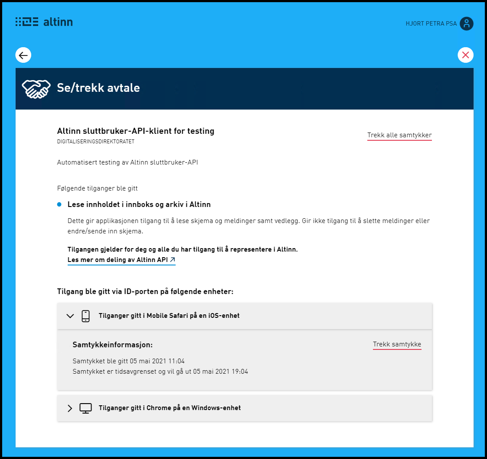

**Vi minner også om endringer i [Altinn 3.0.](https://github.com/Altinn/altinn-studio/releases)**

## Endringer i Portal

### Visning av innbygger sine aktive autorisasjoner i ID-portens OIDC provider

I forbindelse med en innlogging i ID-porten kan tjenester/klienter be om mulighet til å hente innbyggers data fra APIer tilbudt av en tredje-part (se Brukerstyrt datadeling). For eksempel kan en konsument av Altinn sluttbruker REST API be om å få tilgang til å hente data for brukerens meldingsboks i Altinn.

_Dette bildet viser forespørsel fra klient om å få tilgang til brukers meldingsboks og arkiv i Altinn sluttbruker API_

Altinn vil nå gjennom API integrasjon med ID-porten hente ut informasjon om alle autorisasjoner som innlogget bruker har gitt i ID-porten som omfatter minst ett av scopene som er eid av Digitaliseringsdirektoratet. Disse vil bli vist i panelet “Samtykker og fullmakter” i brukerens profilside sammen med evt. samtykkeforespørsler eller aktive samtykker brukeren har gitt i Altinn.

_Dette bildet viser klient som har mottatt ID-Porten autorisasjon i samtykkepanelet på profilsiden_

I visning av autorisasjoner gitt til en spesifikk tjeneste/klient vises informasjon om klienten, hvilke scope/data som er omfattet, samt tidspunkt og hvilken nettleser og enhetstype autorisasjonen ble gitt fra. Her vil brukeren også få mulighet til å trekke både enkelt autorisasjoner eller alle autorisasjonene gitt til denne klienten.

_Dette bildet viser ID-Porten autorisasjoner gitt en spesifikk tjeneste/klient_

## Endringer i SBL

### Lese inn postadresse fra foretrukket strukturet adressetype eller fra prioritert liste

I dag leverer Skattetaten gjennom FREG API en ferdig kontaktadresse som en liste med adresselinjer. Denne vil i fremtiden forsvinne. Som erstatning lages en slik liste ut i fra de ulike adressetypene som en person har. En vil kunne velge fra denne listen i prioritert rekkefølge:

1. Valgt foretrukket kontaktadresse:
2. Postadresse
3. Oppholdsadresse
4. Bostedsadresse
5. PostadresseUtlandet

### Utsatt. Bakoverkompatibel støtte for URI #fragments i redirectUrl

Denne endring er fjernet fra v21.5 og utsettes på ubestemt tid.

## Endringer i Autorisasjon

### Utvidet “Finn skjema eller tjeneste”/tjenestemetadata-visninger til å inkludere 3.0-apps

GetAvailableServices støtter fra før 3.0-apps i form av DelegationSchemes. Dette er nå utvidet for andre 3.0-apptyper.

### Mangler beskrivelse (tjenesteeier navn) når offeredby prøver å godkjenne forespørsel

Eier av tjenesten presenteres nå ved delegering.

### Implementere advarsel på DELETE

Det er lagt inn en sjekk “er du sikker” på sletting av delegeringer.

### Oppdatere ServiceCodesWithParallelSigningForServiceProvider og ServicesWithDuplicateSignatureCheck med tjenestekoder for KFI

Parallellsigneringsfunksjonaliteten er utvidet med en ny tjeneste. Denne funksjonalitetten ble først innført på den første korona-tjenesten (KFN). Den blir nå tatt i bruk for den andre korona-tjenesten (KFI).

## Endringer i Infoportal

### Implementert Azure AD basert innlogging til Infoportalen (EPI-server)

Innlogging til redaktørgrensesnittet i Episerver vil nå skje via Azure AD der OAuth 2.0 sammen med OpenId Connect blir benyttet som protokoller.
Den Azure AD baserte tilgangsstyringen erstatter den eldre løsningen som benyttet asp.net membership.

### Generere PDF av oppsummeringen i e-guide

Som bruker kan man nå velge å laste ned oppsummeringen på slutten av en e-guide. Dette skjer ved å trykke på knappen “Last ned som PDF” på siste side av guiden. Man får da også med alle lenker som er en del av oppsummeringen. PDFen kan brukes som oppslag til aktuelle sider på altinn.no og andre relaterte nettsteder.

## Diverse bugfix

### Får 500 error ved godkjenning av tilgangsforespørsel som krever høyere sikkerhetsnivå

Tilgangssyrere blir bedt om å logge inn på nytt med høyere sikkerhetsnivå isteden for å gi rød errorside. Etter ny innlogging vil brukeren komme tilbake til siden for å godkjenne forespørselen.

### Feil ved åpning av innboks i enkelte tilfeller

Ved noen spesielle tilfeller kunne brukere få en feil ved åpning av innboksen. Dette er nå rettet.

### Fjerning av EC brukere fra listen over brukere med tilgang til elementer i meldingsboksen (“Del og gi tilgang”)
 
Det er ikke støtte for at man kan utføre element delegering til EC brukere under “Del og gi tilgang” på elementet i meldingsboksen. EC brukere er av den grunn fjernet helt fra “Del og gi tilgang” funksjonaltiteten.

### Operasjon i kvittering viste feil ikon dersom man hadde tilgang fra før

Hvis man hadde rettigheten fra før er nå ikonet grået ut både på oppsummeringssiden og kvitteringssiden.

### Formidlingstjeneste ryddet ikke vekk filer fra disk i enkelte tilfeller der opplasting feiler

I noen sjeldne tilfeller kunne det skje feil med opprettelse av kvittering under UploadFileStreamed-operasjonen etter at filen var blitt lagret på disk. Dette medførte rollback av databaseendringene, men ikke fjerning av fil fra disk. Dette er nå endret slik at alle aksjoner i metoden er dekket dersom det oppstår feil som medfører databaserollback vil dette føre til opprydding av filen fra disk.

### Formidlingstjenesten sin slettejobb oppdaterte ikke alltid korrekt status for alle mottakere

I noen svært sjeldne tilfeller skjedde det feil i relasjonen i databasen som ble benyttet av slettejobben til å hente ut filer til sletting, samt oppdatere status etter sletting. Dette førte til at enkelte filer blir forsøkt slettet flere ganger da statusen ikke ble korrekt oppdatert. Dette er nå rettet.

### Formidlingstjeneste CheckIfAvailableFiles returnerte True i noen tilfeller selv når filer ikke er tilgjengelige for nedlastning

Dersom en mottaker tidligere hadde mottatt filer som var blitt slettet på grunn av utløpsdato før de var bekreftet (ConfirmDownload) av mottaker førte dette til at CheckIfAvailableFiles fremdeles regnet disse som tilgjengelige da den kun vurderte status per mottaker og ikke filen som helhet. GetAvaliableFiles ville korrekt vise at det ikke var filer tilgjengelig da denne tar hensyn til filstatus. (Denne gjør også mer eksplisitte autorisasjonskall og er mye tyngre). Som konsekvens ville Sluttbrukersystemer som pollet CheckIfAvailableFiles gå videre til GetAvaliableFiles, men ikke finne filer å laste ned. Dette skapte unødvendig last.

CheckIfAvailableFiles er nå endret til å også vurdere filens status som helhet, så respons ligger mer på linje med GetAvailableFiles.

### For stort mellomrom mellom enkeltrettigheter liste og roller liste

I noen tilfeller skal det være et ekstra stort mellomrom mellom navnet på person/virksomhet og øverste liste i “se rettigheter” modalen. Dette er nå rettet.

### XsnUpgrade feiler for skjemaer som bruker EPPlus (aksess til Excel)

Det er gjort en fix som en workaround for en feil i assembleren ilasm. 

### Operasjon i kvittering

Ikoner på en kvitteringsside mistet overstrek. Dette er nå rettet.

### Admin-grensesnitt Infoportal: Artikkeleksport på engelsk viste norsk innhold

Parameter for språk ble tatt med i søk, men ikke ved eksport. Dette er nå rettet.

### Admin-grensesnitt Infoportal: Noe innhold kom ikke med ved eksport av skjemasider

Nå tas alt innhold med i alle typer eksport og på alle språk.

