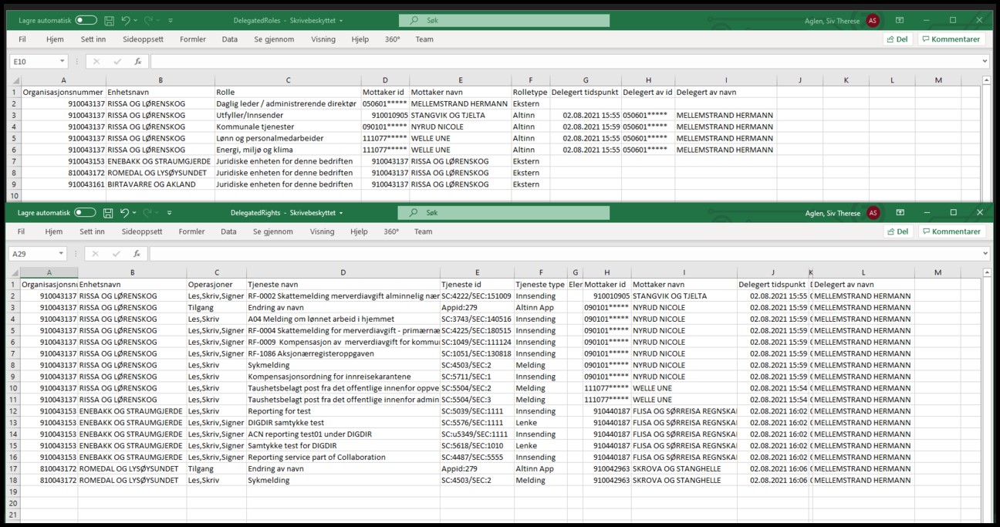

**Vi minner også om endringer i [Altinn 3.0.](https://github.com/Altinn/altinn-studio/releases)**

## Endringer i Portal

### Nedlasting av delegeringer på fil

Det er lagt til mulighet til å laste ned delegeringer på fil det lagres som CSV filer og legges inn i en ZIP fil for å samle det i en nedlasting. For organisasjoner med mange underenheter og delegeringer har det lenge vært et ønske å kunne hente ut en total oversikt over hvem som har hvilke roller/rettigheter på virksomheten, inkludert tilknyttede organisasjonsledd og underenheter.
Formålet med dette er enklere å ha kontroll hvem som har tilgang til hva i Altinn på tvers av hoved og underenheter.
Funksjonaliteten har særlig vært etterspurt av kommuner. Tidligere har det kun vært mulig å bestille denne typen oversikter som manuelle kjøringer.

Hvis uthenting av data tar for lang tid vil spørringen bli stoppet av sikkerhetsårsaker og virksomheten blir bedt om å bestille oversikten på epost. Oversikten vil kun inneholde direkte-delegeringer og ikke rettigheter man får fordi man har en rolle i en virksomhet som har mottatt en rettighet.

Funksjonalitet for å laste ned oversikt over delegeringer på fil finner man i Profil for virksomheten under “Andre med rettigheter”.

Det genereres 2 filer; en med oversikt over roller og en med oversikt over rettigheter inkludert rettigheter for kun et enkelt element (videresending). I filene vil man også kunne se hvem som har delegert roller/rettigheter og når dette skjedde der denne informasjonen er tilgjengelig.

CSV filene benytter semikolon (;) som skilletegn mellom celler slik at åpning i Excel krever at brukeren har satt opp Excel slik at det er dette skilletegnet og ikke komma (,) som benyttes. Dersom komma tolkes som skilletegn kan det gi problemer når data inneholder komma.

### Endring i plattform-delen for MVA kvittering

Endring i plattform-delen for MVA kvittering MVA modulen som genererer betalingsinformasjon som skal vises på kvitteringssiden er endret slik at hvis man sender inn et skjema med Meldingstype “Korrigert melding” så skal man få samme beløp i betalingsinformasjonen på kvitteringssiden som det står i skjemadelen på kvitteringen.

## Endringer i Autorisasjon

### Endring i parallellsignering

For å kunne signere et skjema som benytter parallell signering måtte man tidligere enten ha rollen PASIG direkte for avgiveren eller så må man ha en nøkkelrolle for avgiveren. Dette er nå endret slik at man også kan signere hvis man har en rolle som arver PASIG rollen, uansett om dette er en nøkkelrolle eller ikke.
Dette gjør at de som kun har rollen KNUF for et NUF nå kan signere et skjema som benytter parallell signering. Liste over alle roller fra Enhetsregisteret som kan utføre en paralellsignering på vegne av virksomhet som skal signere finnes [her](https://www.altinn.no/nn/hjelp/skjema/alle-altinn-roller/parallell-signering/).

## Endringer i REST

### Implementere API for å opprette virksomhetsbrukere

Implementerte et API for å opprette, endre og slette virksomhetsbrukere, der tokens brukes i stedet for virksomhetssertifikat. Alle APIene krever tokenet altinn:enterpriseusers.read for GET, altinn:enterpriseusers.write for POST/PUT/DELETE. Brukerne blir opprettet uten thumbprint for virksomhetssertifikat, så de kan ikke logge inn i portalen som en vanlig virksomhetsbruker.

### Støtte for virksomhetsbrukertoken fra 3.0 i sluttbruker REST API
 
Gjøre det mulig å kaller operasjoner som krever maskinporten-token med virksomhetsbruker-token

I release 21.7 ble det åpnet for støtte for virksomhetsbrukertoken fra 3.0 i sluttbruker REST API.
Nå åpnes det også for at virksomhetsbrukertoken kan brukes mot andre virksomhetsautentiserte APIer, som ellers ikke krever brukerautentisering. Dette inkluderer:

- /api/consentrequests
- /api/delegationsrequests
- /api/authorization/token
- /api/serviceowner/*

Brukerautentiseringen av en virksomhetsbruker som da også ligger i tokenet blir da bare ignorert av disse operasjonene, og oppføre seg tilsvarende som om man benytter et vanlig Maskinporten-token utvekslet til AltinnToken.

### HAL-lenke til rolerequirements fra metadata
 
Det er tre forskjellige lenker for de forskjellige tjenestetypene

Correspondence, FormTask, Lookup, Broker, Link og Collaboration:
DelegationScheme: 
AltinnApp:

### Fjerne innlesing av Preferert Kontaktadresse fra Folkeregisteret

Folkeregisteret vil fjerne Preferert Kontaktadresse fra og med 16. oktober. Fram til nå har dette vært hovedkilden til adressene i Altinn. Basert på statistikk fra Skatteetaten vil dette kunne forårsake en endring i adressekilde for opptil 37.000 personer.
Vi vil ikke gjennomføre en komplett re-innlesing av personer som følge av denne endringen, så en persons adresse vil bare bli oppdatert ved neste hendelse mottatt fra Folkeregisteret. Personer som blir oppdatert etter 21.8 vil få registrert adresse fra første gyldige adresse fra følgende kilder:

- postadresse
- oppholdsadresse
- bostedsadresse
- postadresse i utlandet

## Endringer i TUL

### Ny Logo i TUL
Lagt til ny digitaliseringsdirektoratet logo i tjeneste utviklings plattformen.

## Diverse feilrettinger

### KoFuVi kontaktinformasjon for virksomheter tilgjengelig for alle med tilgang til virksomheten

Det har blitt funnet og utbedret en svakhet hvor alle som har tilgang til en virksomhet i sin avgiverliste kunne få uthentet KoFuVi kontaktinformasjon for virksomheten ved å navigere til url: /ui/ContactSettings/Enterprise/ etter å ha valgt virksomheten som avgiver i portalen.
For å kunne få tilgang til KoFuVi informasjon for en virksomhet skal det kreves tilgang til systemressursen EntityProfileAdministration, som det nå også er lagt inn autorisasjonssjekk for på dette endepunktet.

### Omvendt rekkefølge på navn i aksjeselskap ved utlisting til Excel fil

Det har blitt funnet og utbedret en svakhet med CSV-fil eksport funksjonaliteten i “Søk på flere aktører”. CSV-fil eksporten benyttet ikke fullstendig navn på virksomhet fra enhetsregisteret, samtidig som at organisasjonsnummer eller maskert fødselsnummer for eier av meldingsboks-elementene manglet. OBS: Vi minner om at personnummer delen av fødselsnummer er maskert med ***** selv om det er innlogget brukers eget fødselsnummer. Dette for å minske faren for at SSN kan komme på avveie.

### Valideringsfeil i respons body for feil org. nr./SSN eller navn ved opprettelse av samtykkeforespørsler i REST API

Det har blitt utbedret en svakhet i REST API grensesnitt for opprettelse av samtykkeforespørsler. 
Dersom input parameterne OfferedBy og OfferedByName eller RequiredDelegator og RequiredDelegatorName inneholder ett organisasjonsnummer eller fødselsnummer som Altinn ikke har kjennskap til, evt. om oppgitt navn ikke stemmer med personen eller virksomhetens registrerte navn i enhetsregisteret eller folkeregisteret, får man i dag bare HttpStatusCode 400 og en Reason-Phrase med forklaring.
Reason-Phrase er det mange som ikke har ett forhold til i sine implementasjoner og vi har fått flere henvendelser hvor feil SSN eller feilregistrerte navn er årsak til at man ikke får gjennomført samtykkeprosessen.

Grensesnittet blir nå utbedret til å gi tilsvarende feilmelding i respons body som andre valideringsfeil på samtykkeforespørselen:

> [
>    {
>        "ErrorCode": "40332",
>        "ErrorMessage": "01010112345 is either not a valid organization number or social security number, or the provided name; Nordmann does not match the person or organizations registered name."
>    }
> ]

### Tilgangsstyrer for privatperson fikk tilgang til avgivere og rettigheter personen har mottatt av andre

Tilgangsstyrer for en privatperson kunne få tilgang til avgivere og informasjon om roller og rettigheter delegert fra andre til brukeren man car tilgangsstyrer for, gjennom operasjoner laget for det nye “Rettigheter virksomheten har hos andre” panelet. For å bruke disse operasjonene må brukeren nå representere en virksomhet.

### Visning av lese- og skriveikoner var forskjellig i kvitteringssiden og andre med rettigheter panelet

Endret visning av ikoner i andre med rettigheter panelet så det vises likt som i kvitteringssiden. Hvis brukeren har les eller les-arkiv vises leseikonet, og hvis han har skriv eller slett-arkiv vises skriveikonet.

### Samtykkepanel krasjer ikke lenger når IDPorten er nede

Feilen er rettet. Dette gjør at man nå kan åpne samtykkepanelet uten at man får en 400 bad request feilmelding.

### NotificationIcon for samtykkeforespørsel vises ikke på forespørselen i full-vindu-modus

Før var utropstegn-ikonene i samtykkene synlige kun i mobilvisning. Så snart man forstørret vinduet forsvant ikonet. Denne feilrettingen legger til utropstegn-ikonet ved siden av “Behandle forespørsel”-teksten.

### AuthorizeAccess får NULLReference for Sluttbrukersystem med Lokale roller

Metoden AuthorizationDecisionPoint.AuthorizeAccess som brukes blant annet av SubmitFormTask hadde en bug der den som en del av en sjekk gjorde en aksjon på en property som er NULL for Lokale Roller. Lokale roller er definert av brukeren selv, og er relativt sjeldne, noe som kan forklare hvorfor denne bug ikke har vært synlig tidligere, da aktuell kode ikke har vært endret på flere år.

Siden aktuell sjekk kun skal agere på eksterne roller, så legges det på en ekstra sjekk på RoleType.RoleSource = External før man prøver å hente ut RoleTypeCode. Denne verdien er alltid satt, og man unngår derfor å få NULLReference.

### Forbedret håndtering av ukjente adresser

Persondokumenter med postadresser som inneholdt data av typen ukjent adresse eller vegadresser med kun postnummer og poststed ble ikke lest inn korrekt. Dette førte til feil innlesing for noen få personer fra folkeregisteret. Dette har blitt utbedret og fører ikke lenger til feil, men personene vil fortsatt ikke være registrert med adresser, siden disse er tomme.

### Språk for CAPTCHA valideringsmelding

Det er rettet en gammel feil som gjør at man ikke lenger får et tilfeldig språk for valideringsmelding fra CAPTCHA.

### Sharepoint 2019 endringer uten egen branch

Det er gjort tilpasninger som gjør at man ikke trenger en egen kodebranch for Sharepoint 2019.
