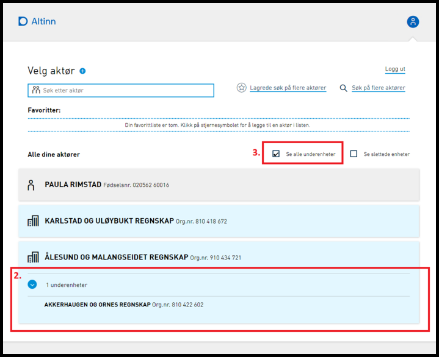

**Vi minner også om endringer i [Altinn 3.0.](https://github.com/Altinn/altinn-studio/releases)**

**Dette er en kommende endring. Gjeldende endring ligger [her](../21-11).**

## Endringer i Portal

### Endringer i aktørvalg og avanserte innstillinger for å gjøre underenheter mer synlig

Tidligere når en hovedenhet kun hadde en underenhet, har denne vært skjult for bruker i aktørvalgene Altinn og bruker har selv måttet velge å inkludere underenheten i aktørlisten gjennom bruk av avmerkingsboksen "Se alle underenheter" i det store aktørvalget.
Denne funksjonaliteten er nå endret slik at:

- Underenhet for hovedenhet med kun en underenhet inkluderes alltid i visningene for aktørvalg (både stort og lite).

- Avmerkingsboksen "Se alle underenheter" har fått endret funksjon til å bety at alle lister av underenheter er automatisk ekspandert i det store aktørvalget. I lite aktørvalg er listen av underenheter fortsatt kollapset ved åpning av visningen uavhengig av valg for "Se alle underenheter".

- "Se alle underenheter" er nå merket som standard ved første pålogging i Altinn. Om bruker ønsker listen av underenheter kollapset kan merking av “Se alle underenheter” fjernes. Valget lagres i brukerens profil i Altinn.

### Ny versjon av DesignSystemet

Altinn Design System er blitt oppgradert for å ta i bruk PatternLab v5 og Bootstrap v4.6.0. Oppgraderingen skal ellers ikke ha noen betydelige funksjonelle påvirkinger for MVC portalen.

## Endringer i sluttbrukerløsningen

### Marger lagt til i topo go bunn ved PDF generering

Dersom en side går over flere sider var det ikke luft etter siste linje på siden og første linje på neste side. For noen medførte dette at tekst forsvant ved utskrift. Det er derfor lagt på tilsvarende marger i top og bunn som det som er på høyre og venstre side.

### Skjema for Nasjonal sikkerhetsmyndighet slettes nå hyppigere

NSM tjenester uten aktivitet slettes nå etter 15 dager. Tidligere ble det slettet etter 30 dager.

### Støtte for innlogging med ID-porten TestID i testmiljøer

Dette er nå lagt til.

## Diverse feilrettinger

### Feil og mangler på modeller i API help siden utbedret

Det er utbedret noen feil og mangler funnet på modell dokumentasjonen på API help siden til Altinn. Det manglet blant annet dokumentasjon av modeller for metadata endepunkt for rollekrav for tjenster og apper i Altinn, og respons modell for opprettelse av virksomhetsbrukere ble vist på dokumentasjon av alle PUT og POST actions i APIet.

### Samiske tegn (eks “ŋ”) støttes ikke i visning av kodelisteverdi

Det er rettet en feil i import koden for kodelister som gjorde at enkelte unicode-tegn ikke ble vist riktig i TUL-kodelistene.

### Ytelse for Sharepoint 2019 forbedret

Det er utført optimaliseringer i sluttbrukerløsningen.

### Feil ved Videresending av melding uten vedlegg til digital postkasse

Det er rettet en feil med videresending til digital postkasse som oppsto når man skulle videresende melding uten vedlegg til digital postkasse.