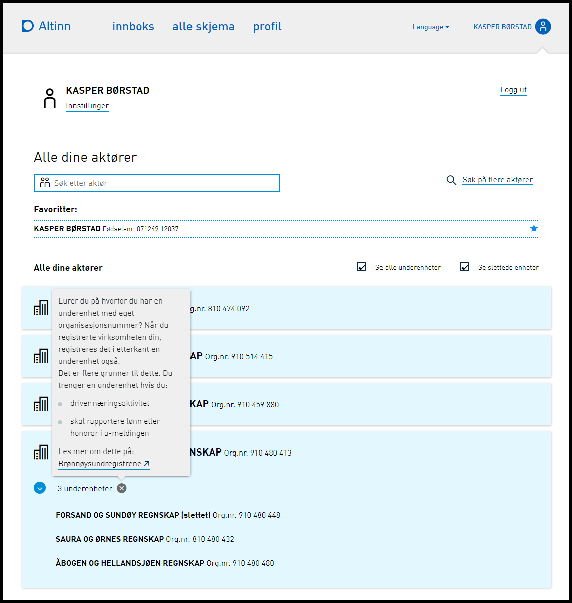

**Vi minner også om endringer i [Altinn 3.0.](https://github.com/Altinn/altinn-studio/releases)**

## Endringer i Portal

### Underenheter i aktørlisten - presentere informasjon om aktør

Både stort og lite aktørvalg i MVC Portalen er utvidet med en info-knapp på listen av underenheter knyttet til en hovedenhet i aktørlisten.
Denne åpner en infoboks med generell informasjon om hva en underenheter er, samt link til brreg.no for mer detaljert informasjon.

### Utsatt til 20.6: Ny logikk for å stenge ute brukere etter autentiseringsfeil

Ved autentisering og Autentiserings forespørslser gjennom Portalen er det et rammeverk for å sperre ute brukere. 
Det nye innstillingene er satt til å utestenge etter 10 misslykkede pålogginger. Disse må være utført de to siste timene og man stenges da ute i en time. Dette er da en endring fra det eksisterender der man ble stengt ute etter 3 misslykkede forsøk. 

## Endringer i Autorisasjon

### Utsatt til 20.6: Lagre tidspunkt AltinnPlatform delegeringer er prossesert i ALtinn II

Ved å legge på en kolonne med tidsstempel i tabellen [Authorization].[AuthZ].[ProcessedPlatformDelegationEvents] som får tidspunkt når raden settes inn vil det i etterkant ved å samenligne med tidstempelet i [Authorization].[AuthZ].[DelegationEvent] kunne se hvor lang tid det tok fra en delegering er utført på AltinnPlatform til den er gjort gjeldende i Altinn II.

## Endringer i REST

### Utsatt til 20.6: Implementert støtte for å kunne oppgi Altinn3 apps som RequestResource i en delegationRequest

Aktivere mulighet for å oppgi Altinn3 apps i REST API for be om tilgang (kun med access) Altinn3 apps er nå mulig å oppgi i RequestResource i kall til både /api/delegationrequest og /api/serviceowner/delegationrequest.

### Utsatt til 20.6: Innføre nytt REST grensenitt for tjenesteeiere

Nytt grensesnitt for tjenesteiere for å hente ut AltinnPlatform app rettigheter.

### Utsatt til 20.6: Fjerne utlisting av Access-operasjon i rights-utlisting, og hindre sletting og oppretting

Endepunktene som returnerer 2.0-rettigheter vil i utganspunktet returnere en Access-operasjon som er “pekeren” til de reelle app-delegeringene i 3.0. Disse må ikke vises, og skal heller ikke kunne slettes direkte.

### Utsatt til 20.6: Forskjell mellom roles, rights og apprights under delegation

Endepunktene returnerte ulik respons ved ugyldig receiverId. Det er nå endret slik at det returneres 404 hvis receiverId er ugyldig, eller ikke finnes. Hvis receiverId er gyldig, men har ikke roller eller rettigheter for gitt who skal det returneres 200 ok med tom liste.

## Diverse feilrettinger

### REST DeleteRight/DeleteAppRight håndterer ikke sletting av regel delegert til virksomhetsbruker

DeleteRight og DeleteAppRight operasjonene håndterte ikke sletting av regel med virksomhetsbruker oppgitt som receiverId. Det er nå implementert støtte for dette i begge operasjoner.

### Authorization delegeringer gir 500 internal server error for altinn3 access rights

Lagt til mapping av intern ErrorCode til Http BadRequest status respons i ErrorFilterAttribute i REST APIet så man får en 400 bad request.

