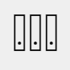
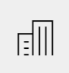

**Vi minner også om endringer i [Altinn 3.0.](https://github.com/Altinn/altinn-studio/releases)**

## Endringer i SBL

### Tjenestekodefilter for Abonnement og Prefill Batcher

Filtrering av prefillelementer i SFTP mottak Innlesningsbatchene for Abonnement (Subscription) og Prefill har fått utvidet funksjonalitet som gjør det mulig å ignorere elementer som tilhører tjenester angitt i en ny parameter “IgnoreServiceCodes”.

Endringen er utformet etter ønske fra en tjenesteeier som ønsker å levere prefill til både Altinn 3 og Altinn 2, men på grunn av begrensinger i sin løsning i praksis leverer samme sett med filer til begge løsningene. 
Siden dette er parameterstyrt og konfigurasjonen for jobbene er satt opp per grensesnitt/tjenesteeier, vil denne funksjonaliteten ikke påvirke noen andre.

## Endringer i Autorisasjon

### Ny logikk for å stenge ute brukere etter autentiseringsfeil

Ved autentisering og autentiseringsforespørsler gjennom Portalen er det et rammeverk for å sperre ute brukere. Det nye innstillingene er satt til å utestenge etter 10 mislykkede pålogginger. Disse må være utført de to siste timene og man stenges da ute i en time. Dette er da en endring fra det eksisterende der man ble stengt ute etter 3 mislykkede forsøk.

### Komplett “avgiverliste” for virksomheter

Virksomheter som har mottatt delegeringer fra andre har i profil-siden siden release 21.3 hatt ett panel for “Rettigheter virksomheten har hos andre”. 
Denne har til nå bare inkludert de avgiverne med en direkte delegert rolle eller enkeltrettighet for en tjeneste eller instans.
Dette er nå utvidet til en mer komplett visning hvor det også inkludere underenheter dersom man har mottatt tilgang for en hovedenhet, samt innehaver av enkeltpersonsforetak dersom organisasjonen er revisor eller regnskapsfører for enkeltpersonsforetaket.

Denne avgiverlisten for virksomheten er da også grunnlaget for hvem en virksomhet kan sende “be om tilgang”-forespørsler for ytterligere tjenestenivå rettigheter.

## Endringer i REST

### Utvide /api/{who}/authorization/delegations til å inkludere rettighetshavere som har tilgang gjennom nøkkelroller

API-operasjoner under /api/{who}/authorization/delegations-endepunktet er blitt utvidet til å nøste inn rettighetshavere som har tilgang via nøkkelroller slik at disse også vises i resultatet.

## Feilrettinger

### Feil ikon brukt for virksomheter under “Andre med rettigheter”

Feil ikon brukt for virksomheter under “Andre med rettigheter”
Det er utbedret en feil hvor ikon for virksomheter under “Andre med rettigheter” panelet i profilsiden feilaktig har benyttet klient ikon

i stedet for det vanlige virksomhetsbygg ikonet

som benyttes ellers i løsningen.
