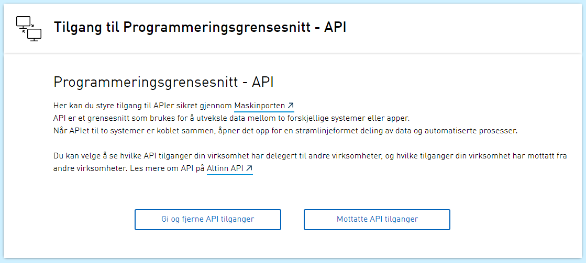

**Vi minner også om endringer i [Altinn 3.0.](https://github.com/Altinn/altinn-studio/releases)**

## Endringer i Portal

### Endret grensesnitt mot ID-Porten - OIDC

Endret grensesnitt mot ID-Porten - OIDC Grensesnittet mot ID-Porten er endret fra protokollen SAML til OIDC.

### Endre plasering og layout knapper API-delegering

Det er gjort noen endringer i UI for API delegering mellom release 23.3 og 23.4. Denne endringen vil ikke være synlig i portalen før den blir aktivert.

### Panel ikon for stort i mobil view

Ikon i panel for API-delegering er endret slik at det er en media query som endrer på stil basert på bredden til siden.

## Endringer i REST

### Slå av DelegationRequest API for sluttbrukersystem

Sluttbruker REST API kall er Feature toglet av og API Help er oppdatert med "Removed"

## Feilrettinger

### Engelsk tekst i panel for API-administrasjon

Endring av tekst fra "API your business accesses have delegated to other businesses"

til "API accesses your business have delegated to other businesses"
