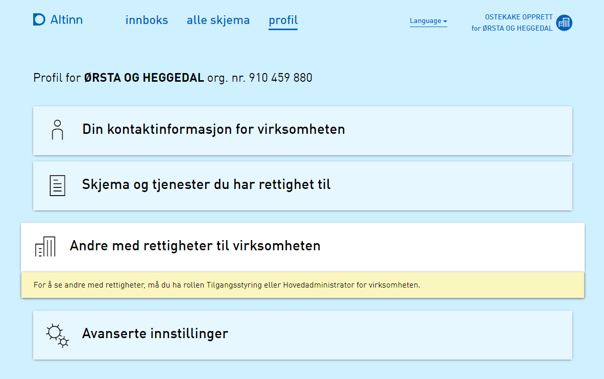

**Vi minner også om endringer i [Altinn 3.0.](https://github.com/Altinn/altinn-studio/releases)**

{}
## Endringer i Portal

### Innsyn i "Andre med rettigheter" for virksomheter krever nå Tilgangsstyring el. Hovedadministrator rolle samt sikkerhetsnivå 3

Frem til Release 24.3 av Altinn 2 har alle som selv har tilgang til en virksomhet, også hatt full innsikt til detaljert tilgangsinformasjon om virksomhetens interne tilgangsstyring. Altså har man fått sett alt av roller, enkelt-tjenester og enkelt meldinger en hver bruker, person, andre virksomheter (samt nøkkelrolle-personer og ansatte for disse virksomhetene) har for avgiveren.

Etter en juridisk vurdering for om dette er ønskelig å videreføre til Altinn 3, har det blitt avgjort at dette er ønskelig å stramme inn. I første omgang ved å kreve pålogging på minst sikkerhetsnivå 3, samt at bruker er Tilgangsstyrer eller Hovedadministrator for virksomheten.

### ID-Porten autorisasjoner kan ikke lenger administreres i Altinn Profil

ID-Porten har ikke API tilgjengelig for sin nye platform for administrering av ID-Porten autorisasjoner enda. Dermed logges det nå veldig mye feil i Altinn som fortsatt forsøker å kalle API på gammel OIDC platform som nå er slått av. Denne integrasjonen slås av inntil ID-Porten har nytt API tilgjengelig.

## Endringer i SBL Bridge API

### API for oppslag av party objekter basert på liste av organisasjonsnummer

I sammenheng med implementasjon av ressurseiers rettighetsregister (RRR) i Altinn 3 som blir arvtaker av tilsvarende funksjonalitet som tjenesteeierstyrt rettighetsregister (SRR) har i Altinn 2, har det oppstått behov for mulighet å slå opp party informasjon i bulk basert på organisasjonsnummere.
Dette er bare til interne behov fra Altinn 3 platform og ikke ett direkte eksponert API.

### API for avgiverliste fra Altinn 2 som inkluderer rolleinformasjon om pr. avgiver

I sammenheng med implementasjon av ny avgiverliste på Altinn 3 platformen, er det behov for å få med rolleinformasjon fra avgiverlisten i Altinn 2. Det vil ikke være gjennomførbart ytelsesmessig å skulle hente roller pr. avgiver individuelt.
Samtidig er rolleinformasjon pr. avgiver allerede del av cachet grunndatasett som benyttes for oppbyggingen av avgiverlisten i Altinn 2 i dag.

Denne endringen gjør nå at rolleinformasjonen blir med hele veien ut i avgiverliste API i SBL Bridge, og kan dermed brukes videre i Altinn 3 for å kunne informere om hvilke Altinn apps og ressurser fra Ressursregisteret man har tilgang til for hver avgiver.

## Diverse bugfix

### Database deploy bug for utviklingsmiljø

**Clean Deploy Broken**

Manglende oppsett for UUID kolonner for Party og UserProfile tabellene skapte problemer for å få gjort ny og ren innstalasjon av databasen i utviklingsmiljø, som nå er utbedret.
