**Vi minner også om endringer i [Altinn 3.0.](https://github.com/Altinn/altinn-studio/releases)**

## Endringer i Portal

### ID-Porten autorisasjoner kan igjen administreres i Altinn Profil

ID-Porten har nå tilgjengeliggjort nytt API for sin nye OIDC platform, som Altinn kan integrere mot for at brukere kan få sett og evt. trukket tilbake autorisasjoner de har gitt til ID-Porten systemer/klienter.
Disse vises i brukerens Profilside i Altinn under panelet "Samtykker og fullmakter"
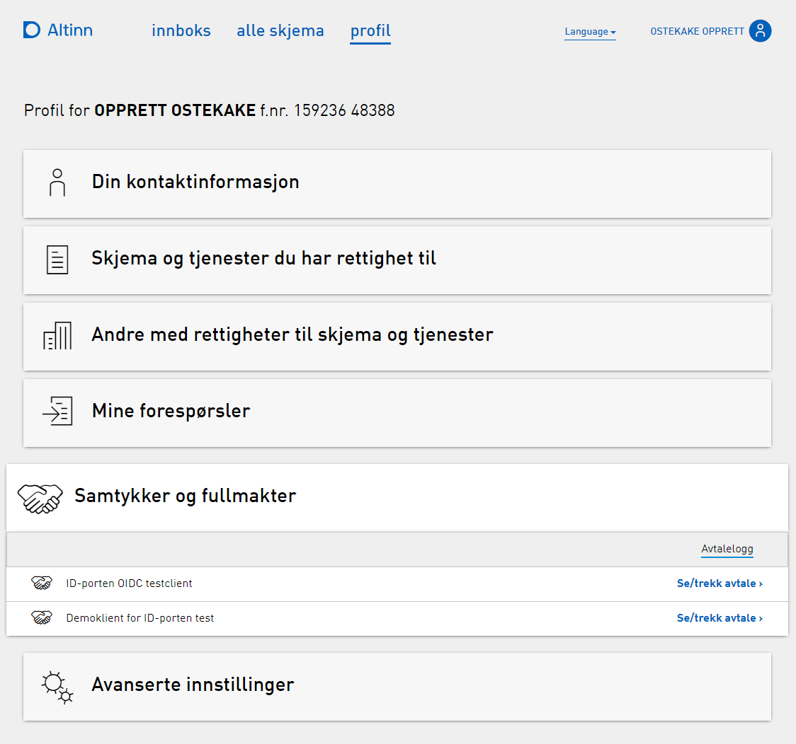

Hver autorisasjon kan da inspiseres for hvilket system/klient autorisasjonen ble gitt til, hvilken organisasjon som eier klienten, en beskrivelse av klienten, hvilke scope som ble gitt tilgang til og beskrivelse fra Samarbeidsportalen om hva scopene gir tilgang til, når autorisasjonen ble gitt, når det utløper og hvilken type nettleser og operativsystem autorisasjonen ble gitt fra.

Her kan brukeren også velge å trekke tilbake autorisasjonen.
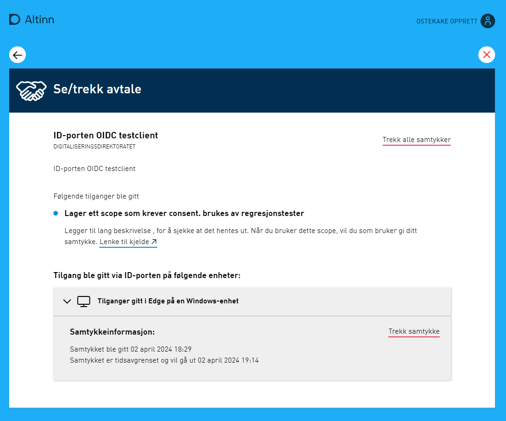

### Nytt brukergrensesnitt for delegering av enkelttilganger

Knapp for å "Gi tilgang til enkelttjenester" vil nå ta brukere til nytt brukergrensesnitt for delegering i Altinn 3.
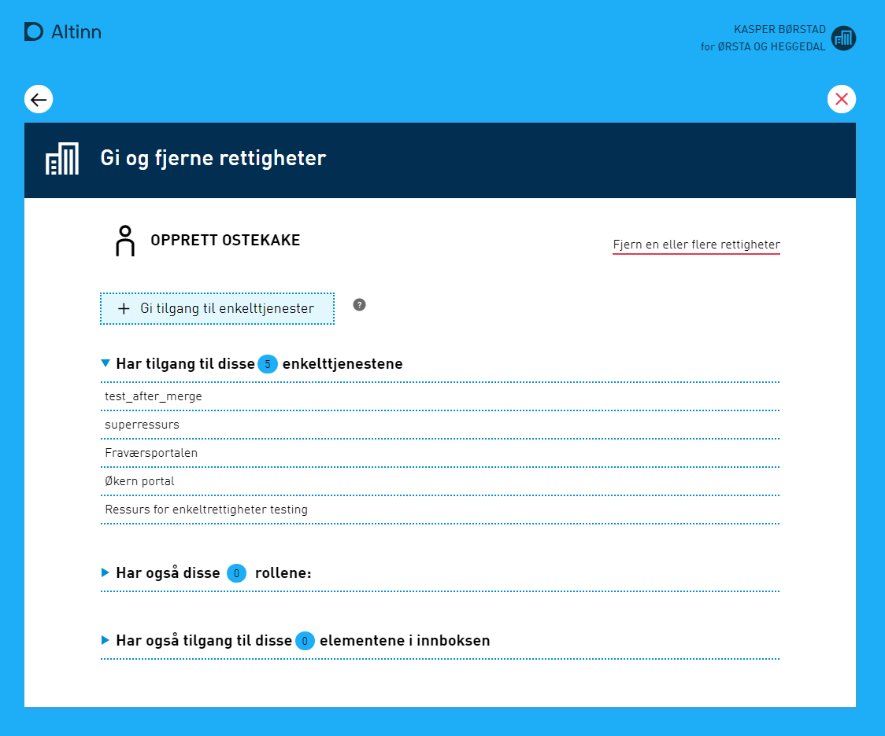

Nytt brukergrensesnitt lar bruker søke, filtrere på tjenesteeier og velge flere Altinn 2 tjenester, Altinn 3 apps eller ressurser fra Ressursregisteret som man ønsker å delegere.
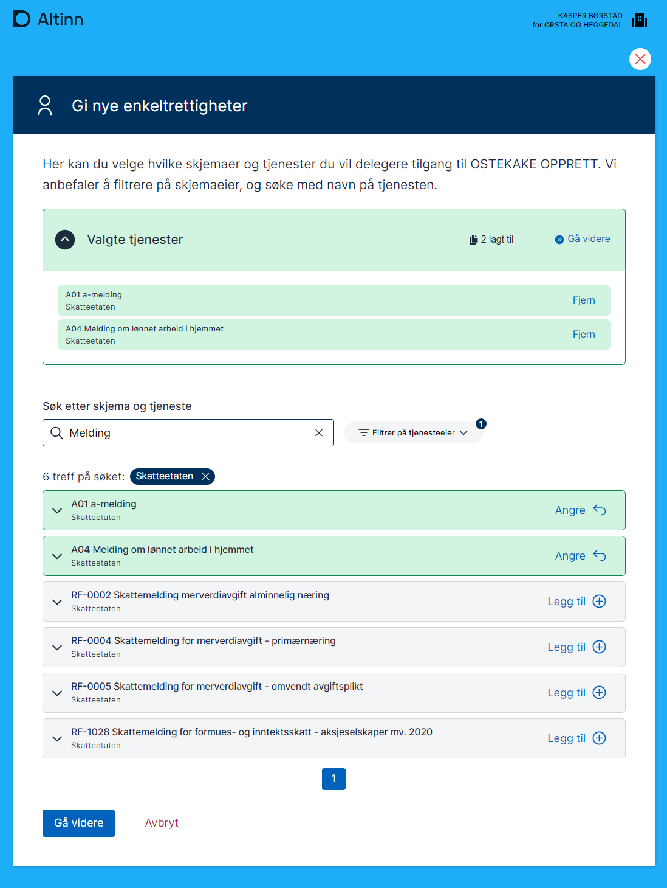

Dersom tilgangsstyrer selv mangler nødvendig tilgang til å kunne gjennomføre delegering vil det gis umiddelbar tilbakemelding om dette ved valg av en tjeneste, app eller ressurs.
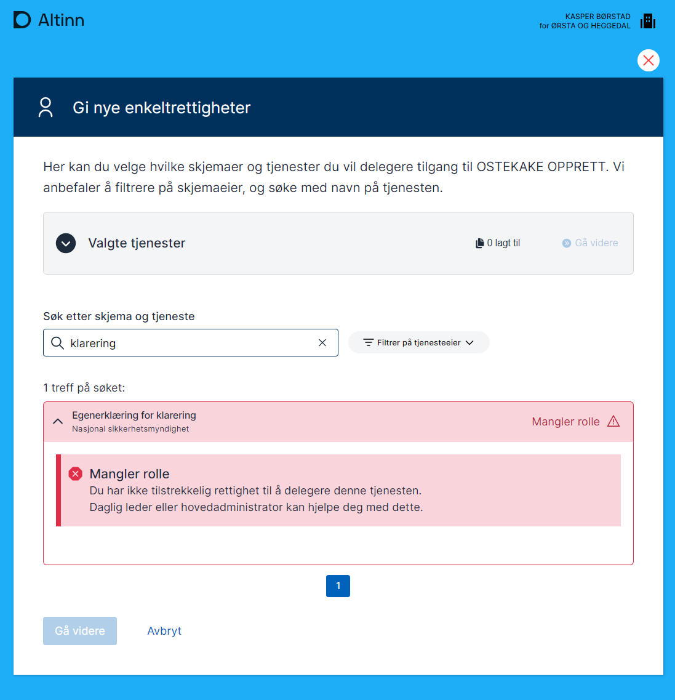

Etter å ha valgt tjenester/apps/ressurser for delegering, får tilgangsstyrer oversikt over tilgjengelige enkelttilganger pr. valgt tjeneste/app/ressurs den har tilgang til å delegere og mulighet til å justere.
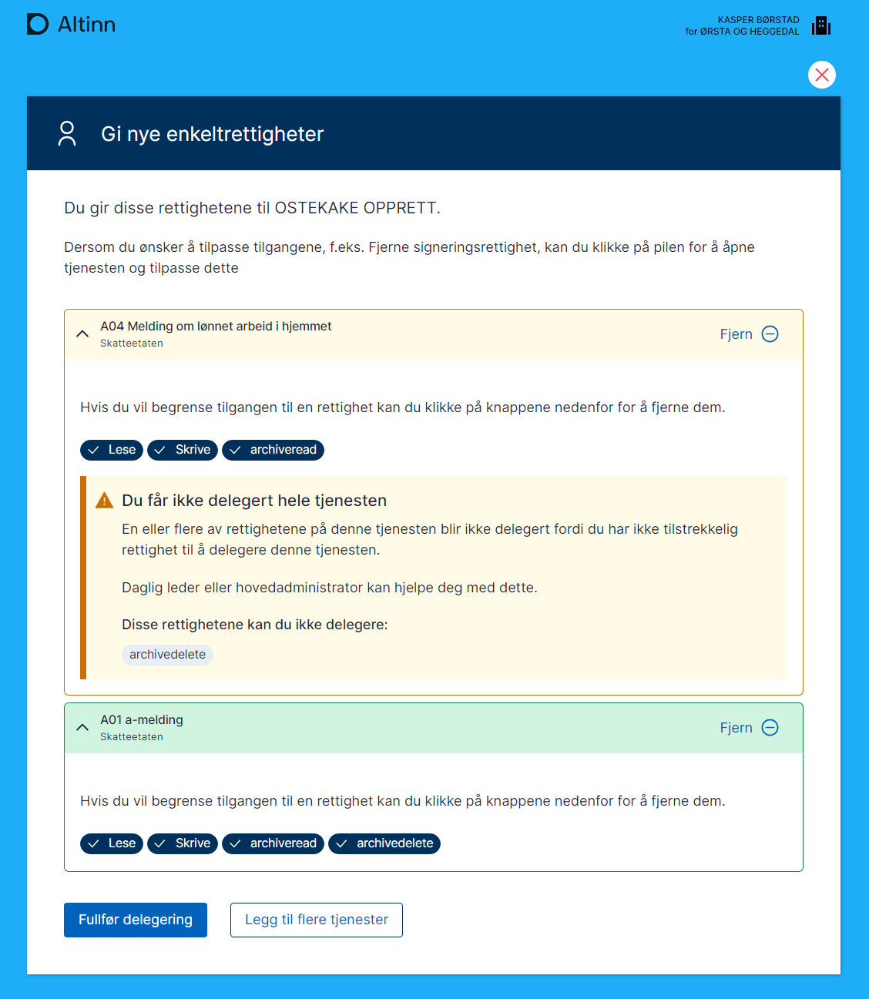

### Avgiverliste i Altinn Portal inkluderer nå avgivere bruker har via tilgang(er) for Altinn 3 ressurser

Via nytt brukergrensesnitt i Altinn 3 for delegering av enkelttilganger, er det nå mulig å delegere tilgang til nye ressurs typer fra Ressursregisteret.
Mottakere som bare har tilgang til en avgiver gjennom å ha mottatt enkelttilgang for en ressurs (enten direkte til bruker eller via virksomheter bruker har nøkkelrolle for), skal kunne få disse avgiverne opp i avgiverlisten i Altinn for å kunne velge denne som avgiver og administrere sine direkte mottatte rettigheter fra Profilsiden til avgiver.

### Økt sikkerhetsnivå krav til nivå 3 for administrering av egne rettigheter for en avgiver

I sammenheng med utfasing av Altinn's egne autentiseringsmetoder med Altinn pinkoder, SMS-pin eller passord, økes kravet til sikkerhetsnivå 3 eller høyere for å kunne administrere egne mottatte rettigheter for en avgiver.

Behovet for endringen kommer også av nye integrasjoner mot Altinn 3 platformen for administrasjon av enkelttilganger i Altinn 3 som også krever sikkerhetsnivå 3 eller høyere.
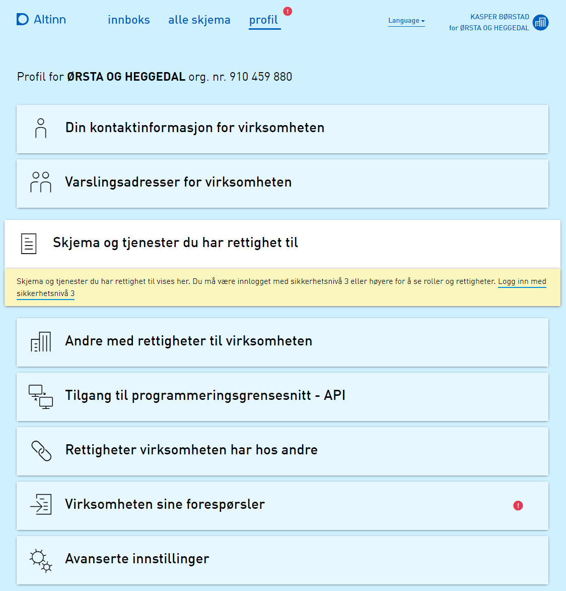

### Økt sikkerhetsnivå krav til nivå 3 for administrering av rettigheter virksomheten har mottatt fra andre

I sammenheng med utfasing av Altinn's egne autentiseringsmetoder med Altinn pinkoder, SMS-pin eller passord, økes kravet til sikkerhetsnivå 3 eller høyere for å kunne administrere en virksomhets mottatte rettigheter fra andre.

Behovet for endringen kommer også av nye integrasjoner mot Altinn 3 platformen for administrasjon av enkelttilganger i Altinn 3 som også krever sikkerhetsnivå 3 eller høyere.
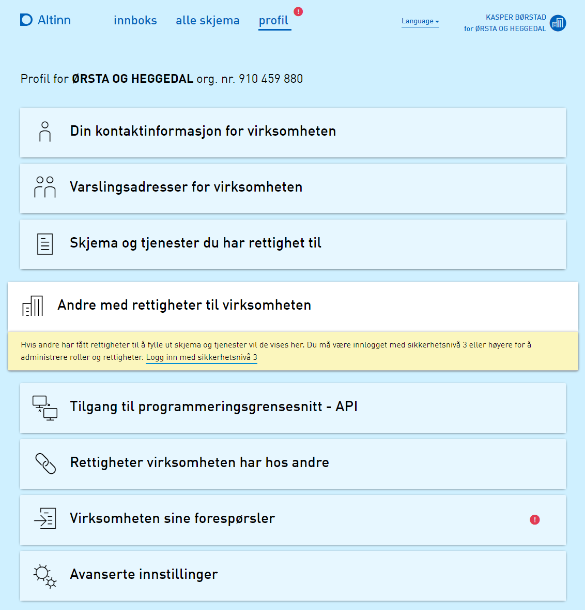

### Skjema og tjenester: Administrering av mottatte enkelttilganger for Altinn 3 ressurser

Når en bruker eller virksomhet har mottatt enkeltrettighet for en ressurs i Ressursregisteret i Altinn 3 vil brukeren (eller virksomhetens nøkkelrolle-personer) kunne se enkelttilgangene de har mottatt i Panelet "Skjema og tjenester du har rettighet til" i Profilsiden til avgiver man har mottatt tilgangene fra.

I eksempel skjermbildet under har bruker både mottatt enkelttilganger direkte som vises med hvit bakgrunn og via virksomhet brukeren har nøkkelrolle (f.eks Dagligleder) som vises med skravert bakgrunn.
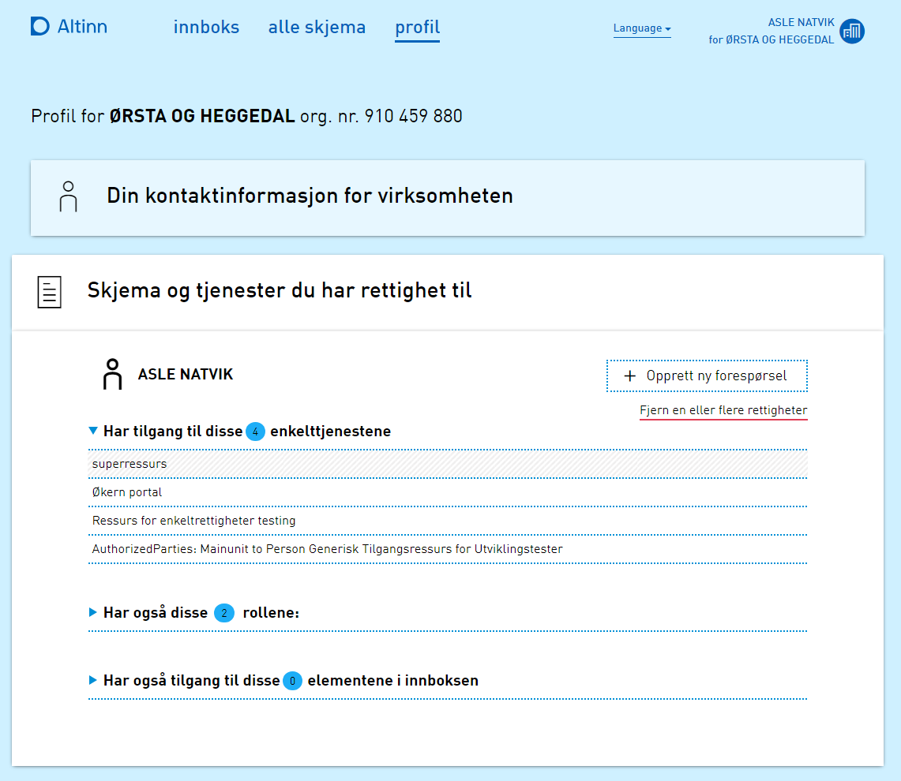

Ønsker bruker å si fra seg sine direkte mottatte enkelttilganger, kan brukeren gjøre dette ved å klikke på "Fjern en eller flere rettigheter" og deretter velge de enkelttilgangene man ønsker å si fra seg.

**Merk:** Tilgang bruker arver via virksomhet brukeren har nøkkelrolle er ikke mulig å si fra seg her. Rettigheter gitt til virksomheten må administreres fra virksomhetens egen Profilside (se: [Rettigheter virksomheten har hos andre: Administrering av mottatte enkelttilganger for Altinn 3 ressurser](#rettigheter-virksomheten-har-hos-andre-administrering-av-mottatte-enkelttilganger-for-altinn-3-ressurser))
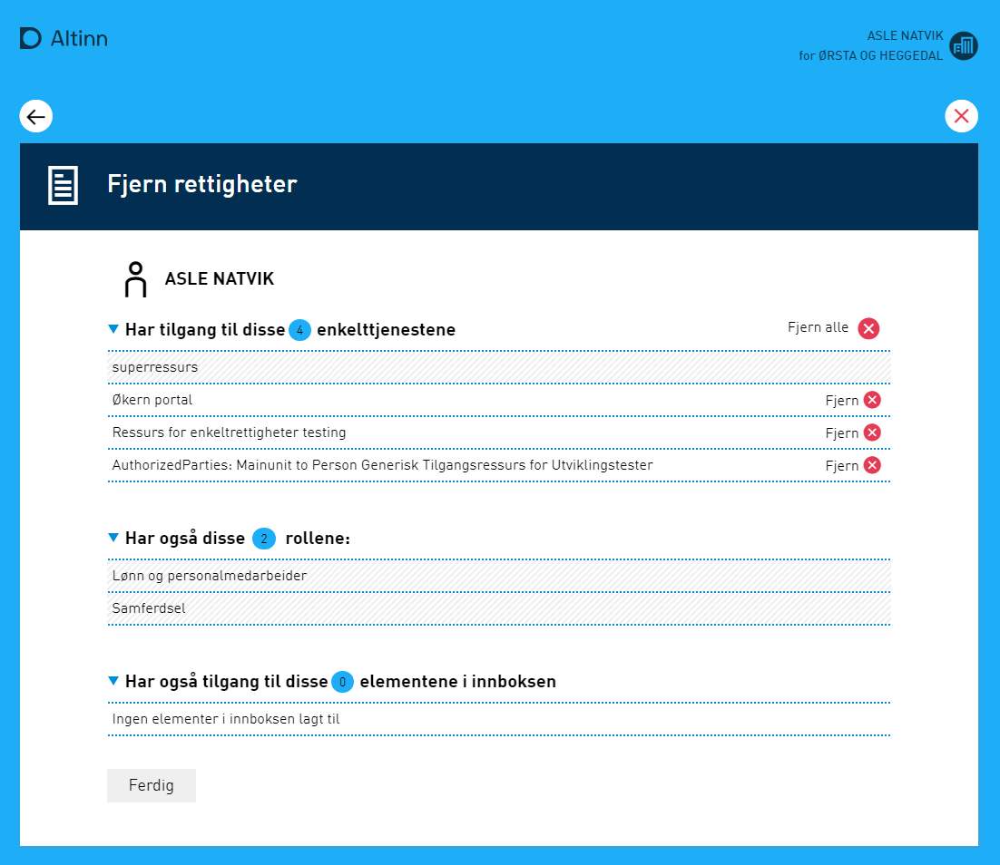

### Rettigheter virksomheten har hos andre: Administrering av mottatte enkelttilganger for Altinn 3 ressurser

Når en virksomhet har mottatt enkeltrettighet for en ressurs i Ressursregisteret i Altinn 3 vil disse avgiverene virksomheten har mottatt vises i Panelet "Rettigheter virksomheten har hos andre" i Profilsiden til virksomheten.

**Merk:** Dette panelet er bare tilgjengelig for Tilgangsstyrere eller Hovedadministratorer for virksomheten.
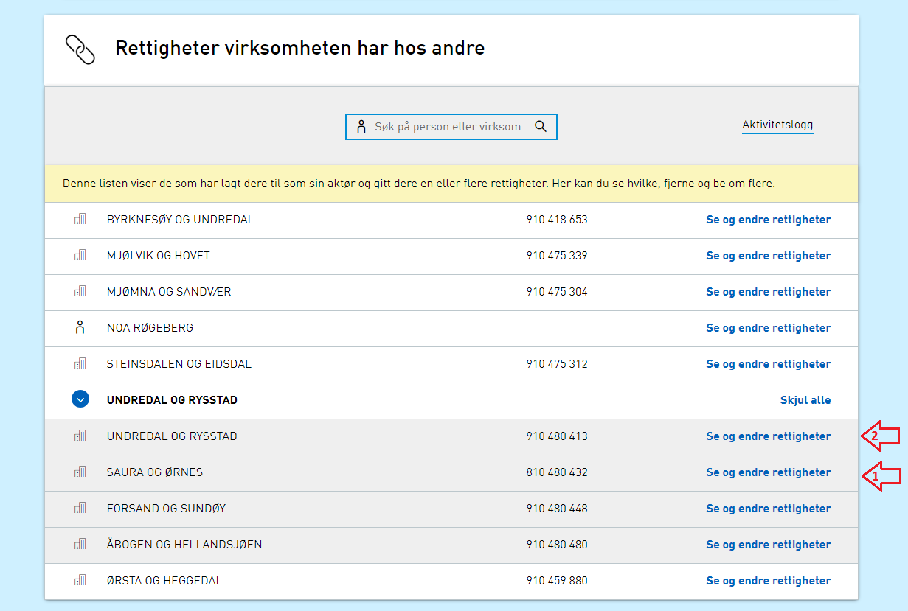

I eksempel skjermbildet under har tilgangsstyrer valgt å se på mottatte enkelttilganger fra en underenhet (Pil nr.1 i skjermbildet over). Her har virksomheten både mottatt enkelttilganger direkte fra underenheten (vises med hvit bakgrunn) og mottatt enkelttilganger fra hovedenheten (vises med skravert bakgrunn).
Bare rettigheter som er gitt direkte fra avgiveren man inspiseres kan slettes fra denne visningen.
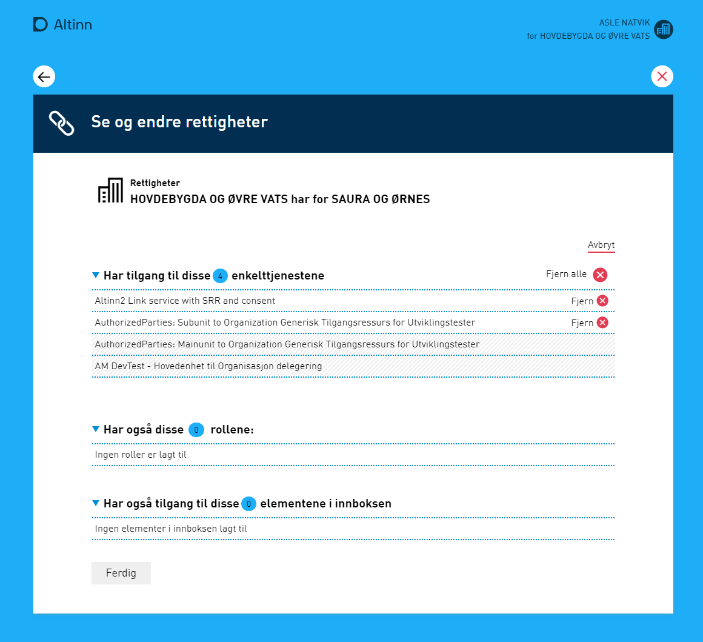

I eksempel skjermbildet under har tilgangsstyrer valgt å se på mottatte enkelttilganger fra hovedenheten (Pil nr.2 i skjermbildet over). Her vises da mottatte enkelttilganger direkte fra hovedenheten med hvit bakgrunn og kan slettes.
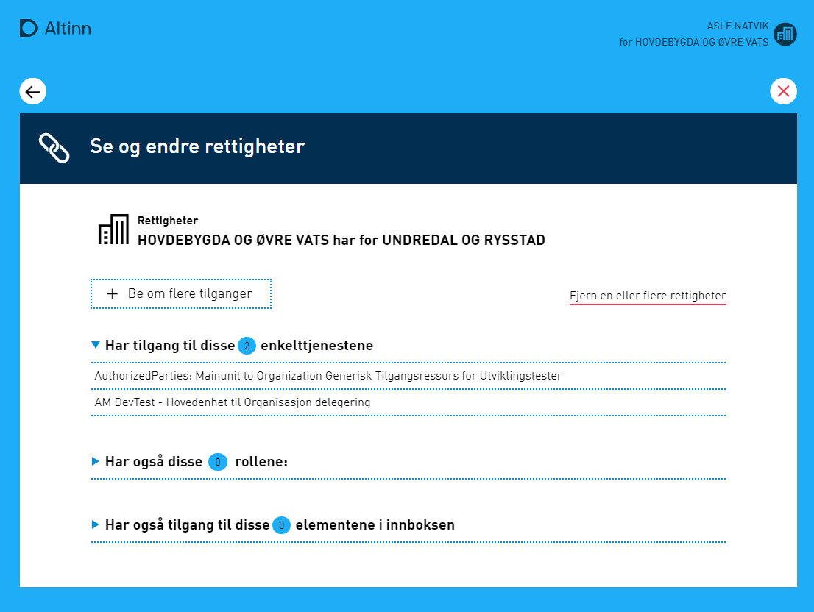

### Andre med rettigheter: Administrering av delegerte enkelttilganger for Altinn 3 ressurser

Når en virksomhet har delegert enkeltrettighet for en ressurs i Ressursregisteret i Altinn 3 vil mottakere av tilgangene vises i Panelet "Andre med rettigheter til virksomheten" i Profilsiden til virksomheten.

**Merk:** Dette panelet er nå bare tilgjengelig for Tilgangsstyrere eller Hovedadministratorer for virksomheten ref.: [Endring i Release 24.3](../../2024/24-03/#innsyn-i-andre-med-rettigheter-for-virksomheter-krever-nå-tilgangsstyring-el-hovedadministrator-rolle-samt-sikkerhetsnivå-3)

I eksempel skjermbildet under har tilgangsstyrer valgt å se på "Andre med rettigheter" for en underenhet.
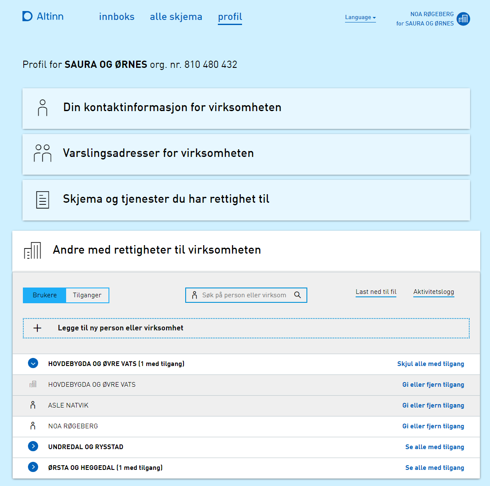

I eksempel skjermbildet under har tilgangsstyrer valgt å se på tilganger en annen virksomhet har for underenheten. Her har mottaker både mottatt direkte enkelttilganger fra underenhet (vises med hvit bakgrunn), samt enkelttilganger fra hovedenheten (vises med skravert bakgrunn).
Rettigheter mottatt fra en hovedenhet er også gjeldende for alle underenheter, som er årsaken til at disse også vises her. Men skal disse trekkes må tilgangsstyrer også være tilgangstyrer for hovedenheten og bytte avgiver til hovedenhet for å administrere delegeringene på hovedenhetens profilside.
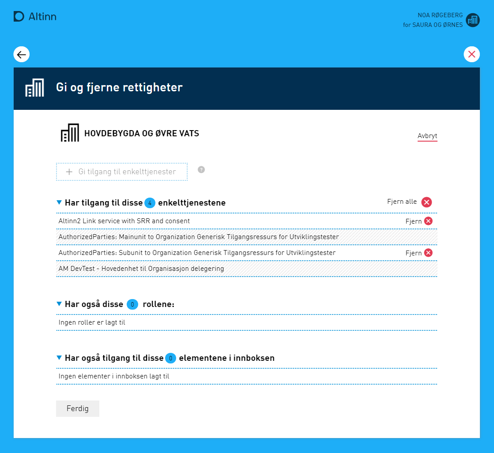

I eksempel skjermbildet under har tilgangsstyrer byttet avgiver og valgt å se på "Andre med rettigheter" for hovedenheten.
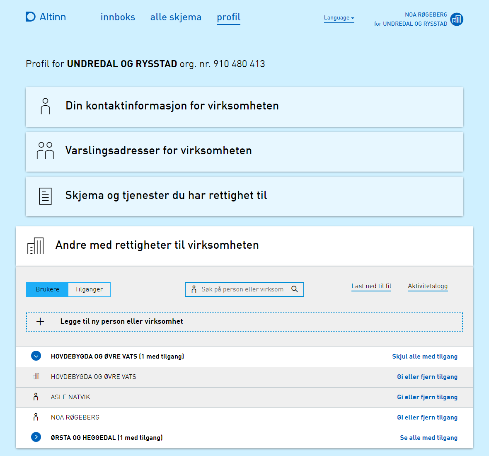

I eksempel skjermbildet under har tilgangsstyrer valgt å se på tilganger en annen virksomhet har for hovedenheten. Her vises da bare tilganger som er direkte delegert fra hovedenheten. Sletter tilgangsstyrer tilgangene her vil mottaker også miste disse tilgangene for alle underenheter.
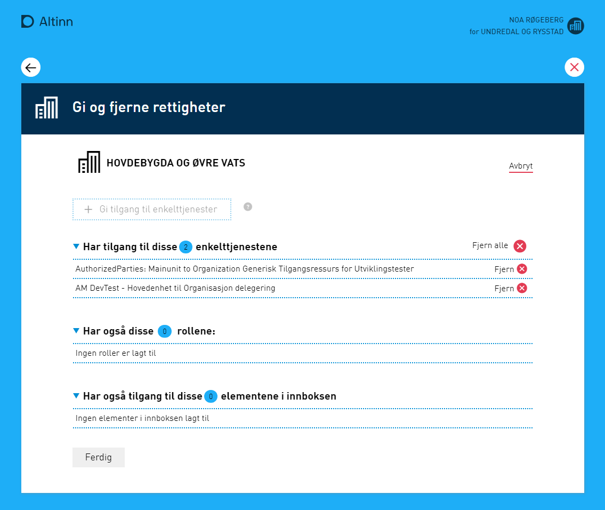

## Endringer i SBL Bridge API

### Mulighet for å trigge cache invalidering i Altinn 2 fra Altinn 3 ved behov

Det har oppstått behov for å kunne invalidere caching av avgiverliste og tilganger i Altinn 2, i sammenheng med nytt brukergrensesnitt i Altinn 3 for delegering av enkelt-tilganger for tjenester, apps og ressurser fra Ressursregisteret.
Dette for at nye delegeringer som nå utføres i brukergrensesnitt i Altinn 3, skal kunne bli synlige for tilgangsstyrer i visning av rettigheter som fortsatt skjer fra eksisterende brukergrensesnitt i Altinn 2 Profilsiden.

## Diverse bugfix (OPPDATERT 19. APRIL)

### Når delegering er gjort til EC_Bruker da ec_bruker dobbelt opp under "Andre med rettigheter"

Når resource og app delegering er gjort til EC_bruker dukker opp 2 ganger under "Andre med rettigheter"
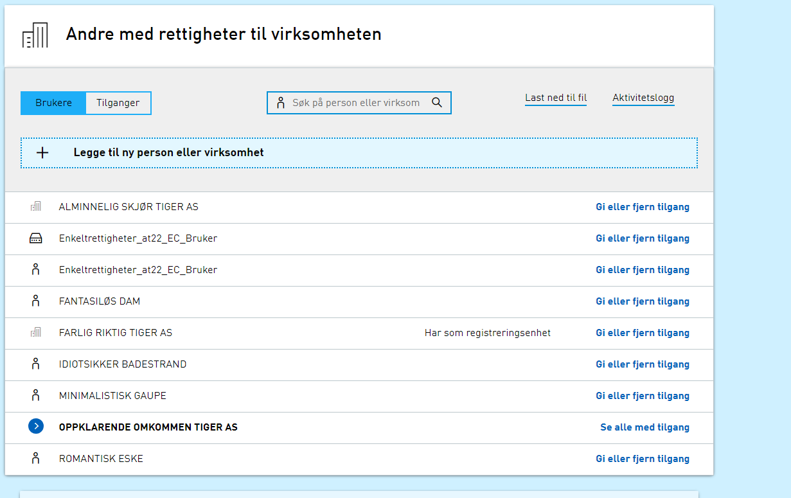

1. Filtreringen som legger til avgivere som kommer fra ALtinnPlatform filtrerte på PartyId mens EC brukere som allerede lå i listen hadde PartyID null så filteret ville ikke se denne som en duplikat og legge til Avgiveren. Endret fire steder.
Endret mappingen av Brukerprofiler (UserProfileBE -> SimpleUserProfileBE) til å inkludere UserType slik at vi vet hvilken brukertype det er snakk om når vi har en brukerprofil (SimpleUserProfileBE) (Fødselsnummer, Viksomhet og Selvidentifisert)
2. Mappingen fra Brukerprofil (SimpleUserProfileBE) til Party (SimplePartyBE) tar med seg brukertype slik at ikon i UI kan settes riktig
3. Mappingen til Party (SimplePartyBE) setter ikke PartyId dersom brukeren er av type Virksomhetsbruker slik at vi ikke blander sammen flere Virksomhetsbrukere som da deler PartyId.
4. Logikken som merger sammen de eksisterende avgiverene med de som skal legges til fra AltinnPlatform ble endret til så skippe å legge til dersom det finnes en bruker med samme USerID der fra før samtidig som den skipper å legge til om det er en med samme PartyId der fra før siden PArtyID ikke er satt på Virksomhetsbrukere blir alle virksomhetsbrukeren som har tilgang lagt til siden de ikke blir evaluert på PartyId.

### Endre tekst på Slett knapp for IDPorten autorisasjon til enkelt samtykker

**Beskrivelse**
Når bruker har gitt IDPorten samtykke/autorisasjon til 2 eller flere klienter som tilhører samme konsument organisasjon vises disse samplet under samme klient navn og beskrivelse.

ID-Porten autorisasjoner samles nå på konsument organisasjon, hvor da bare første autorisasjon i samlingen brukes for å vise klient navn og beskrivelse. I tillegg samles alle Scopes på tvers av klientene i en liste. 

Dette gir ikke mening og bør skrives om så de samles på ClientId i stedet.

**Repro steps**

Gi samtykke til "ID-porten OIDC testclient":
1. Bruk følgende test klient ID-porten OpenID Connect klient (idporten.no)
2. Legg til følgende i Scopes: difitest:requiresconsent
3. Trykk "Start Innlogging" knappen
4. Logg på med TestId bruker og Godta samtykke til tilgangen
5. Når du kommer tilbake til Test Klienten trykk "Hent Tokens" knappen
   
Gi samtykke til "Demoklient for ID-porten test":
1. Bruk følgende test klient: ID-porten OpenID Connect demo client (idporten.no)
2. Legg til følgende i Scopes: altinn:instances.read altinn:instances.write
3. Trykk "Logg inn" knappen
4. Logg på med samme TestId bruker som i forrige samtykke, og Godta samtykket

Under "Samtykker og fullmakter" i profilsiden vises da begge disse samtykkene samlet som om begge ble gitt til "ID-porten OIDC testclient":
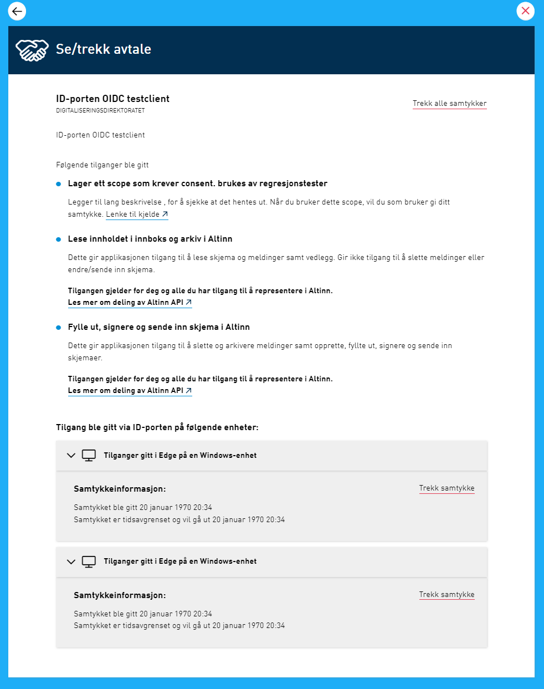

