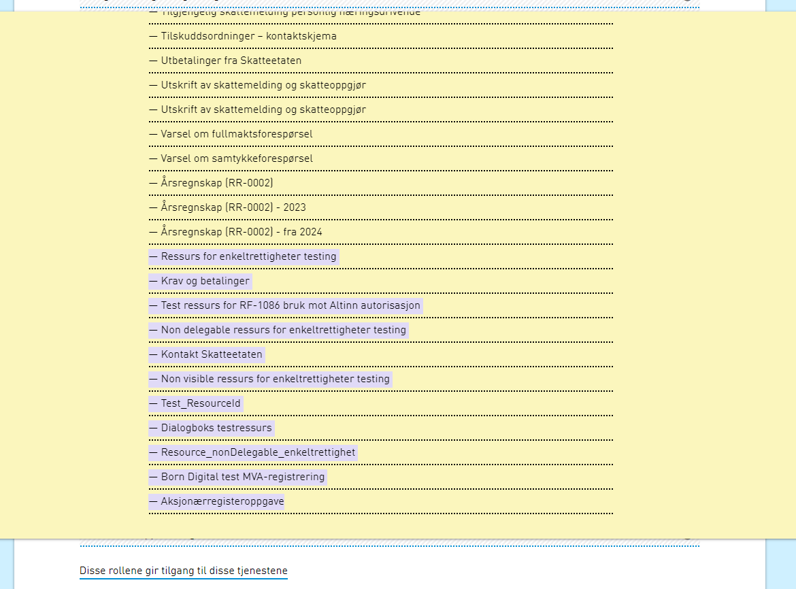
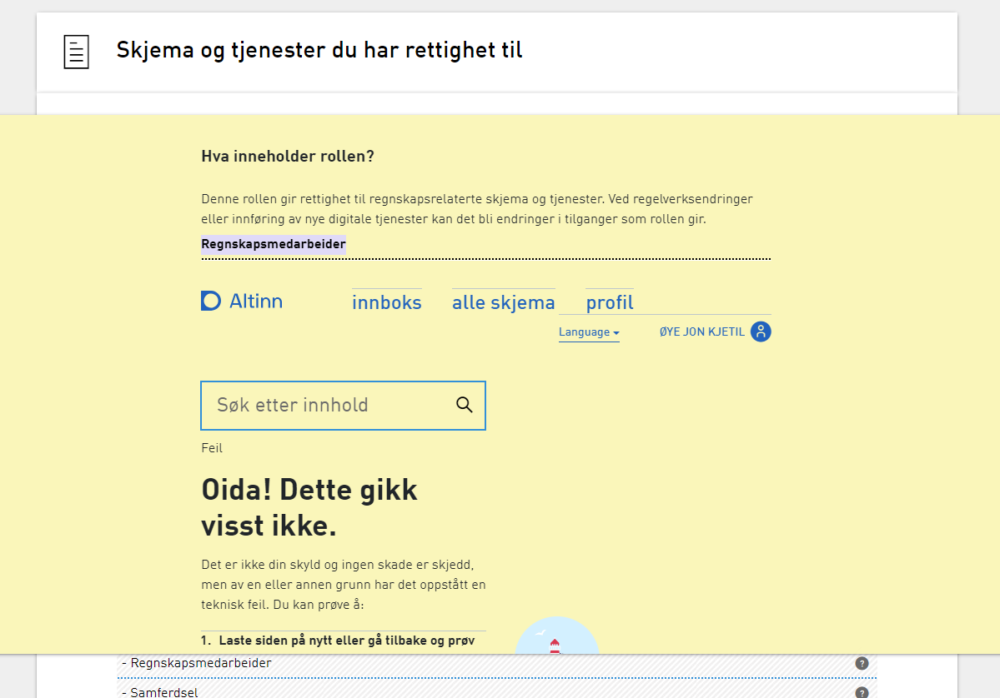

**Vi minner også om endringer i [Altinn 3.0.](https://github.com/Altinn/altinn-studio/releases)**

## Endringer i Autorisasjon
### API in SBL Bridge to disable service in Altinn 2
In the process of migration of lenketjenester to resources in Altinn 2 we need one API that disables the service in Altinn 2 based on service code/service edition code. Disabling a service would prevent any new delegations of it.
#### Definisjoner
Utgått på en tjeneste betyr at den ikke skal vises i utrekk av tjenester i løsningen (UI) men den må være med i når tjenesten hentes ut fordi det er esentsielt for videre bruk i delegerings sammenheng. den skal ikke være delegerbar og det skal ikke være mulig å trekke delegeringer på tjenesten. Ei heller skal delegeringer av tjenesten vises i brukergrensesnittet.
#### Tasks
* Expose API for å sette utgått på en tjeneste
* Lage flagg på ServiceEditionVersion som muliggjør å sette en tjeneste til utgått
* Utvide uthenting av tjenester til å inkludere status (Utgått/aktiv)
* Utvide Revoke til å sjekke om det er mulig å trekke tilgang
* Utvide delegerings api til å hindre delegering
* Utvide uthenting av delegeringer til å filtrere bort utgåtte tjenester.
* Invalider cache for tjeneste uthentinger slik at tjenesten raskere blir vist som utgått. Delegeringer kan ikke kolektivt innvalideres siden vi ikke kan se alle finegrained key og dermed finne alle cache objekter.

### Altinn 2 Export Delegation Batch
#### Description
When migrating link services to Altinn 3 we need a batch that exports delegations to Altinn 3.

We will use the AddRule method available in Access Management to insert rules.

We should try group rules that belong together (resource, receiver, and offer) to create the delegation policy file in one go.

This happens in the PolicyAdministrationPoint
https://github.com/Altinn/altinn-access-management/blob/main/src/Altinn.AccessManagement.Core/Services/PolicyAdministrationPoint.cs#L59

https://github.com/Altinn/altinn-access-management/blob/main/src/Altinn.AccessManagement.Core/Services/PolicyAdministrationPoint.cs#L137

https://github.com/Altinn/altinn-access-management/blob/main/src/Altinn.AccessManagement.Core/Helpers/DelegationHelper.cs#L248

We will use the created time for the first rule for the DelegationChange stored in PostgreSQL, pointing to the

#### Additional Information
https://github.com/Altinn/altinn-access-management/issues/579

## Diverse bugfix

### Altinn 3 ressurser sortert alfabetisk
Ressurser fra Altinn 3 er ikke sortert alfabetisk men ligger på enden av listen

#### Repro steps

#### Resolution
Listen er sortert etter at ressurser er lagt til

### Ressurser for REGNA feiler i PROD
Henting av ressuser for rollen Regnskapsmedarbeider feiler i Prod

#### Repro steps
Det burde ikke krasje på denne måten selv om/når kall til Altinn 3 feiler.

Server: AI-PR-APP01
Tidspunkt feilen oppsto: 22. mai 2024 14:03:31

#### Resolution
Fikset slik at det ikke krasjer

### Tilpasning for migrering av data fra Altinn 2 til Altinn 3

#### Repro steps
Migreringsprogrammet har behov for å kalle Altinn 2 tjenester uten ordinær autorisasjon. Dette kan gjøres ved å eksponere en property som kan settes programmatisk (ikke via config) fra migreringsprogrammet.

#### Resolution
Added property to configure local proxy authorization from migration client

### Høy CPU bruk i prosedyre
Høy cpu bruk i prosedyre i [ServDev].xxxxxxxxxxxxxxxxxx

#### Repro Steps
Høy cpu bruk når NAV gjør spørringer som denne: exec [ServDev].xxxxxxxxxxxxxxxxxx

#### Resolution
Løses ved en tuning av prosedyra samt en ny og en oppdatert indeks.

### Mottakere uten tilgang vises
Andre med rettigheter - Tilganger | Viser mottakere som ikke faktisk har tilgang til tjenestene

#### Repro Steps
1. Logg på med Daglig leder/Hovedadministrator/Tilgangsstyrer for en virksomhet
2. Gå til Profil siden og Andre med rettigheter
3. Bytt til Tilganger tab
4. Søk på en tjeneste eller ekspander en av virksomhetens "mest brukte" tjenester om den har dette.
5. Her vises nå alle mottakere som har enten en App eller Ressurs tilgang i Altinn 3 uavhengig av om de faktisk har tilgang til den tjenesten man ser på

#### Cause Resolution
Berikingen vi gjør av RightHolders basert på tilgang til App eller Ressurs i fra Altinn 3 tar ikke høyde for filtrering basert på tjeneste
