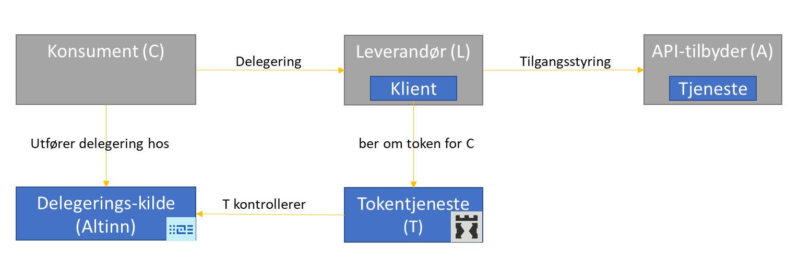

## Q1 - 2019

### :heavy_check_mark: Tilby bruker mulighet til å definere "mine favoritt-aktører" for å lette aktørvalg i pålogging
Tidligere har bruker med mange aktører blitt presentert alle aktører hvor de mest brukte aktørene står øverst. Konseptet "mest brukte aktører" er fjernet og i stedet er det etablert funksjonalitet for å legge til - og fjerne favorittaktører.
Dette ble [levert i release 19.3](../../releases/2019/19-3/#mulighet-for-opprettelse-av-favorittliste).

## Q2 - 2019

### :heavy_check_mark: Nasjonal tjeneste for dokumentasjonsbevis - eBevis
Det er etablert en [løsning](/docs/utviklingsguider/ebevis/) for innhenting av dokumentasjonsbevis fra leverandør.
Denne ble produksjonssatt 4. april, [se artikkel på digi.no](https://www.digi.no/artikler/lover-mindre-pdf-bruk-i-bedriftenes-anbudskonkurranser/463182).

### :heavy_check_mark: Forenkle administrasjon av lokal rolle med mange rettigheter
Prosessen med å legge til nye tjenester i en lokal rolle er forenklet. I stedet for å måtte legge til en og en tjeneste kan  administrator legge til flere tjenester i en operasjon. Det er også mulig å administrere flere tjenester i samme skjermbilde. Eier av tjenesten vises i søkevinduet slik at det er lettere å velge riktig tjeneste.
Dette ble [levert i release 19.5](../../releases/2019/19-5/#forenkle-prosessen-med-opprettelse-av-lokal-rolle-som-skal-inneholde-mange-rettigheter).

### :heavy_check_mark: Altinn skytjenester
Altinn testmiljø er etablert i sky. Miljøene skal benyttes til å teste tjenester utviklet i Altinn Studio, samt endringer i sluttbrukerløsningen. Dette ble levert i mai 2019.

### :heavy_check_mark: Opprette rolle for hovedadministrator
Det er nå mulig for daglig leder/styrets leder eller tilsvarende rolleinnehaver i Enhetsregisteret å peke ut en eller flere tiltrodde medarbeidere i organisasjonen som hovedadministrator for å håndtere all tilgangsstyring i Altinn på vegne av virksomheten. Disse personene vil kunne delegere roller og rettigheter de selv ikke innehar til andre og til seg selv. Dette gjelder også fremtidige roller og rettigheter som opprettes. Det er også mulig for privatpersoner å utnevne en hovedadministrator på vegne av seg selv.
Dette ble [levert i release 19.6](../../releases/2019/19-6/#innf%C3%B8ring-av-hovedadministrator-rolle-for-virksomheter).

## Q3 - 2019

### :heavy_check_mark: Tilby REST grensesnitt for å opprette (persistent) samtykkeforespørsel og oppdatere tjenesteeierstyrt rettighetsregister (SRR)
Det blir nå mulig å ta i bruk en mer robust løsning for å be om - og gi samtykke.

Dagens løsning for å opprette et samtykke benytter url for å sende parametre til en samtykkeside som skal vises for den som skal gi samtykke.
Tjenesteeier må bruke webService for å registre regler knyttet til bruk av samtykke. Denne tjenesten er konstruert slik at det er lett for Tjenesteeier å gjøre feil. 

Med denne endringen tilbys to nye REST-tjenester:

* REST for å opprette samtykkeforespørsel. Aktør som ønsker samtykke kaller en REST-tjeneste med nødvendige parametre for å registrere en samtykkeforespørsel. Altinn returnerer en GUID som senere brukes for å sende bruker videre til samtykkedialogen. 
* REST for å oppdatere tjenesteeierstyrt rettighetsregister (SRR) hvor regler endres ved å sende verdier i en godt definert liste

Dette ble [levert i release 19.8](../../releases/2019/19-8/#endringer-i-rest-api)

### Sanering i tjenesteeieres arkiv
Tjenesteeieres arkiv er der tjenesteeiere i Altinn kan se elementer som tilhører egen virksomhet.
Det skal gjennomføres en revisjon av lagringstid for tjenester i dette arkivet. Det er sendt ut varsel om dette til tjenesteeiere.

### Publisering av hendelser på REST-API for tjenesteeier 
Det vil bli mulig å hente ut status på meldinger og varsler ved at det i Altinn publiseres en feed for hendelser. Denne feed vil på sikt erstatte dagens SOAP-operasjoner for meldingshistorikk. Dataene i feeden vil i første omgang ha levetid på 30 dager.

### Ny innlesing av Enhetsregisteret
Følgende skal utføres:

* Tilpasning/utvidelse av [Enhetsregisteret](https://www.brreg.no/om-oss/oppgavene-vare/alle-registrene-vare/om-enhetsregisteret/) i Altinn
* Full re-innlesing av Enhetsregisteret i Altinn

### Ny brukerdialog for å be om - og gi rettighet
Det blir nå mulig for sluttbruker å "be om tilgang" til en bestemt rolle eller utføre en bestemt tjeneste. En forespørsel vil da gå til de i virksomheten som har administratormyndighet og som kan ta stilling til om rettighet skal innvilges eller ikke. Endringen omfatter ny dialog og brukergrensesnitt som skal brukes for de som ber om rettighet samt for de som skal gi rettighet.

### Utfasing av støtte for TLS 1.1 og 1.0
Transport Layer Security (TLS) er kryptografiske protokoller som tilbyr sikker kommunikasjon på Internett.
Støtte for TLS 1.0 og 1.1 skal fjernes for all inngående trafikk til Altinn. Altinn vil kun støtte inngående trafikk basert på TLS 1.2.
Driftsvarsling er sendt ut til tjenesteeiere og sluttbrukersystemleverandører.

### :heavy_check_mark: Versjonering av webserviceendepunkter (EC2) med sertifikatautentisering
For å forbedre ytelse og forenkle integrasjoner med bruk av virksomhetssertifikat ble det sommeren 2019 lagt ut nye versjoner av alle EC-endepunkter . 
Endringen består av er utelukkende på konfigurasjonsnivå og skal ikke medføre funksjonelle endringer. Les mer [her](/docs/api/soap/grensesnitt/nye-ec-endepunkter/).

Alle som bruker webserviceer med virksomhetssertfikat mot Altinn bør bytte til de nye endepunktene i løpet av høsten 2019.

## Q4 - 2019

### Ta i bruk AA registeret for å registrere ansatt relasjon til virksomhet
AA-registeret (arbeidsgiver- og arbeidstakerregisteret) eies og forvaltes av NAV og er et grunndataregister som gir en oversikt over alle arbeidsforhold i Norge med noen få unntak. AA registeret skal tas i bruk som et hjelpemiddel og forenkling av tilgangsstyring i Altinn. Når vi tar i bruk dette registeret vil vi kunne: 

* gi bedre oversikt over hvem som har tilganger (er vedkommende ansatt/ikke ansatt)
* finne og velge rettighetsmottaker fra en liste over ansatte i stedet for å spørre den ansatte etter fødselsnummer
* gi varsling hvis ansatt slutter
* legge til rette for at ansatte selv kan be om rettigheter

### Håndtering av meldinger og skjema med særlig sensitivt innhold til organisasjoner
I dag må alle tjenester knyttes til roller som daglig leder i virksomheten har. Dette resulterer i at daglig leder får automatisk innsyn i alle meldinger som sendes virksomheten. 
Det blir nå mulig å sende meldinger/opprette skjema til virksomheten som ingen i utgangspunktet får innsyn i. Daglig leder eller hovedadministrator kan fortsatt gi tilgang til disse meldingene til utvalgt medarbeider eller seg selv.

### Oppgradering av Biztalk
Biztalk skal oppgraderes til nyere versjon. Dette er et produkt som anvendes til forsendelse og mottak av data mellom Altinn og tjenesteeiere.
Oppgraderingen planlegges gjennomført slik at eksisterende tjenester ikke skal påvirkes.

### Tjenester 3.0
Tre nye løsninger skal tas i bruk:

* **Altinn Studio** anvendes til å utvikle nye container-baserte applikasjoner ("apps"). Denne løsningen vil overta for dagens tjenesteutviklingsløsning (TUL).
* **Altinn Apps** er container-infrastrukturen som vil kjøre og tilgjengeliggjøre applikasjonene for brukerne. Hver organisasjon vil ha sin helt egen infrastruktur.
* **Altinn Platform** vil tilby APIer for felles funksjonalitet som f.eks. registre, grensesnitt, autorisasjon og datalagring.

Vi utvikler smidig og endringer gjøres fortløpende tilgjengelig på https://altinn.studio.

Alle de nye løsningene etableres i public cloud.
Funksjonalitet for å utvikle en applikasjon og teste den i et testmiljø vil komme i Q2,
og mulighet for å produksjonssette applikasjoner vil komme i Q3.

1. Utvikler lager applikasjoner i Altinn Studio og migrerer selv til infrastrukturen Altinn Apps.
2. I Altinn Apps vil brukere få tilgang til og kunne benytte applikasjonene.
3. Altinn Platform inneholder bl.a. APIer for fellesfunksjoner og data/registre som deles på tvers av alle applikasjoner.
4. Utviklere vil fortsatt kunne utvikle tjenester i TUL i en periode fremover. Det er kun leverandør som kan migrere disse tjenestene til produksjonsmiljøet
5. Brukere går inn på vanlige måte på www.altinn.no, og finner elementer i sin innboks.
   - Når bruker benytter en tjeneste som er utviklet i TUL så vil dette skje på samme måte som tidligere, og denne vil kjøre i sluttbrukerløsningen (SBL).
   - Når bruker benytter en app som er utviklet i Altinn Studio vil den kjøre i sky-infrastrukturen Altinn Apps.  
     Brukerene vil oppleve en annen interaksjon og layout på nye apps vs tjenester som kjører direkte i sluttbrukerløsningen.  
     Skjermbilder og brukergrensesnitt vil oppleves mer moderne og fremtidsrettet i Altinn Apps.

All [kode](https://github.com/Altinn/altinn-studio) og [backlog for utvikling](https://github.com/Altinn/altinn-studio/issues) ligger åpent på GitHub.
Alle kan dermed enkelt [opprette en issue](https://github.com/Altinn/altinn-studio/issues/new/choose), f.eks. bug, spørsmål eller et forbedringsforslag.

De nye løsningene vil eksistere i parallell med TUL og dagens Altinn sluttbrukerløsning (SBL).
Når alle tjenester fra TUL er flyttet over til Altinn Studio vil både TUL og tilhørende funksjonalitet i SBL fases ut.

Mer detaljerte arkitekturtegninger finnes på [docs.altinn.studio](https://docs.altinn.studio), f.eks.
[løsningsarkitektur](https://docs.altinn.studio/architecture/solution/) og
[infrastruktur](https://docs.altinn.studio/architecture/infrastructure/).

Se også https://www.altinndigital.no/studio.

### Erstatte /api/help med dokumentasjon på Altinn docs
[altinn.no/api/help](https://www.altinn.no/api/help) for REST-APIet skal avvikles. I stedet skal dokumentasjon av REST-APIet legges ut på Altinn docs.
Dette vil blir tilrettelagt gjennom at det skal etableres en offentlig tilgjengelig [OpenAPI 3.0](https://swagger.io/docs/specification/about/)-spesifikasjon
som blir lagt til grunn for å generere dokumentasjon.

Målsetning med endringen er å oppnå bedre dokumentasjon samt enklere vedlikehold av dokumentasjon av REST-API.

### Forbedre logging av tjenesteeiers bruk av løsningen
For å støtte opp under en evt. ny forretningsmodell for Altinn vil vi få på plass en bedre logging av tjenesteeiers bruk av løsningen.
Dette omfatter bruk av melding-, skjema-, innsyn-, autorisasjon/lenke-, integrasjons- og varslingstjeneste.

### Bedre oversikt over rettigheter
Det blir nå mulig å tilby bruker bedre og mer tilgjengelig oversikt over rettigheter.
Det kan oppleves som vanskelig for sluttbruker å skaffe oversikt hva man selv kan gjøre og hva andre kan gjøre på vegene av valgt aktør.

Det skal etableres løsning som gir bruker bedre oversikt over:

* hva jeg har og kan gjøre, dvs "Min oversikt"
* hva andre kan gjøre på vegne av valgt aktør, dvs "tilgangsstyrers oversikt"

### Sikkerhet i eOppslag - felles tjeneste fra Maskinporten og Altinn autorisasjon
Det blir nå mulig å bruke Altinns autorisasjonsløsning for å delegere tilgang til API. 
I samarbeid med [Maskinporten](https://difi.github.io/idporten-oidc-dokumentasjon/oidc_guide_maskinporten.html) skal Altinn tilby en helhetlig løsning for å styre tilgang til API ved hjelp av 
OAuth2 token fra Maskinporten beriket med delegeringsinformasjon fra Altinns Autorisasjonsløsning. 
Et tenkt brukerscenario som skal løses er "Leikanger Kommune har hjemmel til å hente informasjon fra NAV sitt API.
Leikanger kommune ønsker at Evry skal bruke APIet for dem."

Løsningen skal også kunne integreres med [API-katalogen](https://fellesdatakatalog.brreg.no/apis) slik at definert delegerbar ressurs og Oauth2 scope er synkronisert på tvers av de tre løsningene. 
Foreslått arkitektur for sikkerhet i eOppslag finnes skissert i Nasjonal Referansearkitektur her: [eOppslag](https://doc.difi.no/nasjonal-arkitektur/nab_referanse_arkitekturer/#_eoppslag). 
