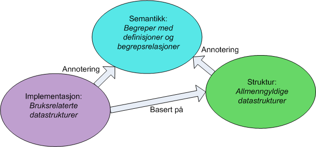

{}
**SERES er lagt ned**

Vi viser til tidligere informasjon om utfasingen av SERES innen 1. mars 2023, og overgang til ny [datamodellerinsløsning i Altinn Studio](https://docs.altinn.studio/nb/app/development/data/data-model/). SERES er nå lagt ned som datamodelleringsløsning. 

Spørsmål knyttet til den nye datamodelleringsløsningen i Altinn Studio kan stilles i slack-kanalen [#datamodelling](https://altinn.slack.com/archives/C041WMBLYMB) på altinn.slack.com eller sendes på e-post til tjenesteeier@altinn.no.

Utviklingsoppgavene til [Altinn Studio](https://docs.altinn.studio/nb/), inkludert datamodelleringsløsningen, blir åpent dokumentert på GitHub. For å registrere behov eller feil, samt se hvilke behov og feil som allerede er registrert, klikk [her.](https://github.com/Altinn/altinn-studio/issues)

{}

I **SERES** (**SE**mantikk**R**egister for **E**lektronisk **S**amhandling) kan brukere etablere og forvalte sine egne metadata til bruk i informasjonsforvaltning og tjenesteproduksjon. 
Det etableres modeller som beskriver informasjon innenfor et domene. Et domene er i denne sammenheng en offentlig aktør, tjenesteeier eller et fagområde.

Ut fra disse informasjonsmodellene kan brukeren lage produkter (p.t. meldingsspesifikasjoner) til bruk i tjenesteutviklingen.

{}

Det er stadig økende forventninger fra privatpersoner, næringslivsaktører, politikere og media til konglomeratet av IT-løsninger som settes opp for informasjonsutveksling med og mellom offentlige institusjoner. Kravene til kvalitet tvinger frem tunge, kostbare utviklingsprosjekter for å etablere og vedlikeholde løsningene.

For å møte denne utfordringen må en bygge løsninger på en smart måte ved å benytte standard programvare-komponenter og minst mulig skreddersøm. Det er i denne erkjennelsen dagens SERES-løsning er utviklet der modelldrevet arkitektur er et sentralt stikkord.

**Følgende scenarier kan illustrere forventningene:**  
Adresseendring må kunne meldes i enhver løsning hvor disse dataene etterspørres. Endringen må deretter distribueres til hele offentlig sektor, både stat, kommuner og viktige næringslivsaktører som for eksempel Posten.
Spesifikasjon av hemmelig adresse må ha en restriktiv distribusjon. Vi trenger altså beskrivelser som setter konfidensialitet av data.
Lønnsrapportering fra en bedrift må kunne gjøres samlet en gang per måned tilknyttet lønnskjøringer i bedriften. Lønnsdata distribueres så til alle offentlig brukere av disse dataene.
En lege som kommer til et ulykkessted må få tilgang til journalinformasjon som er kritisk for behandlingen, men ikke noe mer.
Mange lokale kopier av data medfører økt risiko for utilsiktet lekkasje. Og datakvaliteten forringes fordi oppdatering av dataene gjerne ligger etter.

{}

{}

Metadata er et begrep som er vanskelig å unngå når en beskriver den type løsninger som SERES representerer. Metadata er alt som forklarer betydningen av de enkelte dataelementene og de sammenhengene de inngår i. I et regneark med data plassert i rader og kolonner er det vanlig å bruke første rad for å forklare hvilke data en legger inn i de øvrige cellene:

I figuren over er de hvite cellene de rene dataene, mens de grønne cellene er metadata.

Dersom disse dataene skal flyttes til andre regneark eller helt andre programmer/systemer, må en vite mer enn navnene på metadata-elementene - for eksempel hva de betyr (definisjoner) og sammenhengen de blir brukt i m.m.

{}

{} 

### Hovedprinsipper

- Det bygges et begrepsapparat som beskriver offentlig informasjon (f. eks. person, fødselsnummer, adresse) der hvert begrep blir definert og satt i forhold til andre begreper (f. eks. ansatt er en type person som kan uttrykkes som en rolle for eller et underbegrep av person). Begrepsapparatet forvaltes som et antall såkalte begrepsmodeller på et modellnivå kalt begrepsnivå.
- Det utvikles allmenngyldige sammenstillinger av begreper, kalt strukturelementer som blir organisert i strukturmodeller, der noen begreper sies å være egenskaper for andre begreper (f. eks. at fødselsnummer er en egenskap for person). Knytningen mellom et strukturelement og tilhørende begrep kalles en annotering. Strukturmodellene hører til modellnivået strukturnivå.
- Det utformes bruksnære dataelementer som inngår i datamodeller (f. eks. fødselsnummer angitt som et 11-sifret positivt heltall. Dataelementene kan alternativt inngå i beskrivelser av meldinger (meldingsmodeller) eller beskrivelser av skjemaer m.m. (presentasjonsmodeller). Et dataelement bør så langt det er mulig være basert på og varig peke til et tilhørende strukturelement fra en strukturmodell. Datamodeller, meldingsmodeller og presentasjonsmodeller hører til modellnivået implementasjonsnivå.

Alle begreper, strukturelementer og dataelementer, slik beskrevet over, utgjør det en kaller metadata.

 

### Domener
Alle typer modeller vil tilhøre spesifikke kataloger med underliggende domener som representerer informasjon forvaltet av etater m.m. eller innenfor fagområder. Hvert domene er delt i tre nivåer, et begrepsnivå med begrepsmodeller, et strukturnivå med strukturmodeller og et implementasjonsnivå med datamodeller, meldingsmodeller og presentasjonsmodeller.

Begreper i vanlige domener kan være semantisk relatert til:

- andre begreper i samme begrepsmodell
- begreper i andre begrepsmodeller i eget domene

Elementene på strukturnivået og implementasjonsnivået vil primært ha semantiske annoteringer mot begreper i samme domene.

Meldingsmodellene er grunnlag for generering av meldingsspesifikasjoner. Presentasjonsmodellene kan også brukes for å generere meldingsspesifikasjoner, men er først og fremst ment som grunnlag for
generering av web-baserte skjemaer.

### Repository og klienter
Metadata lagres i et internutviklet repository (SERES Repository) som er basert på Elasticsearch. Brukere produserer metadata samt utveksler metadata med repository ved hjelp av klienten SERES Domeneklient. Klienten er en internutviklet standalone-klient som kjører under Windows.

{}

{}
