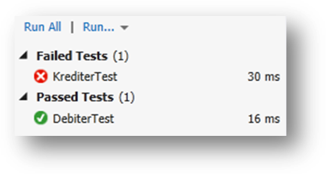

## Teknologi og rammeverk

### Windows Communication Foundation

Windows Communication Foundation (WCF) er en rammeverk for å bygge service orienterte applikasjoner (SOA).
WCF lar utviklere bygge løsninger som kan integreres på tvers av plattformer og samarbeider med eksisterende systemer.
WCF lar applikasjoner kommunisere med hverandre uavhengig om de er på samme maskin, på tvers av nettverk, eller på forskjellige plattformer.
De grunnleggende oppgavene er for å implementere en WCF applikasjon er:

- Definere en service contract
- Implementere servicen basert på contract
- Hoste servicen
- Implementer klient applikasjon

En service contract er det som beskriver hvilke operasjoner en tjeneste tilbyr. En operasjon er definert gjennom en operation contract.
Input- og output-verdier til operasjonen kan være enkle eller komplekse typer.
De komplekse typene beskrives med en data contract med en eller flere data members.
I WCF defineres en service contract med et interface med metoder, mens en datakontrakt er en klasse med klassevariabler.
Når tjenesten tilgjengeliggjøres på en web-server blir datakontraktene oversatt til XSD mens tjenestekontraktene blir
oversatt til en WSDL med referanse til XSDene. Denne kan deretter distribueres til klientene slik at disse kan kommunisere
med tjenesten via SOAP eller andre protokoller.

### Service Contract

En service contracten er et interface eller en klasse som eksponerer funksjonalitet.
Interfacet eller klassen annoteres med `[ServiceContract]` og eventuelt namespace som vist i eksempelet.

Eksempel på tjenestekontrakt:

```csharp
[ServiceContract(Namespace=”brreg.no/api/sampleservice/2012/11/”)]
public interface ISampleService
{
  [OperationContract]
  public string GetString();

  [OperationContract]
  public int GetInt();  
}
```

Metoder som annoteres med [OperationContract] vil være de metoder som blir offentliggjort til konsumenter av servicen.
En service contract kan være enten en klasse eller et interface, men det anbefales å bruke interface.
Dette gjør det mulig at et service contract interface kan extende en eller flere andre interface,
samtidig som at andre klasser kan implementere flere service contracts.


### Data Contract

Service orienterte WCF applikasjoner er designet slik at de skal kunne brukes mellom forskjellige konsumenter uavhengig av
plattform og transportmedium. Derfor annoteres klasser som skal kommuniseres med `[DataContract]`, mens variabler i klassen som vil
være dataen som skal sendes/mottas annoteres `[DataMember]`.

Eksempel på en datakontrakt:

```csharp
using System;
using System.Runtime.Serialization;

[DataContract]
public class Person
{
    // This member is serialized.
    [DataMember]
    internal string FullName;

    // This is serialized even though it is private.
    [DataMember]
    private int Age;

    // This is not serialized because the DataMemberAttribute 
    // has not been applied.
    private string MailingAddress;

    // This is not serialized, but the property is.
    private string telephoneNumberValue;

    [DataMember]
    public string TelephoneNumber
    {
        get { return telephoneNumberValue; }
        set { telephoneNumberValue = value; }
    }
}
```

Disse annotasjonene brukes for at klasser og variabler skal bli serialisert ved bruk av WCF sin
[DataContractSerializer](https://docs.microsoft.com/en-us/dotnet/framework/wcf/feature-details/data-contract-serializer).
Det går alternativt an å benytte andre serializere dersom det kreves større kontroll over den serialiserte informasjonen,
men det er DataContractSerializer med attributtering som er den anbefalte serializeren.

Verdt å nevne er at data contracts er uavhengig av access modifier.
Det vil si at private variabler i en klasse kan serialiseres og sendes avgårde til konsumering.

### Implementere en tjeneste

En tjenestekontrakt må følges av en implementasjon. Dette er en vanlig klasse som implementerer tjenestekontrakt-interfacet.
Utvikleren står fritt til å implementere metoden som ønsket så lenge interfacets kontrakt er ivaretatt.

Eksempel på implementasjon av en tjeneste:

```csharp
public class SampleService : ISampleService
{
  public string GetString()
  {
    return “Hello world”;
  }

  public int GetInt(){
    return 42;
  }  
}
```

### Kjøre en service

For å tilgjengeliggjøre en tjeneste for bruk må denne «hostes» i et kjøretidsmiljø.
Dette kan gjøres på ulike måter, men det vanligste er å la Internet Information Services (IIS, Windows sin Web-server) kjøre tjenesten.
Dette gjøres ved å legge en .svc-fil sammen med den installerte tjenesten. Denne inneholder informasjon til IIS om hvilken tjeneste
som skal tilgjengeliggjøres.

Eksempel på en .svc-fil:

```csharp
<%@ServiceHost Language="C#" Service="Tempuri.Demo.Service" %>
```

I .svc-fila angis det hvilket .NET språk tjenesten er skrevet i, om det skal være debuggingsmulighet og hvilken tjeneste som skal hostes.
Det skal da refereres til implementasjonen med fullt kodenamespace og ikke tjenestekontrakten.

Under utvikling kan man benytte Visual Studio til å hoste tjenesten slik at man ikke trenger å installere løsningen på IIS først.
Fra Visual studio kan WCF Test Client benyttes til å teste tjenesten. Dette gjøres ved å starte opp prosjektet fra Visual Studio
slik at denne hostes av den innebygde webserveren.
Testklienten vil da starte ferdig oppkoblet mot tjenesten slik at tjenesten enkelt kan testes.

### Service Reference

For å lage en WCF proxy/klient som konsumerer en service contract er man nødt til å sette opp noe som kalles en "Service Reference"
i klient prosjektet. Dette gjøres på følgende måte:

1. Verifiser at tjenesten du skal koble til kjører
2. Høyreklikk på prosjektet og velg &quot;Add Service Reference&quot;
   
3. Skriv inn URL&#39;en som hosten har som adresse og trykk på GO. Tjenesten vil nå lastes og tilgjengelige operasjoner vil vises.
   Angi her også hvilket namespace proxy-koden skal ha.
   
4. Trykk OK for å generere proxy-klassene.

Nå har du laget en proxy som klient applikasjonen vil bruke til å kalle servicen.
Nå har en mulighet til å opprette klient objekter som kan aksessere og bruke metodene som er definert i en Service Contract.

### Konfigurasjon

Konfigurasjon av WCF på både klient og server-side gjøres i App.config-filen som ligger med prosjektet.
Denne xml-filen inneholder ulike konfigurasjonselementer for applikasjonen.
WCF-spesifikk konfigurasjon ligger i xml-elementet system.serviceModel.

De viktigste elementene er:

Seksjon    | Beskrivelse
---------- | --------------------------------------------------------
Behaviours | Her konfigureres oppførselen til endepunktene. Dette kan være sikkerhetsmekanismer, serialiseringsoppførsel og lignende.
Bindings   | Her konfigureres det hvordan overføringen skal være. Dette inkluderer hvilken protokoll og overføringsmekanisme som skal benyttes. Her kan også begrensninger på tidsbruk, pakkestørrelse og lignende settes.
Client     | Her angis konfigurasjonsparametere for klienten. Det vil her listes opp de tjenester klienten kan kobles seg til og hvilke behaviours, bindings og lignende disse skal benytte.
Services   | Her konfigureres det hvilke tjenester en server skal tilby og hvilke behaviours, bindings og lignende tjenesten skal tilbys med.

### Videre lesning

Tema                             | Link
-------------------------------- | ----------------------------------------------------------------------
Windows Communication Foundation | http://msdn.microsoft.com/en-us/library/vstudio/ms735119(v=vs.90).aspx
Service Contracts                | http://msdn.microsoft.com/en-us/library/vstudio/ms733070(v=vs.90).aspx
Serialisering                    | http://msdn.microsoft.com/en-us/library/vstudio/ms732038(v=vs.90).aspx
WCF tutorial                     | http://msdn.microsoft.com/en-us/library/ms734712.aspx
Basic WCF Programming Lifecycle  | http://msdn.microsoft.com/en-us/library/vstudio/ms732098(v=vs.90).aspx

## Testrammeverk

Testrammeverket i .NET, MSTest framework, eller Visual Studio Unit Testing, er basert på enhetstesting.

Den anbefalte arbeidsmåten er å opprette et nytt testprosjekt i samme solution som prosjektet man vil teste.
Man lager da én kildefil med tester for hver kildefil i kildeprosjektet.

### Testklasser

Hver testklasse hører til én kildeklasse. De er annotert med [TestClass].
Navnekonvensjonen er at testklasser navngis som klassen den skal teste, med et Test-postfiks.

#### Navngiving og markering av testklasser

I hver testklasse vil man kunne definere rutiner, som for eksempel hva man vil gjøre før og etter at man kjører klassen,
og før og etter hver test. Metodene for disse rutinene er annotert som:

```csharp
[ClassInitialize]
[ClassCleanup]
[TestInitialize]
[TestCleanup]
```
### Testmetoder

Testmetoder har postfikset Test i navnet, og er annotert med [TestMethod].  Et eksempel på en testmetode:

```csharp
[TestMethod]
public void DebiterTest()
{
  // Test
}
```

Det er anbefalt at testmetoder er uavhengig av hverandre, og at de kun tester én funksjon. 
For eksempel vil metoden over ikke benytte andre testmetoder i det hele tatt, og den vil kun teste om debitering av en konto gjøres riktig.
Test av for eksempel kreditering gjøres av en egen metode.

### Assert-klassen

Assert-klassen inneholder hjelpemetoder for å verifisere at riktig resultat oppnås. Eksempler på metoder i denne klassen er:

- AreEqual
- AreNotEqual
- AreSame
- AreNotSame
- IsNull
- IsNotNull

Under blir det testet at debitering av en konto gjøres riktig. 
Først settes saldoen på bankkontoen til `11.99`. Deretter debiteres den med `11.22`. 
Assert.AreEqual sjekker at den resterende saldoen etter debitering er `0.77`.

```csharp
[TestMethod]
public void DebiterTest()
{
    BankKonto target = new BankKonto();
    target.Saldo = 11.99;
    double beloep = 11.22;
    target.Debiter(beloep);
    Assert.AreEqual(0.77, target.Saldo);
}
```

Hvis ikke saldoen hadde vært `0.77` ville Assert.AreEqual kastet en AssertFailedException.
Testrammeverket plukker opp AssertFailedException og markerer metodene hvor disse kastes fra som feilede tester.

### Kjøre tester

For å kjøre tester i Visual Studio velger man Test på hovedmenyen.
Der kan du velge å kjøre eller debugge alle eller enkelte tester i løsningen.
Resultatet av en kjøring vil vises i et resultatvindu som vist under.



### Videre lesning

Tema                               | Link
---------------------------------- | ----------------------------------------------------------------
Verifying Code by Using Unit Tests | https://msdn.microsoft.com/en-us/library/dd264975(v=vs.100).aspx
Creating and Running Unit Tests    | https://msdn.microsoft.com/en-us/library/ms182532(v=vs.100).aspx
Wikipedia: Unit testing            | https://en.wikipedia.org/wiki/Unit_testing
