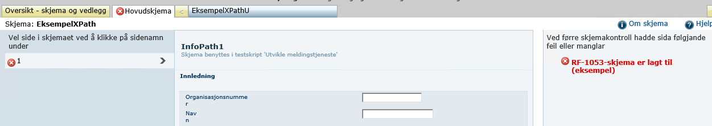

I Testdepartementet finnes det eksempeltjenester som viser bruk av regelmotor.

Disse finner du her:  
<http://sttul01.altinn.basefarm.net/sites/acn/RegelmotorEksempel/EksempelXPath/default.aspx>
<http://sttul01.altinn.basefarm.net/sites/acn/RegelmotorEksempel/EksempelOR/default.aspx>

## Eksempeltjeneste som bruker XPath

Denne eksempeltjenesten er basert på "InfoPath1" som hovedskjema og RF-1053 "RF-1053 Fradrag i skatt for forskning og
utvikling 2012" som underskjema.

Fellesoppsett for alle reglene:

```xml
<?xml version="1.0" encoding="UTF-8"?>
<AltinnRuleEngine name="InfoPath1" version="Beta">
  <Description>Samples using XPath as field identificator.</Description>
  <Configuration>
    <Forms default="1080">
      <!--target-->
      <Form name="InfoPath1"
            dataFormatId="1080"
            validationEngine="AltinnRuleEngine"
            calculationEngine="AltinnRuleEngine"/>
      <!--source-->
      <Form name="RF-1053"
            dataFormatId="866"
            validationEngine="AltinnRuleEngine"
            calculationEngine="AltinnRuleEngine"/>
    </Forms>
  </Configuration>
</AltinnRuleEngine>
```
### Flytte en verdi fra et hovedskjema til et underskjema

For å overføre en verdi fra et skjema til et annet bruker vi regeltypen «TransferValue». Vi setter opp hvilket felt som
er kilde i «Source» og hvilket felt verdien skal kopieres til i «Target». I tillegg har vi lagt til en sjekk på at det
finnes en verdi i kildefeltet. Dette er gjort ved å legge til en «condition» av type «HasValue». Er det ingen verdi i
kildefeltet vil denne feile, og regelen blir ikke utført.

```xml
<!-- Transferring value from main form to sub form -->
<Rule type="TransferValue" 
      description="Transferring value from InfoPath1 form to RF-1053 form">
  <Source form="998" field="/Skjema/OpplysningerOmPersonligeForholdMv-grp-4886/OpplysningerOmPersonligeForholdMv-grp-4529/Skattyter-grp-4531/SelvangivelseType-datadef-27745"/>
  <Target form="866" field="/Skjema/GenerellInformasjon-grp-2228/Revisor-grp-2231/RevisorOrganisasjonsnummer-datadef-1938"/>
  <Param name="IgnoreGUID" value="true"/>
  <Condition type="HasValue" check="/Skjema/OpplysningerOmPersonligeForholdMv-grp-4886/OpplysningerOmPersonligeForholdMv-grp-4529/Skattyter-grp-4531/SelvangivelseType-datadef-27745" form="998"/>
</Rule>
```

Verdien blir hentet fra «Organisasjonsnummer» i hovedskjemaets første side.


Dersom vi har en verdi her, vil samme verdi dukke opp i feltet "organisasjonsnummer" (under revisor) i underskjema.


### Vis melding om en validering feiler

Her viser vi hvordan du kan gjøre en sjekk og vise en feilmelding dersom denne sjekken avdekker en ugyldig tilstand. Vi
setter opp hvilket felt som skal motta valideringsmeldingen i «Target». Selve valideringen setter vi opp i «Condition».
Her har vi valgt type «IsNegative». Feltet som skal sjekkes fører vi opp i «check». Inne i «Texts» legger vi inn en
valideringsmelding for både bokmål, nynorsk og engelsk.

```xml
<!-- Validate the XPath value. If it fails, shows the validation at check form -->
<Rule type="SimpleValidation"
        description="Validate the field value. If it fails shows the validation at check form">
  <Target field="/Skjema/Innledning-grp-8781/EnhetOrganisasjonsnummer-datadef-18"/>
  <Condition type="IsNegative" check="/Skjema/Innledning-grp-8781/EnhetOrganisasjonsnummer-datadef-18"/>
  <Texts>
    <Text lang="1044">Negativ verdi er ikke lovlig.</Text>
    <Text lang="2068">Negativ verdi er ikkje lovleg.Text>
    <Text lang="1033">Negative values are not allowed.</Text>
  </Texts>
</Rule>
```

Dersom vi setter inn en negativ verdi i organisasjonsnummer, vil vi etter å ha trykket «Kontroller skjema» få opp
meldingen.


### Sjekker om et spesifikt underskjema er til stede

Valideringsregel som sjekker om underskjemaet RF-1053 er til stede. Vi bruker her «condition» av type «HasForm», og
setter skjemaet vi leter etter i «form».

```xml
<!-- Check whether RF-1053 form is added to main form or not -->
<Rule type="SimpleValidation"
      description="Check whether RF-1053 form is added to main form or not">
  <Target field="/Skjema/Innledning-grp-8781/EnhetOrganisasjonsnummer-datadef-18 "/>
  <Condition type="HasForm" form="866"/>
  <Texts>
    <Text lang="1044">RF-1053-skjema er lagt til (eksempel)</Text>
    <Text lang="2068">RF-1053-skjema er lagt til (eksempel)</Text>
    <Text lang="1033">RF-1053 form is added</Text>
  </Texts>
</Rule>
```
Etter å ha trykket «Kontroller skjema» får vi opp meldingen dersom underskjema er på plass.



### Fjerner et felt om det eksisterer, og et annet felt ikke har en verdi

I dette eksempelet skal vi fjerne et felt basert på om to vilkår er innfridd eller ikke. Vi bruker feltet «Navn» i
hovedskjemaet for dette, og forteller dette i «Source». De to kravene vi må innfri for å fjerne feltet er at «Navn» ikke
skal ha noen verdi og at «Poststed» skal ha en verdi. Vi bruker «condition» av type «IsEmpty» for det første kravet. For
krav nummer to bruker vi typen «HasValueIgnoreZero».

```xml
<!-- Remove field if it exists when user doesn't have value for that field and another specific field has value. -->
<Rule type="RemoveFieldElement"
      description="Remove EnhetNavn if it exists, if EnhetNavn does not have value and EnhetPoststed has a value">
  <Source form="1080" field="/Skjema/Innledning-grp-8781/EnhetNavn-datadef-1"/>
  <Param name="IgnorePrefill" value="true"/>
  <Param name="AlwaysRun" value="true" />
  <Condition type="IsEmpty" check="/Skjema/Innledning-grp-8781/EnhetNavn-datadef-1"/>
  <Condition type="HasValueIgnoreZero" form="1080" check="/Skjema/Innledning-grp-8781/EnhetPoststed-datadef-6674" />
</Rule>
```

Dersom vi har lagt inn en verdi i poststed, og samtidig ikke har en
verdi i navn, vil feltet «navn» bli fjernet (det er ikke lenger mulig å skrive i det). Dette vil skje når skjemaet blir
lastet inn på nytt (for eksempel ved å navigere ut av skjemaet og tilbake igjen).


### Komplett regelfil med alle XPath-eksemplene

```xml
<?xml version="1.0" encoding="UTF-8"?>
<AltinnRuleEngine name="InfoPath1" version="Beta">
  <Description>Samples using XPath as field identificator.</Description>
  <Configuration>
    <Forms default="1080">
	    <!--target-->
      <Form name="InfoPath1"
            dataFormatId="1080"
            validationEngine="AltinnRuleEngine"
            calculationEngine="AltinnRuleEngine"/>
			<!--source-->
      <Form name="RF-1053"
            dataFormatId="866"
            validationEngine="AltinnRuleEngine"
            calculationEngine="AltinnRuleEngine"/>
    </Forms>           
  </Configuration>
  <Rules>	
	  <!-- Transferring value from main form to sub form -->
	  <Rule type="TransferValue" description="Transferring value from InfoPath1 form to RF-1053 form">
		  <Source form="1080" field="/Skjema/Innledning-grp-8781/EnhetOrganisasjonsnummer-datadef-18"/>
		  <Target form="866" field="/Skjema/GenerellInformasjon-grp-2228/Revisor-grp-2231/RevisorOrganisasjonsnummer-datadef-1938"/>
		  <Param name="IgnoreGUID" value="true"/>
		  <Condition type="HasValue" check="/Skjema/Innledning-grp-8781/EnhetOrganisasjonsnummer-datadef-18" />
		</Rule>
		<!-- Validate the xpath value. If it fails, shows the validation at check form -->
		<Rule type="SimpleValidation" description="Validate the field value. If it fails shows the validation at check form">
      <Target field="/Skjema/Innledning-grp-8781/EnhetOrganisasjonsnummer-datadef-18"/>
      <Condition type="IsNegative" check="/Skjema/Innledning-grp-8781/EnhetOrganisasjonsnummer-datadef-18"/>
      <Texts>
        <Text lang="1044">Negativ verdi er ikke lovlig.</Text>
        <Text lang="2068">Negativ verdi er ikkje lovleg.Text>
        <Text lang="1033">Negative values are not allowed.</Text>
      </Texts>
    </Rule>
	  <!-- Check whether RF-1053 form is added to main form or not -->
	  <Rule type="SimpleValidation" description="Check whether RF-1053 form is added to main form or not">
			<Target field="/Skjema/Innledning-grp-8781/EnhetOrganisasjonsnummer-datadef-18"/>
      <Condition type="HasForm" form="866"/>         
      <Texts>
        <Text lang="1044">RF-1053-skjema er lagt til (eksempel)</Text>
        <Text lang="2068">RF-1053-skjema er lagt til (eksempel)</Text>
        <Text lang="1033">RF-1053 form is added</Text>
      </Texts>
    </Rule>
	  <!-- Remove field if it exists when user doesn't have value for that field and another specific field has value. -->
    <Rule type="RemoveFieldElement"
          description="Remove EnhetNavn if it exists, if EnhetNavn does not have value and EnhetPoststed has a value">
      <Source form="1080" field="/Skjema/Innledning-grp-8781/EnhetNavn-datadef-1"/>
      <Param name="IgnorePrefill" value="true"/>
	    <Param name="AlwaysRun" value="true" />
	    <Condition type="IsEmpty" check="/Skjema/Innledning-grp-8781/EnhetNavn-datadef-1"/>
      <Condition type="HasValueIgnoreZero" form="1080" check="/Skjema/Innledning-grp-8781/EnhetPoststed-datadef-6674" />
    </Rule>
  </Rules>
</AltinnRuleEngine>
```

## Eksempeltjeneste som bruker OR-id

Denne eksempeltjenesten er basert på OR-skjemaene RF-1053 «Fradrag i skatt for forskning og utvikling 2012» og RF-1016
«Formue av skogseiendom».

Fellesoppsett for alle reglene:

```xml
<?xml version="1.0" encoding="UTF-8"?>
<AltinnRuleEngine name="RF-1016" version="Beta">
  <Description>Sample rules</Description>
  <Configuration>
    <Forms>
      <Form name="RF-1016"
            dataFormatId="1187"
            validationEngine="Both"
            calculationEngine="Both"/>
      <Form name="RF-1053"
            dataFormatId="866"
            validationEngine="Both"
            calculationEngine="Both"/>
    </Forms>
    <Codelists>
      <Codelist name="SKD_Kommuner_Prod" version="543" lang="1044"/>
      <Codelist name="ASF_Land" version="404" lang="1044"/>
    </Codelists>
  </Configuration>
</AltinnRuleEngine>
```

### Sette verdi basert på en betingelse

I dette eksempelet skal vi sette en gitt verdi til et felt i et skjema (RF-1016) om et annet skjema (RF-1053) er til
stede. Her skal vi sette verdien i «Navn» under Enkeltpersonforetak til «Underskjema er lagt til» når underskjemaet
RF-1053 er lagt til.

Dette gjør vi ved å definere en «SetFieldValue»-regel. I denne definerer vi RF-1016 (som har id 1187) og feltet med orid
68 («Navn») som target. Verdien vi vil ha legger vi inn i «value». Parameteren «AlwaysRun» er lagt til for at regelen
både skal kjøres under utregning og validering. I «condition» forteller vi at denne verdien bare skal bli lagt til om
skjemaet 866 (RF-1053) er til stede.

```xml
<!-- When RF-1053 is added, field with orid 68 gets a pre-defined value -->
<Rule type="SetFieldValue" description="When RF-1053 is added, transfer value to orid 1937">
  <Target form="1187" field="orid(68)" value="Underskjema er lagt til"/>
  <Param name="AlwaysRun" value="true"/>
  <Condition type="HasForm" form="866"/>
</Rule>
```

Med denne regelen på plass vil skjemaet se slik ut dersom du ikke har lagt til underskjemaet:


Med underskjemaet lagt til ser det slik ut:


### Overføre verdi fra et skjema til et annet

Overfører en verdi fra et skjema (RF-1053) til et annet skjema (RF-1016).

```xml
<!-- Transfer a value from  RF-1053 to RF-1016-->
<Rule type="TransferValue"
      description="Transfer a value from RF-1053 to RF-1016">
  <Source form="866" field="orid(1938)"/>
  <Target form="1187" field="orid(18)" index="0"/>
  <Param name="IgnoreGUID" value="true"/>
  <Condition type="HasValue" check="orid(1938)" form="866"/>
</Rule>
```

Det er feltet «organisasjonsnummer» under revisor som er kilde i denne regelen.


Dersom vi legger inn en verdi her vil verdien bli kopiert over til hovedskjemaet.


Verdien vil du finne igjen i «organisasjonsnummer» under «Selskap».


### Overføre verdi basert på et vilkår

Dette eksempelet viser hvordan du kan sjekke en tilstand og basert på denne sette en verdi. Her ser vi på radioknapper
for «Ja» og «Nei» i underskjema. I «condition» velger vi type «equals», som betyr at regelen blir utført dersom verdien
i det feltet vi sjekker er lik den verdien vi legger inn i «value». Vi skal i dette tilfellet altså utføre regelen
dersom verdien i den valgte radioknappen er «Ja».

```xml
<!-- If radio button selected as "Yes" in RF-1053 then a pre-defined value is added to RF-1016 -->
<Rule type="SetFieldValue"
        description="When orid_17413 from RF-1053 is YES, transfer value to field">
  <Source form="866" field="orid(17413)"/>
  <Target form="1187"
          field="orid(1)"
          value="Valgt verdi er 'Ja' i RF-1053"/>
  <Param name="AlwaysRun" value="true"/>
  <Condition type="Equals"
              check="orid(17413)"
              value="Ja"
              form="866"
              fieldindex="0"/>
</Rule>
```


Verdien vi sjekker er det som er valgt i radioboksene (“Ja”/”Nei”) for
«101 Tilfredsstiller foretaket vilkårene…» i underskjemaet.


Dersom du velger «Ja» så vil verdien «Valgt verdi er ‘Ja’ i RF-1053» bli satt i feltet «Virksomhetens navn» i
hovedskjemaet.


### Gi en verdi til et felt dersom en betingelse inntreffer

Dersom et felt (17415) mangler verdi blir feltet satt til verdien “0”. Regeltypen vi bruker her er «SetFieldValue», som
setter en verdi vi bestemmer i «value». For at dette ikke skal skje uansett velger vi «IsMissing» som type for vår
betingelse («condition»). Feltet vi skal sjekke fører vi opp i «check». Her har vi satt samme felt som mål for verdien
som feltet vi brukte til å sjekke betingelsen. Vi kan også bruke ulike felt til dette.

```xml
<!-- If a field is missing a value, the value 0 is set to the field -->
<Rule type="SetFieldValue" description="For 866">
  <Source form="866"/>
  <Target form="866" field="orid(17415)" value="0"/>
  <Param name="DoNotIgnoreZeroValue" value="true"/>
  <Condition type="IsMissing" check="orid(17415)"/>
</Rule>
```

Feltet «204 Totale FoU kostnader …» i underskjemaet blir automatisk
satt til 0 dersom verdi mangler i dette feltet.


### Gjøre en utregning og overføre resultatet til et annet skjema

Gjør en utrekning i et skjema (RF-1053) og overfører resultatet til et annet skjema (RF-1016). Vi bruker regeltypen
«TransferResult». Vi bestemmer hvilke verdier som skal med i utregningen i «addFields» og «subtractFields». Vi har bare
brukt et felt i hver av disse, men du kan også legge til flere felt om du ønsker det. Da bruker du komma til å skille
mellom feltene. Utregningen vi får i dette eksempelet er summen vi får når vi legger til verdien i feltet i «addFields»
og trekker fra verdien i feltet i «subtractFields».

```xml
<!-- Add the value from one field and subtract the value from another field. Transfer the result to RF-1016 form -->
<Rule type="TransferResult" description="Transferring Result">
  <Source form="866" addFields="orid(24107)" subtractFields="orid(17418)"/>
  <Param name="IgnoreGUID" value="true"/>
  <Target form="1187" field="orid(24974)"/>
</Rule>
```
I underskjemaet bruker vi feltene «206 Herav kostnader til ulønnet
arbeidsinnsats …» og «207 Hvis prosjektet mottar…» som grunnlag for utregningen. Her skal altså verdien 150 trekkes fra
verdien 200.


Resultatet av utregningen (50) vil dukke opp i feltet «Super bonitet 0,7 kbm pr da» i hovedskjemaet.


### Oversikt over felter brukt i OR-eksempelet

RF-1016:

  - Orid(1) = «Virksomhetens navn»  
    (EnhetNavn-datadef-1, Visning 1)
  - Orid(18) = «Organisasjonsnummer»  
    (EnhetOrganisasjonsnummer-datadef-18, Visning 1)
  - Orid(24974) = «Super bonitet 0,7 kbm pr da»  
    (SkogBonitetSvartHoyAreal-datadef-24974, Visning 3)

RF-1053:

  - Orid(1938) = «Organisasjonsnr.» (revisor)  
    (RevisorOrganisasjonsnummer-datadef-1938, Visning1)
  - Orid(17413) = “101 Tilfredsstiller foretaket vilkårene i forskrift av 19. november 1999 nr 1158 til skatteloven
    (FSFIN § 16-40-5) til SMB (små og mellomstore bedrifter)?” (EnhetESAVilkarStorrelse-datadef-17413, Visning 1)
  - Orid(17415) = «204 Totale FoU kostnader, inkl. ev. kostnader knyttet til ulønnet arbeidsinnsats som ikke omfattes av
    den ordinære skattefunnordningen»  
    (KostnaderFoUSpesifisertProsjekt-datadef-17415, Visning 2)
  - Orid(17418) = «207 Hvis prosjektet mottar annen off. støtte; oppgi dette beløpet her»
    (ProsjektStatsstotteSkattefradragReduksjonSpesifisertProsjekt-datadef-17418, Visning 2)
  - Orid(24107) = «206 Herav kostnader knyttet til ulønnet arbeidsinnsats som ikke omfattes av den ordinære
    skattefunnordningen (Se rettledningen.)» (KostnaderFoUUlonnetArbeidSpesifisertProsjekt-datadef-24107, Visning 2)

### Komplett regelfil med alle eksemplene

```xml
<?xml version="1.0" encoding="UTF-8"?>
<AltinnRuleEngine name="RF-1016" version="Beta">
  <Description>Set field value and transferring value to RF-1016</Description>
  <Configuration>
    <Forms>
      <Form name="RF-1016"
            dataFormatId="1187"
            validationEngine="Both"
            calculationEngine="Both"/>
      <Form name="RF-1053"
            dataFormatId="866"
            validationEngine="Both"
            calculationEngine="Both"/>
    </Forms>
    <Codelists>
      <Codelist name="SKD_Kommuner_Prod" version="543" lang="1044"/>
      <Codelist name="ASF_Land" version="404" lang="1044"/>
    </Codelists>
  </Configuration>
  <Rules>
    <!-- When RF-1053 is added, field with orid 68 gets a pre-defined value -->
    <Rule type="SetFieldValue"
          description="When RF-1053 is added, set value to orid(1)">
      <Target form="1187" field="orid(68)" value="Test"/>
      <Param name="AlwaysRun" value="true"/>
      <Condition type="HasForm" form="866"/>
    </Rule>

    <!-- Transfer a value from  RF-1053 to RF-1016 -->
    <Rule type="TransferValue"
         description="Transfer the value from RF-1053 to RF-1016">
      <Source form="866" field="orid(1938)"/>
      <Target form="1187" field="orid(18)" index="0"/>
      <Param name="IgnoreGUID" value="true"/>
      <Condition type="HasValue" check="orid(1938)" form="866"/>
    </Rule>

    <!-- If Radio button selected as "Yes" in RF-1053 then a pre-defined value is added to RF-1016 -->
    <Rule type="SetFieldValue"
            description="When orid_17413 from RF-1053 is YES, transfer value to field">
      <Source form="866" field="orid(17413)"/>
      <Target form="1187"
              field="orid(1)"
              value=" Valgt verdi er 'Ja' i RF-1053"/>
      <Param name="AlwaysRun" value="true"/>
      <Condition type="Equals"
                 check="orid(17413)"
                 value="Ja"
                 form="866"
                 fieldindex="0"/>
    </Rule>

    <!-- If a field is missing a value, the value 0 is set to the field -->
    <Rule type="SetFieldValue" description="For 866">
      <Source form="866"/>
      <Target form="866" field="orid(17415)" value="0"/>
      <Param name="DoNotIgnoreZeroValue" value="true"/>
      <Condition type="IsMissing" check="orid(17415)"/>
    </Rule>

    <!-- Add the value from one field and subtract the value from another field. Transfer the result to RF-1016 form -->
    <Rule type="TransferResult" description="Transferring Result">
      <Source form="866" addFields="orid(24107)" subtractFields="orid(17418)"/>
      <Param name="IgnoreGUID" value="true"/>
      <Target form="1187" field="orid(24974)"/>
    </Rule>
  </Rules>
</AltinnRuleEngine>
```