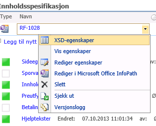

Enkelt sagt er det en «motor» som kan opprette, lese, oppdatere og slette felter på tvers av
flere ulike skjema (representert med xml). Samtidig kan den verifisere at skjema (xml-dokumentet) samsvarer med det som
er spesifisert som lovlig (xsd-spesifikasjonen).

Regelmotoren tilbyr et sett med regler som du som tjenesteutvikler kan benytte deg av. Dette gjør du ved å definere
hvilke skjema og regler du vil bruke i et xml-dokument. Dokumentet må følge det [oppsettet](../xsd/) som det er bestemt at enn slik
regelfil skal ha.

## Tegnveiledning for denne håndboken

I eksemplene i denne håndboken bruker vi ellipse-tegnet (…) for å markere at det på denne plasseringen skal være noe
mer. Hva som skal stå der blir forklart i andre eksempler. Selve ellipse-tegnet skal ikke være med i regelfilen, og må
fjernes dersom eksemplene skal brukes. Dette er gjort for at eksemplene i størst mulig grad skal vise bare det som blir
forklart i hver enkelt eksempel.

## Ta i bruk regelmotoren

Før du kan ta i bruk regelmotoren må du ha [opprettet en tjeneste](../../../tjenestetyper/ny/#lage-tjeneste)
og en [utgave](../../../tjenestetyper/ny/#lage-utgave) for skjemaet du tenker å bruke den på. Du
må også ha en tjeneste og en utgave for alle underskjema du har tenkt å bruke.
Alle skjema som du gjør bruk av i reglene dine må finnes tilgjengelig i tjenestens
[skjemasett](../../../tjenestetyper/innsending/#skjemasett) for at regelen skal kunne slå til. Har du ikke lagt til skjemaet vil ikke regelfilen
feile, men regler som bruker skjemaet vil ikke kunne tre i kraft.

## Lage regelfil

Regelfilen må lages i xml-format. Dersom du ikke kjenner til dette formatet bør du først lese [innføring i xml](../innføring-i-xml).
For at en xml-fil skal kunne godkjennes som en regelfil av Altinn må den følge en rekke regler for hvordan
den er satt opp. Disse reglene er definert i [Regelmotor.xsd](../xsd).

Altinn regelfilen må ha en rotnode med navn `AltinnRuleEngine`. Denne rotnoden må ha attributtene `name` og `version`
definert. AltinnRuleEngine-elementet må inneholde nodene «Description», «Configuration» og «Rules» i akkurat den
rekkefølgen.

**1. Rammestruktur for regelfilen**

```xml
<?xml version="1.0" encoding="utf-8" ?>
<AltinnRuleEngine name="test" version="1">
  <Description>
    …
  </Description>
  <Configuration>
    …
  </Configuration>
  <Rules>
    …
  </Rules>
</AltinnRuleEngine>
```

Description-noden blir brukt til å gi en beskrivelse av hele regelsettet som er definert i regelfilen. Innholdet her
skal være en tekst.

**2. "Description"-noden**

```xml
<Description>
  This is used to give a description of the rule set.
</Description>
```

### Sette opp hva som skal påvirkes

#### Configuration

Configuration-noden blir brukt til å fortelle hvilke skjema som skal brukes i regelsettet. Her kan du også legge til de
kodelistene som du har tenkt å bruke.

Noden kan inneholde fire elementer, [Forms](#forms), [Codelists](#codelists),
[AttachmentTypes](#attachmenttypes) og [FormDependencies](#formdependencies).  
Forms må alltid være der og må stå først. Codelists, AttachmentTypes og FormDependencies er
valgfri. Ingen av disse nodene kan være brukt mer enn en gang.

**3. "Configuration"-noden**

```xml
<Configuration>
  <Forms>
    …
  </Forms>
  <AttachmentTypes>
    …
  </AttachmentTypes>
  <Codelists>
    …
  </Codelists>
  <FormDependencies>
    …
  </FormDependencies>
</Configuration>
```

#### Forms

Forms-noden blir brukt til å fortelle hvilke skjemaer som blir brukt i regelsettet. Noden må inneholde minst ett
`Form`-element. Du kan legge inn så mange Form-element du vil. Skjemaene du legger inn her må være inkludert i
[skjemasettet](../../../tjenestetyper/innsending#skjemasett) for hovedutgaven. Merk at regelfilen ikke vil feile om et skjema mangler, men regler som
bruker skjemaet vil bli ignorert om skjemaet mangler.

Dersom du har et skjema som blir brukt av mange regler, kan du med fordel legge det til som standard. Dette gjør du ved
å legge til attributtet `default` i Forms-noden med skjema-iden som verdi (se eksempelet over).




Form-noden må inneholde attributtene «dataFormatId», «calculationEngine» og «validationEngine» for å være gyldig.
DataFormatId er id-en for skjemaet, og denne vil du finne i xsd-en til skjemaet eller i TUL på utgavearbeidsflaten (se
figur 1).

CalculationEngine og validationEngine har begge de samme fire alternativene.

| Alternativ       | Beskrivelse
| ---------------- | ------------------------------------------------------
| AltinnRuleEngine | Skjemaet skal bare bruke Altinns regelmotor
| InfoPath         | Skjemaet skal bare bruke InfoPath
| Both             | Skjemaet skal bruke både InfoPath og Altinn regelmotor
| None             | Skjemaet skal ikke bruke noen av delene

`calculationEngine` blir brukt til å fortelle om skjemaet skal bruke InfoPath eller Altinns regelmotor for utregninger.
`validationEngine` blir likeledes brukt for å fortelle hva som skal brukes til valideringer.

I tillegg kan du bruke det valgfrie attributtet `name`. Dette attributtet vil ikke bli brukt av regelmotoren, men du kan
legge inn navnet på skjemaet for å gjøre regelfilen enklere å lese.

**4. "Forms"- og "Form"-nodene**

```xml
<Forms default="1">
  <Form dataFormatId="1" 
        calculationEngine="AltinnRuleEngine" 
        validationEngine="InfoPath" />
  <Form dataFormatId="2"
        calculationEngine="Both"
        validationEngine="None" />
</Forms>
```

#### AttachmentTypes

AttachmentTypes –elementet er valgfritt og brukes til å definere vedleggstyper som kan bli benyttet i tjenesten og som
er brukt i regelmotoren for validering. Eksempel:

```xml
<AttachmentTypes>
  <AttachmentType name="AT01_Cycle01"/>
  <AttachmentType name="AT02_Cycle01"/>
  <AttachmentType name="AT03_Cycle01"/>
  <AttachmentType name="AT04_Cycle01"/>
  <AttachmentType name="AT06_Cycle01"/>
</AttachmentTypes>
```

Se utvidede beskrivelser for oppsett av vedleggsvalidering

#### FormDependencies

FormDependencies-noden blir brukt til å fortelle hvilke eksterne skjema som skal lastes inn som en del av skjemasettet
(hvis tilgjengelig), og hvordan disse skal lastes. Noden må inneholde minst ett «FormDependency» element, men det er
ingen begrensning på hvor mange elementer som kan legges inn.

Eksempel på oppsett:

```xml
<FormDependencies>
	<FormDependency type="FirstArchivedForFirstENK">
		<Param name="serviceCode" value="123" />
		<Param name="serviceEdition" value="1234" />
    <Condition type="Equals" type="orid(9999)" value="myValue" form="111" />
	</FormDependency>
</FormDependencies>
```

FormDependency-elementene har et `type`-attributt som sier hvordan det eksterne skjemaet skal lastes inn. Pr. 30.09.2015
støttes kun `FirstArchiveForFirstENK` som en gyldig type.

Avhengighetstypen FirstArchivedForFirstENK laster inn det mest nylig arkiverte elementet av en gitt type for det første
enkeltmannsforetaket til den nåværende avgiveren. Hvis de gitte conditions er oppfylt og et gyldig skjema er funnet
legges skjemasettet inn den vanlige listen med skjema som om det var en del av skjemasettet det jobbes med – og det kan
skrives regler som benytter seg av dette skjema på samme måte som for andre skjema. Det er et krav at skjema som lastes
tilhører samme tjenesteeier som tjenesten avhengigheten er definert i.

FormDependency støtter også conditions på samme måte som øvrige regler i regelfilen.

#### Codelists

Codelists-elementet er valgfritt, men om du har det med så må det inneholde minst en Codelist-node. Dette elementet må
du bruke dersom du vil ta i bruk kodelister i skjemaet. Codelist-noden må ha attributtene `name` og `lang`, og kan i
tillegg ha det valgfrie attributtet `version`. Name brukes til å angi navnet på kodelisten, mens lang brukes til å
angi hvilken språkversjon av kodelisten som brukes. Version kan brukes dersom du vil bruke en spesiell versjon av
kodelisten. Dersom du utelater det attributtet vil siste versjon automatisk bli brukt.

«Lang» har disse alternativene:

| lang | Språk   |
| ---- | ------- |
| 1033 | Engelsk |
| 1044 | Bokmål  |
| 2068 | Nynorsk |


**5. "Codelists"- og "Codelist"-nodene**

```xml
<Codelists>
  <Codelist name="ASF_Land" lang="1044" />
</Codelists>
```

### Sette opp regler

`Rules`-noden blir brukt til å sette opp de reglene du vil bruke. Denne noden er obligatorisk og det kan bare være en av
den. Den må inneholde minst en `Rule`-node, men det er ingen øvre grense. Det kan være lurt å legge inn en kommentar
over hver regel der du forteller hva regelen skal gjøre.

#### Rule

«Rule»-noden må ha det obligatoriske attributtet `type` og kan i tillegg ha det valgfrie attributtet `description`.
Description-noden blir brukt til å gi en beskrivelse av regelen. Type-noden bruker du til å fortelle hvilken type regel
dette er.

**6. "Rules"- og "rule"-nodene**

```xml
<Rules>
  <!-- Comments can be useful for explaining what the rule is for -->
  <Rule type="SetFieldValue" description="This is a rule to set the value of a field">
    …
  </Rule>
</Rules>
```

For Rules har `type`-attributtet disse alternativene:

Overføringer:

- [CalculateResult](../regler#calculateresult) - Gjør utregninger og overfører resultatet til et felt i skjema.
- [RemoveFieldElement](../regler#removefieldelement) - Fjerner et felt dersom ett eller flere vilkår er til stede.
- [RemoveParentPost](../regler#removeparentpost) - Fjerner foreldreposten til et gitt felt dersom ett eller flere vilkår er til stede.
- [SetFieldValue](../regler#setfieldvalue) - Setter verdi til et felt basert på ett eller flere vilkår.
- [TransferResult](../regler#transferresult) - Setter resultatet av en utregning som verdi i et felt.
- [TransferValue](../regler#transfervalue) - Flytter en verdi fra et felt til et annet felt.
- [TransferTransformedResult](../regler#transfertransformedresult) - Setter sammen verdiene fra flere felter og overføre resultatet til ett enkelt felt som en kommaseparert liste.
- [TransferSingleExternalValue](../regler#transfersingleexternalvalue) -	Overfører en gitt ekstern verdi, dette er verdier som ikke ligger som en del av skjemadataen,
  men som kan settes eksplisitt i implementasjonen for f.eks lasting eksterne skjema.

Valideringer:

- [SimpleValidation](../regler#simplevalidation) - Sjekker at et felt følger de vilkår som du har satt opp.

WebSA-spesifikke regeltyper:

- websa:InternalRF1224Calculations
- websa:TransferSumToChildcare
- websa:TransferFromNO1ToRF1224
- websa:TransferSumToTravelDeduction
- websa:TransferFromRF1084ToRF1030
- websa:TransferSumToWizard
- websa:TransferFromRF1084ToRF1175
-	websa:ValidatePost337StandardDeductionTempStay
- websa:TransferFromRF1125ToRF1030
- websa:ValidateRF1219TransferToWizard
- websa:TransferSumFrom0402
- websa:TransferFromRF1224ToRF1030
- websa:ValidateRF1224BelongsToPost0402
- websa:ValidateOnePrimaryDwelling

En «Rule»-node og dens innhold definerer en regel, og bestemmer hva denne regelen skal gjøre.
Elementene som er tillatt inne i Rule-noden er [Source](#source), [Target](#target), [Param](#param),
[Condition](#condition), [Texts](#texts), [ErrorTextValueFields](#errortextvaluefields) og [caption](#caption).
Ingen av disse elementene er obligatoriske og foruten «Texts» har de ingen øvre grense på antall.
«Texts» kan det bare være en av. Disse elementene bruker du til å fortelle hvordan regelen skal virke.
Selv om ingen av dem er obligatoriske, vil det være nødvendig med noen av dem avhengig av regelen du vil lage.

**7. Innhold i «Rule»-noden**

```xml
<Rule type="RemoveFieldElement">
  <Source/>
  <Target/>
  <Param/>
  <Condition/>
  <ErrorTextValueFields/>
  <caption/>
  <Texts>
    …
  </Texts>
</Rule>
```

#### Source

Source-noden blir brukt til å fortelle om hvilken kilde som skal brukes.
«Form»-attributtet forteller hvilket skjema det er snakk om. «Field» forteller hvilket felt det er.
Du kan bruke enten OR-id-attributtet, eller XPath for å identifisere feltet. Eventuelt kan du bruke «property(…)» for å hente
fra et egendefinert felt («my»-felt). «addFields»-attributtet blir brukt dersom verdien fra felter skal summeres før overføring.
«subtractFields»-attributtet blir brukt dersom verdien fra felter skal trekkes fra  før overføring.
«multiplyFields»-attributtet blir brukt dersom verdien fra felter skal multipliseres før overføring. «divideFields»-attributtet blir brukt dersom verdien fra felter skal divideres før overføring. Funksjonaliteten til addFields, subtractFields, multiplyFields og divideFields er slik at verdien fra alle feltene som ligger i hver liste vil bli «påført» totalverdien før overføring. Det vil si at alle feltene i addFields vil bli summert og så vil alle feltene i subtractFields bli trukket fra summen man fikk fra addFields. Så vil den nye summen bli multiplisert med alle feltene i multiplyFields og så til slutt vil den nye summen bli dividert med alle feltene i divideFields.

Eksempel:  
Det skal overføres en verdi fra felt1 til felt2.
Og verdien skal adderes med 2 felter (felt3 og felt4) og multipliseres med 2 felter (felt5 og felt6) og så til
slutt divideres med 2 felter (felt7 og felt8).
Da vil det matematiske utrykket for denne overføringen bli slik:

Felt2 = (((felt1 + felt3 + felt4) * felt5 * felt6) / felt7) / felt8

«SumRecurringFields» forteller om overføringen skal summere repeterende felt eller ikke før overføringen.
«Multiple» forteller om modergruppa kan få verdier fra flere kilder.
Dersom regelen skal bruke skjemaet du har satt til å være standardskjema i Forms-noden (se Forms side 10), er
det ikke nødvendig å oppgi et source-element.

**8. "Source"-noden**

```xml
<Rule type="TransferResult">
  <Source form="1" 
          field="/Skjema/Utregninger/Utregning1/belop1" 
          addFields="/Skjema/Utregninger/Utregning1/belop2"
          subtractFields="/Skjema/Utregninger/Utregning1/belop3" 
          multiplyFields="/Skjema/Utregninger/Utregning1/belop4" 
          divideFields="/Skjema/Utregninger/Utregning1/belop5" 
          multiple="false" 
          sumRecurringFields="false" />
</Rule>
```

#### Target

Target-noden blir brukt til å fortelle om målet for regelen.
«Form»-attributtet forteller hvilket skjema det er snakk om. «Field» forteller hvilket felt det er.
«Index» er indeksen til målfeltet. «Value» brukes om du vil sette en fast verdi.

**9. "Target"-noden**

```xml
<Rule type="RemoveFieldElement">
  <Target form="2" 
          field="/Skjema/Adresseopplysninger/Postadresse/Adresse2" 
          index="1" 
          value="2" />
</Rule>
```

#### Param

Param-noden blir brukt til å gi parameter til regelen. Denne har to attributter, som begge er obligatoriske.
«Name»-attributtet blir brukt til å fortelle hva slags parameter dette er.
Det er bare et begrenset antall navn som er lovlig å ha her. Se tabellen under for en oversikt.
«Value»-attributtet brukes for å fortelle hvilken verdi denne parameteren har.

**10. "Param"-noden**

```xml
<Rule type="RemoveFieldElement">
  <Param name="IgnoreGUID" value="true" />
</Rule>
```

Gyldige verdier i `name`-attributtet til "Param":

- **IgnoreGUID** - Denne bestemmer om regelmotoren skal ta hensyn til sourceFormGuid når den gjør overføringen.
- **RemoveOnMismatch** -	Forteller om målfeltet skal bli tømt dersom betingelsene ikke inntreffer.
- **RemoveFieldIfConditionsFail** -	Dette avgjør om felt som ikke innfrir betingelsene for verdioverføring skal slettes.
- **SignStorageHint** -	Denne forteller om den overførte verdien skal bli lagret spesifikt som en positiv eller negativ verdi.
- **TransferRecurringFields** -	Avgjør om repeterende felt skal overføres.
- **TransferType** -	Avgjør typen overføring.
- **AlwaysRun** -	Bestemmer om en overføringsregel i tillegg til å kjøres i utregningsprosessen også skal kjøres i valideringsprosessen.
- **IgnorePrefill** -	Avgjør om et felt kan slettes selv om det er merket som pre-utfylt.
- **RemoveDirtyField** -	Avgjør om såkalte «skitne felt» (felter som har blitt skrevet til i løpet av prosessen) skal fjernes eller ikke.
- **DoNotIgnoreZeroValue** -	Avgjør om verdien 0 skal overføres eller ikke.
- **InsertEmptyIfNotCalculated** -	Avgjør om 0 skal brukes som verdi dersom skjemaet ikke inneholder et eller flere felter som er nødvendige for å regne ut verdien i feltet.
- **PercentageTransfer** - Denne definerer hvor stor del av verdien som skal overføres.
- **PurgeOldTransfers** - Denne brukes når det er ønskelig at gamle overføringer skal slettes før nye gjennomføres.
- **SetValueForMultiplePosts** - Denne brukes til å definere om oppdatering av feltverdi skal gjøres til alle målfelter i samme skjema.

WebSA-spesifikke:

- IndustryTypes	
- MaxDeduction	
- ValueType	
- MaxDistance	
- MinimumTollAndFerryDeduction	
- Deductible	
- NormalRate	
- OverMaxDistanceRate	
- BaseRate

For detaljer se [Regler](../regler/#param).

#### Condition

«Condition»-noden brukes til å fortelle hvilke betingelser som må være til stede for at regelen skal bli tatt i bruk.
«Type»-attributtet er det eneste som er obligatorisk. Her er det et begrenset sett med typer du har lov til å bruke (se tabellen under).
«Check»-attributtet bruker du til å fortelle hvilke felt som skal sjekkes.
Skal du ha flere felter, må du skille de med komma. «Value»-attributtet brukes i de betingelsene som krever sammenligning med en verdi.
«Codelist»-attributtet bruker du til å fortelle hvilke kodelister det er snakk om i de betingelsene som handler om kodelister.
«Form»-attributtet skal fortelle hvilket skjema det er snakk om.
«FieldIndex» skal du bruke til å legge inn indeks for feltet som betingelsen gjelder.

**11. "Condition"-noden**

```xml
<Rule type="RemoveFieldElement">
  <Condition type="AnyFieldEquals" 
              check="/Skjema/Adresseopplysninger/Postadresse/Land" 
              codelist="ASF_Land" 
              fieldindex="1" 
              form="1" 
              value="NO" />
</Rule>
```

Gyldige verdier i `type`-attributtet for "Condition":

| Navn                            | Blir sann dersom                                                                                                            
|---------------------------------|-------------------------------------------------------------------
| AnyFieldEquals                  | Et av de gitte feltene har samme verdi som den gitte verdi                                                                  
| AnyFieldNotEquals               | Et av de gitte feltene har ikke samme verdi som den gitte verdi                                                             
| AnyFieldHasValue                | Et av de gitte feltene har en verdi.                                                                                        
| AnyFieldHasValueIgnoreZero      | Et av de gitte feltene har en verdi, og 0 er ikke en verdi.                                                                 
| AnyFieldIsEmpty                 | Et av de gitte feltene er tomme.                                                                                            
| AnyFieldIsMissing               | Et av de gitte feltene mangler i skjema-xml-en.                                                                             
| AnyFieldIsPositive              | Et av de gitte feltene har en positiv verdi.                                                                                
| AnyFieldExists                  | Et av de gitte feltene eksisterer.                                                                                          
| CodeExistsInCodelist            | En verdi finnes i en kodeliste.                                                                                             
| CodeNotInCodeList               | Den gitte koden ikke finnes i den gitte kodelisten.                                                                         
| ContainsAny                     | Feltet inneholder en av de gitte verdiene.                                                                                  
| Equals                          | Feltet har samme verdi som den gitte verdi.                                                                                 
| NotEquals                       | Feltet ikke har samme verdi som den gitte verdi.                                                                            
| Exists                          | Feltet eksisterer i skjema-xml-en.                                                                                          
| GreaterThan                     | Feltets verdi er større enn den gitte verdi.                                                                                
| HasAnyForm                      | Skjemasettet har et av de gitte skjemaene.                                                                                  
| HasForm                         | Skjemasettet inneholder det gitte skjemaet.                                                                                 
| HasValue                        | Feltet har en verdi. Tallet 0 er regnet som en verdi.                                                                       
| HasValueIgnoreZero              | Feltet har en verdi Tallet 0 er ikke regnet som en verdi.                                                                   
| IsEmpty                         | Feltet er tomt eller har 0 som verdi.                                                                                       
| IsEmptyWithZeroValue            | Et felt er tomt. Tallet 0 blir regnet som en verdi.                                                                         
| IsNegative                      | Feltet har en negativ verdi.                                                                                                
| IsNonValidSSN                   | Feltet har en verdi som ikke passer formatet for personnummer. (Sjekker ikke om noen faktisk har dette personnummeret)      
| IsPositive                      | Feltet har en positiv verdi, og 0 er ikke regnet som positiv verdi.                                                         
| IsPositiveIncludingZero         | Feltet har en positiv verdi, og 0 er regnet som positiv verdi.                                                              
| LessThan                        | Feltets verdi er mindre enn den gitte verdi.                                                                                
| MissingForm                     | Skjemasettet ikke inneholder det gitte skjemaet.                                                                            
| SumEquals                       | Summen av de gitte felt er lik den gitte verdi.                                                                             
| SumNotEquals                    | Summen av de gitte felt ikke er lik den gitte verdi.                                                                        
| SumNotEqualsWithRange           | Dersom summen av feltene ikke er innenfor et verdiområde.                                                                   
| ValueFoundMoreThanOnceInFields  | Den gitte verdien finnes i mer enn ett av feltene.                                                                          
| ValueNotInCodeList              | Feltet har en verdi som ikke er lik en verdi fra den gitte kodelisten.                                                      
| IsValidSSN                      | Feltet inneholder en verdi som passer til formatet for personnummer. (Sjekker ikke om noen faktisk har dette personnummeret)
| IsNonValidSSN                   | Feltet ikke inneholder en verdi som passer til formatet for personnummer.                                                   
| IsValidOrgNr                    | Feltet inneholder en verdi som passer formatet for organisasjonsnummer.                                                     
| IsNonValidOrgNr                 | Feltet inneholder en verdi som ikke passer formatet for organisasjonsnummer.                                                
| IsNonValidEmail                 | Sjekker om verdien er en gyldig epostadresse.                                                                               
| IsMissing                       | Feltet ikke finnes i skjema-xml-en                                                                                          
| IsPrefilled                     | Feltet er forhåndsutfylt.                                                                                                   
| NotPrefilled                    | Feltet ikke er forhåndsutfylt(virker bare i selvangivelsen [APE-skjema])                                                    
| AnyFieldNotEquals               | Et av de gitte feltene ikke har samme verdi som den gitte verdi                                                             
| AnyFieldExists                  | Et av de gitte feltene eksisterer.                                                                                          
| NotExists                       | Feltet ikke eksisterer.                                                                                                     
| NoneFieldHasValue               | Ingen av feltene har en verdi.
| HasAttachment                   | Sjekker om et gitt vedlegg finnes for et skjema.
| HasAnyAttachment                | Sjekker om noen av vedleggene eksisterer fra en gitt liste av vedlegg
| MissingAttachment               | Sjekker om et gitt vedlegg mangler for et skjema
| MatchPattern                    | Feltet matcher et regulært uttrykk.                                                                                                                                                                   
| DoesNotMatchPattern             | Feltet ikke matcher et regulært uttrykk.                                                                                                                                                              
| NotEqualAcrossMultipleForms     | En verdi ikke er lik over flere skjema.                                                                                                                                                               

For detaljer se [Betingelser](betingelser/).

#### Texts

Texts-noden blir brukt til å legge inn valideringstekster som skal bli vist dersom valideringen feiler.
Texts-noden skal inneholde «Text»-noder med den teksten du vil ha.
«Lang»-attributtet er obligatorisk for text-nodene og lovlige verdier er «1033» (engelsk), «1044» (bokmål) og «2068» (nynorsk).

**12. "Texts"- og "Text"-nodene**

```xml
<Rule type="RemoveFieldElement">
  <Texts>
    <Text lang="1033">You have not filled out the necessary text.</Text>
    <Text lang="1044">Du har ikke fylt ut nødvendig tekst.</Text>
    <Text lang="2068">Du har ikkje fylt ut nødvendig tekst.</Text>
  </Texts>
</Rule>
```

#### ErrorTextValueFields

ErrorTextValueFields-noden kan du bruke dersom du vil bruke verdier fra felt i feilmeldingsteksten.
I denne noden definerer du hvilke felt du vil hente verdier fra.
Deretter må du legge inn markør i teksten der du vil ha verdien fra feltet vist.
Dette gjør du ved å bruke `{0}`, der tallet refererer til indeksen for feltet i den kommaseparerte lista du lager i «fields».
`{0}` vil da bety det første feltet du har listet opp, `{1}` vil bety det andre feltet du har listet opp og så videre.

**13. "ErrorTextValueField"- og "Text"-nodene**

```xml
<Rule type="RemoveFieldElement">
  <ErrorTextValueFields fields="/Skjema/Adresseopplysninger/Postadresse/Land">
  <Texts>
    <Text lang="1033">The value {0} is not valid.</Text>
    <Text lang="1044">Verdien {0} er ikke gyldig.</Text>
    <Text lang="2068">Verdien {0} er ikkje gyldig.</Text>
  </Texts>
</Rule>
```

#### Caption

Caption blir brukt til å legge inn hjelpetekst ved valideringer.

**14. "Caption"-nodene**

```xml
<Rule type="RemoveFieldElement">
  <caption>
    <Texts>
      <Text lang="1033">The value is not valid.</Text>
      <Text lang="1044">Verdien er ikke gyldig.</Text>
      <Text lang="2068">Verdien er ikkje gyldig.</Text>
    </Texts>
  </caption>
</Rule>
```

### Kombinere nodene til en regelfil

En regelfil får du ved å kombinere alle elementene nevnt over på rett måte i forhold til det du ønsker.

**15. Eksempel på en enkel regelfil**

```xml
<?xml version="1.0" encoding="UTF-8"?>
<AltinnRuleEngine name="Testtjeneste" version="Beta">
  <Description>
    Dette er et eksempel på å sette verdi i et felt ved hjelp av en regel.
  </Description>
  <Configuration>
    <Forms>
      <Form name="Testtjenesteskjema"
            dataFormatId="1"
            validationEngine="AltinnRuleEngine"
            calculationEngine="AltinnRuleEngine" />
    </Forms>
  </Configuration>
  <Rules>
    <!-- For å sette verdien 0 i felt «Utbetaling1» dersom felt "Krav1" ikke har noen verdi -->
    <Rule type="SetFieldValue" description="For å sette verdi om den mangler">
      <Source form="1" />
      <Target form="1" 
              field="/Skjema/Tilbakebetaling/Utbetaling/Utbetaling1" 
              value="0" />
      <Condition type="IsMissing" 
                 check="/Skjema/Tilbakebetaling/Krav/Krav1" />
    </Rule>
  </Rules>
</AltinnRuleEngine>
```

Dette eksempelet viser en enkel regelfil som bruker ett enkelt skjema. Den har en regel som setter en verdi i et felt
(«Utbetaling1») dersom et annet felt mangler («Krav1»).

#### Eksempel med flere skjema

**16. Eksempel på regelfil med to skjema og to regler**

```xml
<?xml version="1.0" encoding="UTF-8"?>
<AltinnRuleEngine name="TestTjeneste" version="Beta">
  <Description>
    Dette er et eksempel på å sette verdi i et felt ved hjelp av en regel. 
    Og flytte en verdi fra et skjema til et annet med en annen regel.
  </Description>
  <Configuration>
    <Forms>
      <Form name="Testtjenesteskjema"
            dataFormatId="1"
            validationEngine="AltinnRuleEngine"
            calculationEngine="AltinnRuleEngine" />
      <Form name="Testtjeneste underskjema1"
            dataFormatId="2"
            validationEngine="AltinnRuleEngine"
            calculationEngine="AltinnRuleEngine" />
    </Forms>
  </Configuration>
  <Rules>
    <!-- For å sette verdien 0 i felt «Utbetaling1» dersom felt «Krav1» ikke har noen verdi -->
    <Rule type="SetFieldValue" description="For å sette verdi om den mangler">
      <Source form="1" />
      <Target form="1" 
              field="/Skjema/Tilbakebetaling/Utbetaling/Utbetaling1" 
              value="0" />
      <Condition type="IsMissing" 
                 check="/Skjema/Tilbakebetaling/Krav/Krav1" />
    </Rule>
    <!-- Flytte verdi fra felt «Navn» i skjema 2 til felt «Navn» i skjema 1 -->
    <Rule type="TransferValue" description="">
      <Source form="2"
              field="/Skjema/Personopplysninger/Navn"
              sumRecurringFields="false"
              multiple="false" />
      <Target form="1" field="/Skjema/Ansvarlig/Navn" index="0" />
      <Condition type="HasValue" check="/Skjema/Personopplysninger/Navn" form="2" />
    </Rule>
  </Rules>
</AltinnRuleEngine>
```

Dette eksempelet viser en regelfil som har fått en regel og et skjema i tillegg til første eksempel. Den nye regelen
sjekker først om feltet «Navn» i skjema 2 har en verdi, og dersom den har en verdi blir denne verdien kopiert til felt
«Navn» i skjema 1.

### Rekkefølge på regler

Reglene vil bli utført i den rekkefølgen de står i regelfilen. Derfor er det viktig at du setter de opp i den
rekkefølgen som passer for ditt formål. For eksempel er det viktig å tenke på rekkefølgen dersom flere regler bruker
verdien fra samme felt. Dersom den ene regelen setter en verdi i feltet og en annen regel bruker verdien fra det samme
feltet, kan resultatet bli forskjellig avhengig av rekkefølgen det skjer på. Tenk deg at regel 1 henter verdi fra A og
legger den sammen med verdi fra B og legger resultatet i C. Regel 2 trekker 100 fra verdien i B dersom A er større enn 10.
Dersom regel 1 kjører først vil ikke regel 2 ha noen innvirkning på summen som blir lagt i C. Dersom regel 2 kjører
først vil regel 1 bruke de verdiene som er resultat av regel 2.

Regel 1 kjører før regel 1:

| Start                        | Etter at regel 1 er   kjørt     | Etter at regel 2 er   kjørt         |
| ---------------------------- | ------------------------------- | ----------------------------------- |
| A = 20<br>B = 1800<br>C = 0  | A = 20<br>B = 1800<br>C = 1820  | A = 20<br>B = 1700<br>**C = 1820**  |

Regel 2 kjører før regel 1:

| Start                        | Etter at regel 2 er kjørt       | Etter at regel 1 er kjørt           |
| ---------------------------- | ------------------------------- | ----------------------------------- |
| A = 20<br>B = 1800<br>C = 0  | A = 20<br>B = 1700<br>C = 0     | A = 20<br>B = 1700<br>**C = 1720**  |

## Bruke regelfilen i en tjenesteutgave

For å ta i bruk regelfilen i en tjenesteutgave må du laste opp filen i utgaven. Dette gjør du ved å gå inn på
[Metadatafiler](../../../tjenestetyper/innsending/#metadatafiler)-siden.


Inne på «Metadatafiler»-siden så må du først sjekke ut, velge «Regler og kalkyler (for Altinn regelmotor)» og så klikke
på «Browse»-knappen. Du finner så fram til der du har lagret filen og laster den opp. Filen vil da dukke opp under
«Metadatafiler» nederst på siden. Deretter må du sjekke inn for å lagre endringen. Neste gang du migrerer
tjenesteutgaven vil regelfilen følge med.


Det blir ikke gjort noen validering av filen du laster opp. Det er derfor fullt mulig å laste opp en feilaktig regelfil.
Vær derfor nøye med å sjekke at regelfilen din er korrekt.
