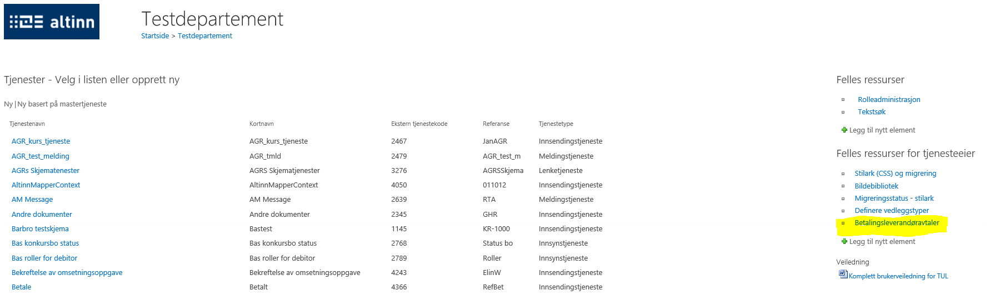
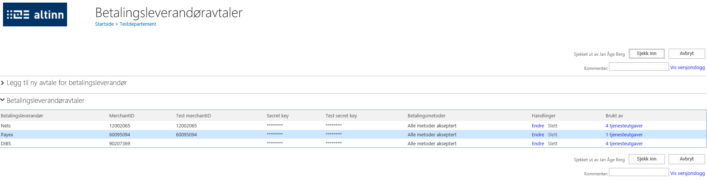
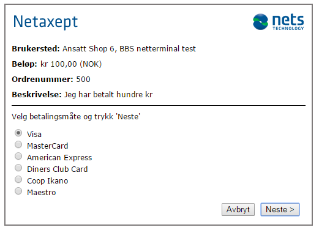
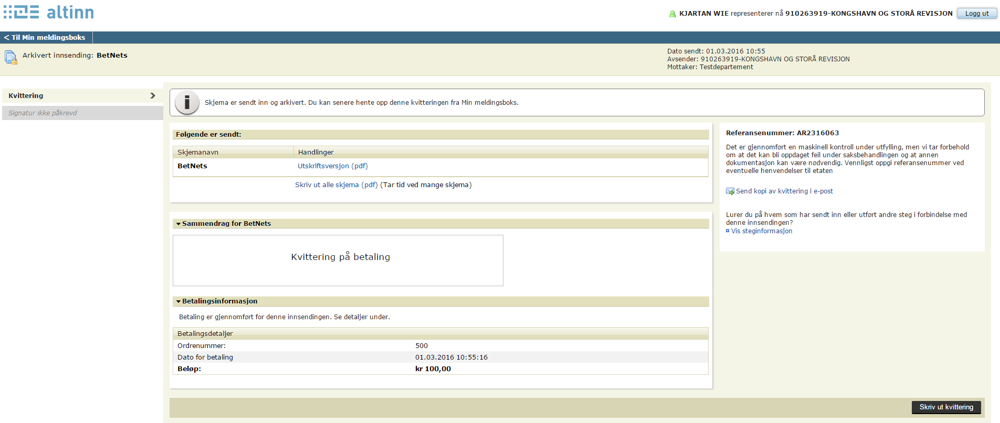

En del offentlige tjenester innebærer brukerbetaling som del av saksbehandlingen. Dette kan gjøres enkelt via ny funksjonalitet i Altinn levert med Altinn versjon 16.1.

Altinn og flere tjenesteeiere i Altinn-samarbeidet, har sett behovet for en betalingsløsning som del av Altinn. En gruppe representanter for flere tjenesteeiere og Altinn har jobbet mot å kunne tilby dette.

## Del av arbeidsflyten

Betalingsløsningen kan være del av arbeidsflyten til en innsending på fire ulike måter:

1. **I parallell med innsendingssteget**  
Det vil si at man fyller ut et skjema, og fra siden der man skal bekrefte innsending velger man «Send inn og betal». Man sendes videre til en av betalingsleverandørene, og så snart betaling er utført er man tilbake på kvitteringen på innsending i Altinn.VarselDPVUtenRevarsel  
2. **Betaling før signering**  
Der man etter utfylling først gjennomfører en betaling, og deretter signerer på innsendingen.
3. **Betaling etter signering**  
Der man får fylle ut og signere en innsending før man sendes videre til betalingsløsningen
4. **Forhåndsutfylt betaling**  
Det vil si at det ikke kreves noen aktiv utfylling av et skjema. Brukeren sendes direkte til et betalingssteg.

Altinn har støtte for betaling med tre av de største betalingsleverandørene på det norske markedet. Det er opp til tjenesteeier å lage avtale med den leverandøren de ønsker å bruke av alternativene Nets, Payex og DIBS. Altinn vil også ha funksjonalitet for å begrense hvilke betalingsalternativer som er tilgjengelig – for eksempel hvis det er uønsket at betaling skal skje med enkelte typer kort.    

## Kan være avhengig av utfyllingen
Det trenger ikke være et forhåndsbestemt beløp som skal betales per innsending. Tjenester med betaling kan defineres slik at hvor mye som skal betales avhenger av hva som fylles ut i skjemaet. Det går også an å definere at det kun er bestemte data som skal medføre betaling.
Utfyllingen trenger ikke skje i Altinn. Betaling er også tilgjengelig til bruk i for eksempel apper eller tjenesteeiernes egne nettsteder via Altinns REST-API. Brukeren trenger med andre ord ikke vite at det er Altinns betalingsløsning som benyttes som del av en tjenesteeier sin tjeneste.

## Gjennomgang av oppsett av enkel betalingstjeneste

### Betalingsleverandøravtale
Grunnleggende for å få satt opp en betalingsløsning er at tjenesteeier (TE) har gjort en avtale med betalingsleverandør om bruk av dennes betalingstjenester. Data om denne avtalen må legges inn i TUL for å kunne lage en tjeneste med betaling. Her støtter løsningen avtaler med Nets, Payex og DIBS. Felter for å spesifisere at en tjenesteutgave skal ha betalingsfunksjonalitet vil være skjult inntil minst en betalingsleverandøravtale er lagt inn i TUL. Betalingsavtalen finnes til høyre på tjenesteeierarbeidsflaten under «Felles ressurser for tjenesteeier»

Ved åpning av denne kommer en til side for opprettelse og vedlikehold av betalingsleverandøravtaler

Ved vedlikehold/opprettelse av avtale må betalingsleverandør, merchant-id og nøkler mottatt fra betalingsleverandør legges inn. Videre kan betalingsmåter begrenses ved å sjekke boks for dette valget som vist på bunnen i seksjon «Legg til ny avtale for betalingsleverandør» av betalingsavtalen under.

Med betalingsavtale på plass kan tjeneste med betaling spesifiseres.
#### Utgavespesifikasjon
Det er en seksjon under Utgaveparametre nederst på tjenesteutgaven som spesifiserer hvordan betaling skal fungere. Denne blir som tidligere nevnt først synlig når minst en betalingsavtale er registrert:

- **Bruk betaling** bestemmer om betalingssteg skal aktiveres for denne tjenestutgaven.  
- **Ordrenummer** genereres i skjema» bestemmer om betalingstransaksjonene skal få unikt ordrenumer automatisk generert
  fra teller i Altinn eller om tjenesteutvikler skal lage ordrenummer i skjema etter fritt valgt logikk.  
  Er dette feltet aktivert så er det da tjenestutvikler som genererer ordrenummer gjennom logikk i skjema.
  Ordrenummer er et av fire felter som er obligatoriske for betalingen og som sendes i utvekslingen som skjer med betalingsleverandøren.
  Mer lenger ned om disse 4 feltene (heretter kalt betalingsfelter)  
- **Betalingsleverandøravtale** angir hvilken avtale som skal brukes for denne tjenesteutgaven.  
- **XPath til..** Betalingsfelter som må finnes i meldingsdefinisjonen for skjema (xsd). De sendes i utveksling med betalingsleverandøren.
  - **sum-felt** er beløpet som skal betales. Typisk sum av tjenester/artikler i skjema.
    Dersom sum er null etter endt utfylling av sluttbruker vil ikke steget for betaling bli gjennomført.
    Tjenesteutvikler kan da gjennom dette feltet styre om sluttbruker skal ledes gjennom betalingssteget og dermed måtte betale.
    Eksempelvis kan tjenesteutvikler sette feltet til null som følge av valg sluttbruker har tatt og dermed unngå betaling.
    Skjema sendes inn uavhengig av om betaling utføres.
  - **beskrivelse-felt** angir tekst som beskriver betalingen.
  - **ordrenummer-felt** unik alfanumerisk verdi som settes i skjema/av Altinn for å identifisere transaksjonen (se om ordrenummer over).
  - **transaksjonsid-felt** unik verdi som settes av betalingsleverandør for å identifisere transaksjonen.  

Under Prosessflyt er det 4 maler som har med betaling å gjøre:

- **Betaling (med innsending).** Tjenesteutvikler har definert i skjemadefinisjonen hvilke verdier som skal være i betalingsfeltene.
  Dvs at sluttbruker har ikke anledning til å fylle ut skjema, bare gjøre selve betalingen. Skjema sendes inn og betalingstransaksjonen utføres.
- **Utfylling og betaling (med innsending).** Sluttbruker fyller ut skjema og betaler deretter for skjema. Skjema sendes inn og betalingstransaksjonen utføres.
- **Utfylling, betaling og signering.** Sluttbruker fyller ut skjema, betaler og signerer.
- **Utfylling, signering og betaling (med innsending).** Sluttbruker fyller ut skjema, signerer og betaler. Skjema sendes inn og betalingstransaksjonen utføres.

## Bruk i Sluttbrukerløsningen (SBL)

Her er det illustrert hvordan det kan arte seg for sluttbruker når betaling gjennom prosessflyt 2 – Utfylling og betaling (med innsending), brukes.

Første steg: Skjema fylles ut. Dette er et test-skjema som bare inkluderer betalingsfeltene.

Andre steg: Skjema kontrolleres og vises før betaling. Ved å trykke «Betal og send inn» nederst til høyre, så blir bruker ledet til betalingsleverandør sin betalingsterminal.

Bruker velger betalingsform

Bruker legger inn betalingsdetaljer

Betalingstransaksjon utføres og skjema sendes inn.

Tredje steg: Bruker vises kvitteringsside.

Betaling kan også brukes via REST-API: https://altinn.github.io/docs/guides/integrasjon/sluttbrukere/api/diverse/betaling/
