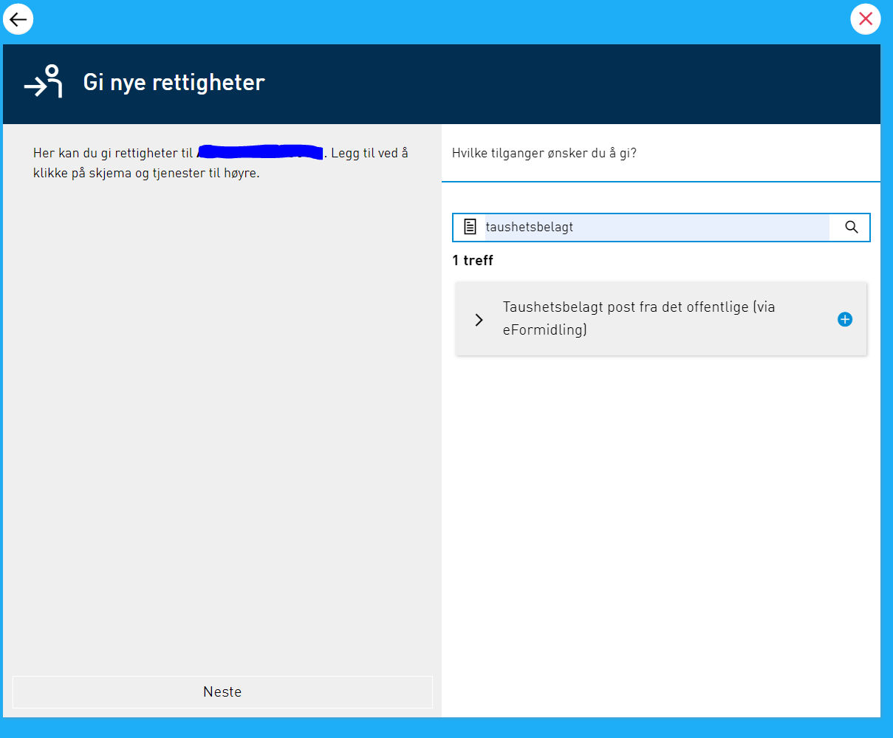
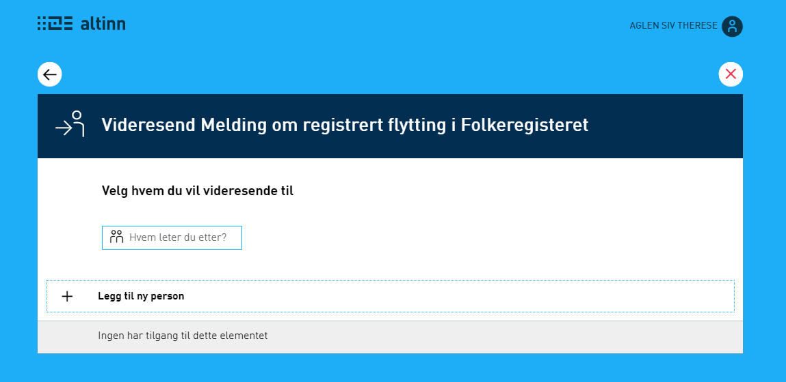
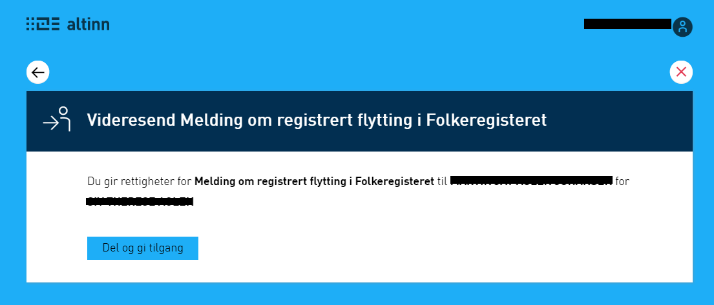
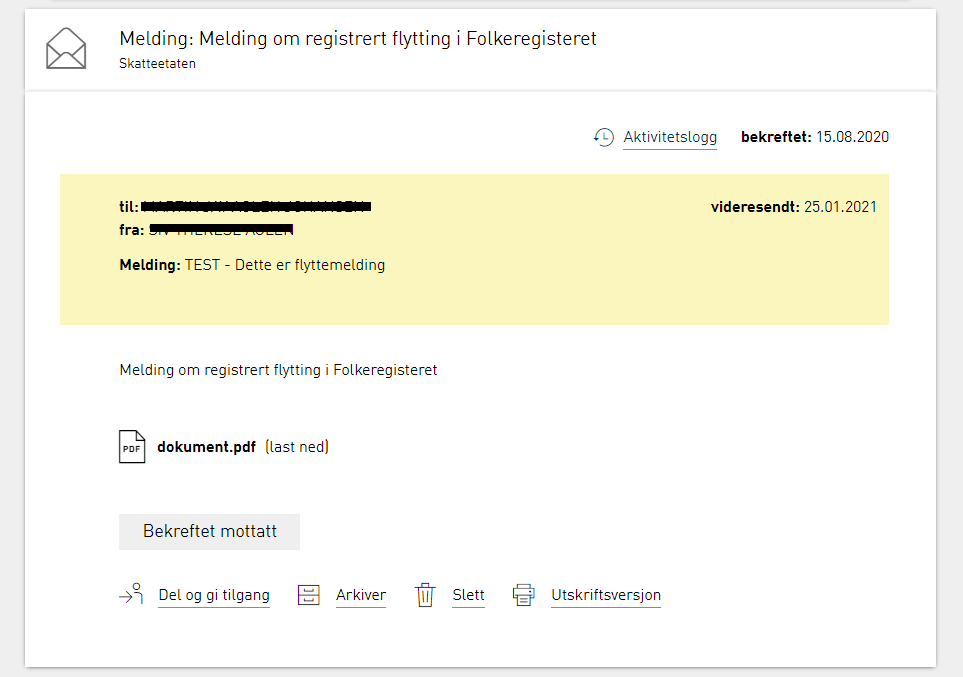

Det er viktig at virksomheten som mottar taushetsbelagt post med særlig sensitivt innhold (f eks informasjon om enkeltpersoner knyttet til straffesaker, barnevernssaker o.l.)
sikrer at tilgangen til denne typen melding begrenses til kun de som har tjenestlig behov for å se innholdet. 

I utgangspunktet har INGEN i virksomheten tilgang til disse meldingene. 
Virksomheten må derfor peke ut noen i sin virksomhet som får tilgang til all taushetsbelagt post innenfor sin kategori. 
Denne personen blir da en "postfordeler" for virksomheten som i praksis åpner meldinger og distribuerer disse videre til de ansatte som faktisk skal lese og behandle meldingen. 

## Slik gir du tilgang til den som er postfordeler

For å gi tilgang til taushetsbelagte tjenester, må Hovedadministrator i virksomheten (denne rollen er forhåndstildelt til Daglig leder, Styreleder, Innehaver og Bestyrende reder) 
delegere tjenesterettigheter eller nødvendig(e) rolle(r) til de som skal ha tilgang til de taushetsbelagte tjenester. 

Hovedadministrator kan gi rettighetene til seg selv dersom han skal ha tilgang til tjenesten(e). 

Vi anbefaler at man gir personen som skal være "postfordeler" tilgang til tjenesten. Dette gjøres fra Profilen til virksomheten i Altinn under panelet "andre med rettigheter"

Velg eller legg inn person og finn den aktuelle tjenesten vedkommende skal være postfordeler for

## Slik fordeles posten videre til den som skal behandle meldingen

Den som skal fordele posten åpner meldingen og finner ut hvem som faktisk skal behandle denne videre. For å gi tilgang til denne personen trenger man personnummer og etternavn på vedkommende. 

1) åpne meldingen og velg "del og gi tilgang"

2) velg "legg til ny person"

3) legg inn personnummer og etternavn på den som skal ha tilgang til meldingen
4) bekreft at personen skal ha tilgang til meldingen 

5) legg evt inn melding som personen skal få vedr tilgangen

På meldingen i innboks vil det synes at tilgang er delt og evt hvilken melding som ble formidlet

## Følgende tjenester med taushetsbelagt innhold finnes i Altinn

| Tjenestekategori                                                        | Rollekrav                                         |
|-------------------------------------------------------------------------|---------------------------------------------------|
| Taushetsbelagt post fra det offentlige innenfor helse, sosial og omsorg |	Taushetsbelagt post - helse, sosial og omsorg     |
| Taushetsbelagt post fra det offentlige innenfor oppvekst og utdanning	  | Taushetsbelagt post - oppvekst og utdanning       |
| Taushetsbelagt post fra det offentlige innenfor administrasjon		  | Taushetsbelagt post - administrasjon              |

