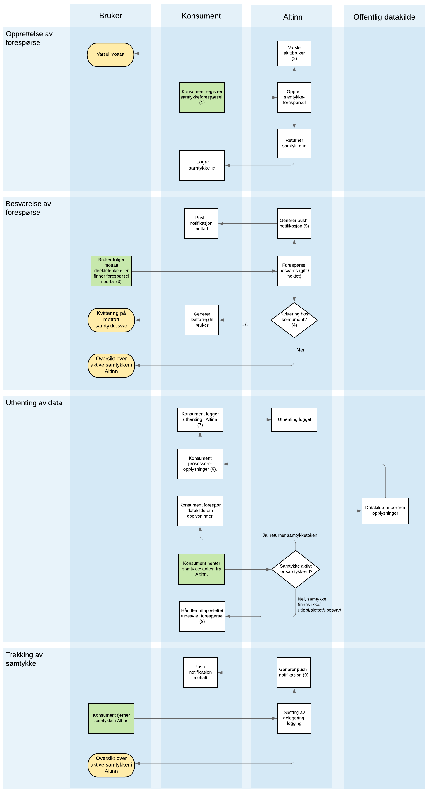

## Overordnet

Rent teknisk er enhver bruk av samtykkeløsningen asynkron, siden den baserer seg på interaksjon med en sluttbruker gjennom en nettleser, men for enkelhets skyld definerer vi en synkron flyt som en hvor brukeren hele tiden er tilstede og starter og fullfører prosessen hele samtykkeprosessen uten nevneverdig opphold. En asynkron prosess er derimot en som ikke nødvendigvis er startet av sluttbruker, eller som fullføres en stund etter - gjerne dager - etter prosessen ble startet. Synkron/asynkron omfatter prosessen fra en samtykkeforespørsel blir initiert, til et samtykke er gitt (eller nektet). Hvorvidt et samttykke er gyldig over tid, eller prosessen rundt tilbaketrekking av et samtykke har den sammenheng ikke noe betydning.

Den vanligste flyten er en synkron flyt, hvor også samtykket er kortlevd. I noen sammenhenger er det imidlertid hensiktsmessig å initiere en samtykkeprosess som en *indirekte* konsekvens av noe sluttbruker/avgiver har foretatt seg. For eksempel kan en entreprenør levere et tilbud på et offentlig anbud, og den offentlige innkjøperen trenger senere i prosessen å innhente et samtykke for å hente taushetsbelagte data om leverandøren som vurderingsgrunnlag. Et annet eksempel kan være en kundebehandler som sender en samtykkeforespørsel etter at en kunde har foretatt en supporthenvendelse.

{}
Push-varsler som omtalt i dette kapitlet vil ikke leveres før 2023. Dette er en server-til-server/push-basert mekanisme for å underrette konsument/leverandør om at et samtykke er gitt (eller ikke gitt, eller trukket), som supplement til `redirectUrl`-mekanismen. Dette vil gjøre det mulig for konsumenten/leverandøren å agere på tilstandsendringer for samtykkeforespørsler/samtykker i sanntid, uten å måtte foreta oppslag/polling mot Altinn. Inntil dette er på plass, må konsumenten benytte `redirectUrl`-mekanismen, eller foreta oppslag for å sjekke status på forespørsler.
{}

## Sekvensdiagram

{}
(1) Vil indirekte skje som følge av at brukeren initierer en prosess som krever at konsumenten innhenter et samtykke. Dette kan f.eks. være igangsatt ifm en support-henvendelse fra bruker til konsument.
 (2) Aktive forespørsler vil kunne vises i portalen til bruker, og varsling vil kunne sendes til registrerte endepunkter hos kunden i KRR/KoFuVi (SMS, e-post) eller via push-notifkasjon på mobil eller desktop. MERK! Varsling til sluttbruker vil ikke implementeres før 2023. 
 (3) Konsument har selv kontroll på hvordan forespørselen skal distribueres til bruker. Kunden kan selv logge inn i Altinn og finne forespørselen etter mottatt varsel.
 (4) Hvis forespørselen er konfigurert til å ikke vises i Altinn-portalen, vil brukeren bli forsøkt sendt til oppgitt `redirectUrl` hos konsumenten. Konsumenten har da selv ansvaret for å distribuere samtykke-lenken til brukeren. Hvis forespørselen vises og besvares fra portalen, vil brukeren ikke bli sendt til `redirectUrl`, men vil holdes i Altinn.
 (5) Uavhengig av om brukeren blir sendt til redirectUrl eller holdes i Altinn-portalen, vil det sendes en server-til-server-notifikasjon til konsumenten, på et endepunkt som oppgis i registreringen av forespørselen. 
 (6) Hva konsument benytter opplysningene til er case-spesifikt
 (7) Logging av uthenting av data tjener to formål: innslag i samtykkeloggen synlig for bruker, og for revokering av éngangssamtykker.
 (8) Ulik logikk kan benyttes her avhengig av case - f.eks. at det opprettes en ny forespørsel, eller kunde kontaktes.
 (9) Som ved inngåelse av samtykke, vil det også ved trekking av samtykke genereres en push-notifikasjon hvis oppgitt i den opprinnelige forespørselen som konsument kan velge å agere på hvis hensiktsmessig.
{}
