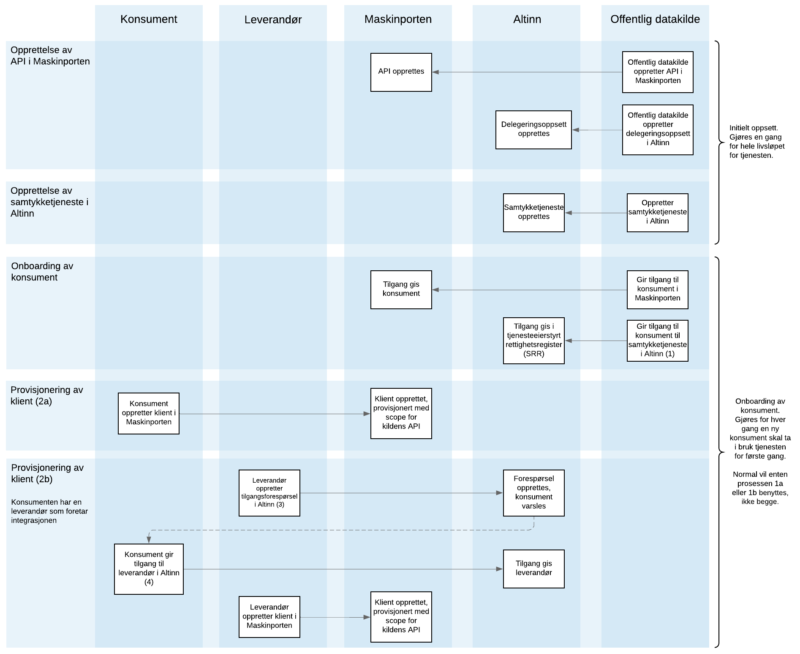

## Overordnet

Dette beskriver arkitekturmønsteret som foretrekkes for deling av offentlige data til private konsumenter, som f.eks. banker og finansforetak. Altinns API-er for samtykkeoperasjoner krever virksomhetssautentisering, som kan være enten med [virksomhetssertifikat eller Maskinporten-token](). Sistnevnte er anbefalt, da dette også enklere åpner for å kunne ta i bruk leverandører gjennom [API-delegering]() i tråd med [referansearkitekturen for eOppslag](https://doc.difi.no/nasjonal-arkitektur/nab_referanse_arkitekturer_eoppslag/).

Vanligvis vil den offentlige aktøren som forvalter dataene som skal deles også benytte Maskinporten for å sikre sine API-er. Uthenting av data vil da involvere at konsumenten må oppgi to ulike tokens; ett Maskinporten-token som autentiserer og autoriserer foretaket, og et samtykke-token som autoriserer det samme foretaket til å uthente data for den personen eller virksomheten for den {}tjenestekonteksten{}) som er oppgitt i tokenet. 

## Sekvensdiagram

**Her vises de fire typiske prosessene knyttet til livssyklusen til en samtykketjeneste for datadeling som skal sikres med Maskinporten og tjenesteeierstyrt rettighetsregister, og være tilgjengelig for konsumenter å kunne delegere til leverandører.**

{}
(1) Se avsnittet om bruk av <a href="#bruk-av-tjenesteeierstyrt-rettighetsregister-srr">tjenesteierstyrt rettighetsregister</a>.
 (2a) I de tilfeller hvor konsumenten selv skal foreta integrasjonen mot datakilden. Konsument får ikke provisjonert klient før API-eier har gitt tilgang.
 (2b) Hvis en [leverandør skal foreta integrasjonen]() på vegne av konsument, altså administrere samtykkeforespørsler og hente samtykketokens, må konsument delegere "API-tilgang til å administrere samtykker" til leverandøren sin i Altinn, samt tilgang til API-ressursen som API-eier har opprettet. 
 (3) "Be om tilgang"-funksjonaliteten kan benyttes i Altinn for at leverandør kan be konsumenten om de tilgangene som ønskes, i stedet for at konsumenten selv må initiere dette.
 (4) Denne tilgangen er uavhengig av den aktuelle samtykketjenesten og Maskinporten-tilgangen til konsumenten, og vil gi leverandøren tilgang til å administrere forespørsler/tokens for alle samtykketjenester som konsumenten har tilgang til. Her gis også tilgang til delegeringsoppsettet til API-eier på vegne av konsumenten. En konsument kan potensielt ha mange leverandører.
{}

### 1. Opprettelse av API i Maskinporten

Dataene som skal delegeres må eksponeres i et eller annet API, som regel et REST / JSON-RPC orientert API over HTTP, men i prinsippet kan dette benytte hvilken som helst protokoll som konsumenter vil kunne implementere og som det vil være mulig å oppgi tokens gjennom. Sluttbruker eller Altinn er ikke del i kommunikasjonen mellom datakonsument og datakilde.

For å registrere et API i Maskinporten, må den offentlige datakilden tegne en tjenesteeieravtale for Maskinporten med Digdir. For mer informasjon om dette, se [Samarbeidsportalen](https://samarbeid.difi.no/felleslosninger/maskinporten). Når tilgang til Samarbeidsportalen er gitt, må datakilden registrere et {}scope{} som representerer API-et som konsumentene skal hente data fra. For mer informasjon, se Maskinportens [integrasjonsguiden for API-tilbydere](https://difi.github.io/felleslosninger/maskinporten_guide_apitilbyder.html).

For å kunne gjøre API-et delegerbart i Altinn, må scopet som opprettes i Maskinporten knyttes til en {}delegerbar API-ressurs{}. For mer informasjon om dette, se [denne utviklingsguiden for API-tilbydere]().

### 2. Opprettelse av samtykketjeneste i Altinn

Samtykketjenesten er ressursen i Altinn som sluttbrukeren gir konsumenten tilgang til gjennom en samtykkedelegering. Samtykketjenesten opprettes av tjenesteeier i [TUL]() som en lenketjeneste, og bestemmer bl.a. hvordan samtykkedialogen skal fremstå for brukeren. [Les mer om hvordan samtykketjenester opprettes]().

### 3. Onboarding av konsument

Når en ny konsument skal få tilgang til samtykketjenesten beskyttet, må organisasjonsnummeret gis tilgang i Maskinporten. [Dette kan gjøres i samarbeidsportalen](https://difi.github.io/felleslosninger/maskinporten_guide_apitilbyder.html#1b-tilgangsstyring---via-samarbeidsportalen), eller via API.

#### Bruk av tjenesteeierstyrt rettighetsregister (SRR)
Tjenesteeierstyrt rettighetsregister (SRR) lar tjenesteeieren definere en whitelist på hvem som kan motta en samtykkedelegering for tjenesten(e) som en gitt samtykkeforespørslen inneholder, og følgelig også hvem som kan opprette samtykkeforespørsler. Så lenge konsument også må gis tilgang til API-et i Maskinporten vil ikke SRR-sikring være påkrevd for å hindre at uautoriserte konsumenter får tilgang til data, men vil hindre at de får opprettet samtykkeforespørsler og dermed eksponere sluttbrukere for ugyldige samtykkedialoger. Listen over organisasjoner som har tilgang i Maskinporten og SRR vil typisk være den samme, og må holdes i synk av API-eier.

* Les mer om [autorisering av datakonsument]().

### 4. Provisjonering av klient

For å ta i bruk API-et til Altinn samt API-et til datatilbyder, må det [opprettes OAuth2-klienter i Maskinporten](https://difi.github.io/felleslosninger/maskinporten_guide_apikonsument.html). Det er teknisk mulig å provisjonere scopene for å opprette samtykkeforespørsler og uthente samtykketokens i samme klient som den som må brukes for å hente ut data fra datakilden, men dette anbefales ikke. Hver klient bør gis så begrenset tilgang som mulig for å begrense risiko knyttet til feil eller hemmeligheter / klienter_id-er på avveie, og følgelig ha tilgang til så få API-er (scopes) som mulig. Det samme gjelder tilgangstokens. Vær også oppmerksom på at ulike API-er (scopes) er konfigurert med ulik maksimum levetid på autorisasjoner og tilgangstokens, så for å redusere behovet for å hente nye tokens fra Maskinpoten bør tokens omfatte så få scopes som mulig.

Hvis leverandør skal benyttes, må en [token-forespørsel inkludere konsumenten en ønsker å hente token på vegne av](https://difi.github.io/felleslosninger/maskinporten_guide_apikonsument.html#bruke-delegering-som-leverand%C3%B8r)gjennom claimet "consumer_org", slik at Maskinporten kan spørre Altinn om det foreligger en delegering på det aktuelle scopet. Konsumenten må da på forhånd ha delegert tilgang til leverandøren i Altinn, ellers vil uthenting nektes.

* [Les mer om å bruke Altinn samtykke som leverandør]().
