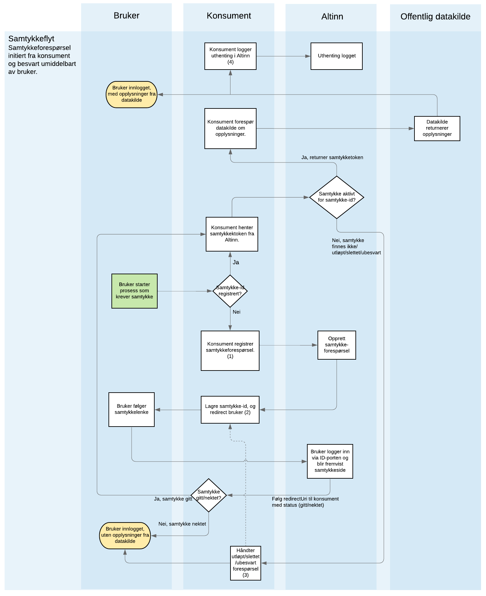
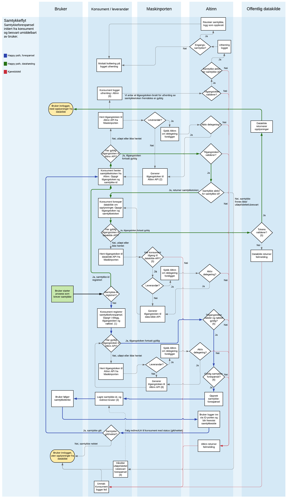

## Overordnet

Rent teknisk er enhver bruk av samtykkeløsningen asynkron, siden den baserer seg på interaksjon med en sluttbruker gjennom en nettleser, men for enkelhets skyld definerer vi en synkron flyt som en hvor brukeren hele tiden er tilstede og starter og fullfører prosessen hele samtykkeprosessen uten nevneverdig opphold. En asynkron prosess er derimot en som ikke nødvendigvis er startet av sluttbruker, eller som fullføres en stund etter - gjerne dager - etter prosessen ble startet. Synkron/asynkron omfatter prosessen fra en samtykkeforespørsel blir initiert, til et samtykke er gitt (eller nektet). Hvorvidt et samttykke er gyldig over tid, eller prosessen rundt tilbaketrekking av et samtykke har den sammenheng ikke noe betydning.

Den vanligste flyten er en synkron flyt, hvor også samtykket er kortlevd. 

## Sekvensdiagram (overordnet)

**Her vises sekvensen til en samtykkeproses hvor brukeren selv (fra konsumentens system) initierer en tjeneste som krever samtykke, hvorpå han/hun umiddelbart blir sendt til Altinn for å behandle en forespørsel, og konsumenten umiddelbart henter ut data fra den aktuelle datakilden**.

Det er overordnet fire prosesser knyttet til en synkron samtykkeflyt. Disse er beskrevet under det første diagrammet, som tar for seg de logiske sekvensene, og går ikke i detalj mht. autentisering mot Maskinporten. Se lengre ned på siden for en mer detaljert visning av samme prosess. Du kan også klikke på diagrammet for å få opp en større versjon.

{}
(1) Se [mer informasjon om forespørsler]() . Krever også en API-nøkkel utstedt av Altinn.
 (2) Samtykke-id brukes både for å kunne sjekke status på samtykkeforespørselen og som authCode for å hente ut samtykketoken, hvis gitt. 
 (3) Hvis en samtykkeforespørsel allerede er opprettet på brukeren, men fremdeles er ubesvart kan potensielt brukeren bli redirectet på nytt (fra pkt 2) for å unngå opprette flere tilgangsforespørsler. 
 (4) Logging av uthenting av data tjener to formål: innslag i samtykkeloggen synlig for bruker, og for revokering av éngangssamtykker.
{}

### 1. Registrering av samtykkeforespørsler

Samtykkeforespørsler registreres gjennom det autentiserte consentRequest-API-et i Altinn. Her oppgis partene i samtykket. Konsumenten ({}CoveredBy{}) er den juridiske personen som har fått tilgang av API-tilbyder gjennom Maskinporten og tjenesteeierstyrt rettighetsregister, og er den som skal motta samtykket. Avgiver ({}OfferedBy{}) er den som gir samtykket. Dette kan være en person eller en juridisk person, hvor den som faktisk gir samtykket er en person som har tilstrekkelige rettigheter. Eventuell leverandør ({}HandledBy{}) som skal foreta dette på vegne av konsumenten må oppgis, og forutsetter at konsumenten har gitt leverandøren tilgang. 

* [Les mer om opprettelse av forespørsler]()
* [Les mer om bruk av leverandører]()

### 2. Uthenting av samtykketokens

Umiddelbart ved registrering av samtykkeforespørselen mottar konsument/leverandør en samtykke-id, også kalt autorisasjonskode. Denne benyttes både for å sjekke status på samtykkeforespørselen, og for å hente ut samtykketokens på innfridde forespørsler. Dette kan gjøres umiddelbart etter forespørselen er opprettet, men fortrinnvis gjøres dette etter at samtykkeforespørselen er innfridd og samtykket er gitt. Den vanligste måten å detektere om og når et samttykke gis er gjennom at sluttbrukeren blir videresendt til `redirectUrl` som oppgis i forespørselen. Det anbefales ikke å utelukkende belage seg på `redirectUrl`-mekanismen for å detektere om et samtykke er blitt gitt, da dette er en klientstyrt mekanisme som er gjenstand for f.eks. ustabile mobildekningsforhold mv. Der det er hensiktsmessig, anbefales det å foreta et oppslag mot token-endepunktet med å for å se om et samtykke er blitt gitt selv om det ikke er registrert svar på forespørselen via  `redirectUrl`. Dette vil kunne sikre at brukeren ikke mottar dupliserte forespørsler, eller opplever å se flere aktive samtykker for samme konsument/tjeneste i Altinn.

{}
I første halvdel av 2021 vil Altinn begynne å tilby en server-til-server/push-basert mekanisme for å underrette konsument/leverandør om at et samtykke er gitt (eller ikke gitt, eller trukket), som supplement til `redirectUrl`-mekanismen. Dette vil gjøre det mulig for konsumenten/leverandøren å agere på tilstandsendringer for samtykkeforespørsler/samtykker i sanntid, uten å måtte foreta oppslag/polling mot Altinn.
{}

### 3. Uthenting av data fra kilde

Gitt et samtykketoken, vil konsumenten/leverandøren foreta et oppslag mot datakilden hvor samtykketokenet oppgis sammen med et tilgangstoken fra Maskinporten. Samtykketokenet blir typisk oppgitt i en tilpasset HTTP-header; dette dokumenteres av API-tilbyder for det aktuelle API-et.

### 4. Logging av hentede data

Etter at data er hentet fra API-tilbyder skal konsumenten logge til Altinn at dette er foretatt. Dette sikrer at sluttbrukeren har en logg over hendelesforløpet, og kan benytte denne i forbindelse med f.eks. innsynsbegjæringer både hos konsument og datakilden. For tjenester som er konfigurerert som éngangssamtykker, vil dette kallet føre til at samtykket blir slettet (oppbrukt).

## Sekvensdiagram (detaljert)

Her vises samme flyt som over, men med et detaljeringsnivå som omfatter Maskinporten og eventuell bruk av leverandør som foretar uthentingen på vegne av konsumenten. Sekvensene knyttet til opprettelse av forespørsel, uthenting av samtykketoken og (enkel) håndtering av eventuelle kjøretidsfeil er merket med ulike farger. 

Klikk på diagrammet for å få opp en større versjon.

{}
(1) Se [mer informasjon om forespørsler]() . Krever også en API-nøkkel utstedt av Altinn.
 (2) Token-uthenting krever et åpent scope i Maskinporten som alle med mulighet for å opprette integrasjoner i Maskinporten kan provisjonere til en klient. Denne tilgangen kan også delegeres til leverandører. 
 (3) Samtykke-id brukes både for å kunne sjekke status på samtykkeforespørselen og som authCode for å hente ut samtykketoken, hvis gitt. 
 (4) Hvis en samtykkeforespørsel allerede er opprettet på brukeren, men fremdeles er ubesvart kan potensielt brukeren bli redirectet på nytt (fra pkt 3) for å unngå opprette flere tilgangsforespørsler. 
 (5) Her antas at datakilden har beskyttet sitt API med Maskinporten og whitelisting av de organisasjonene som kreves
 (6) Validering av Maskinporten-token, og sjekk av API-nøkkel. API-nøkkel må være tilknyttet samme organisasjon som skal motta samtykket (CoveredBy).
 (7) Forespørselen sjekkes for logiske feil (f.eks. gyldig kominasjon av tjenester og parter), samt SRR hvis det er benyttet for å sikre samtykketjenesten.
 (8) På samme måte som (2) er dette et åpent scope, som også kan delegeres.
 (9) Logging av uthenting av data tjener to formål: innslag i samtykkeloggen synlig for bruker, og for revokering av éngangssamtykker.
{}