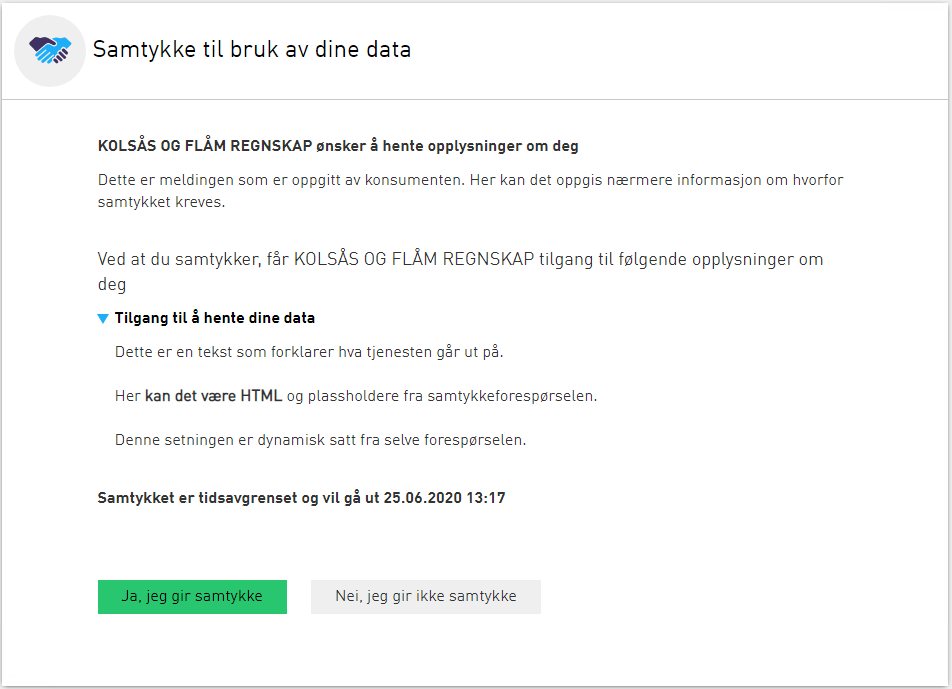
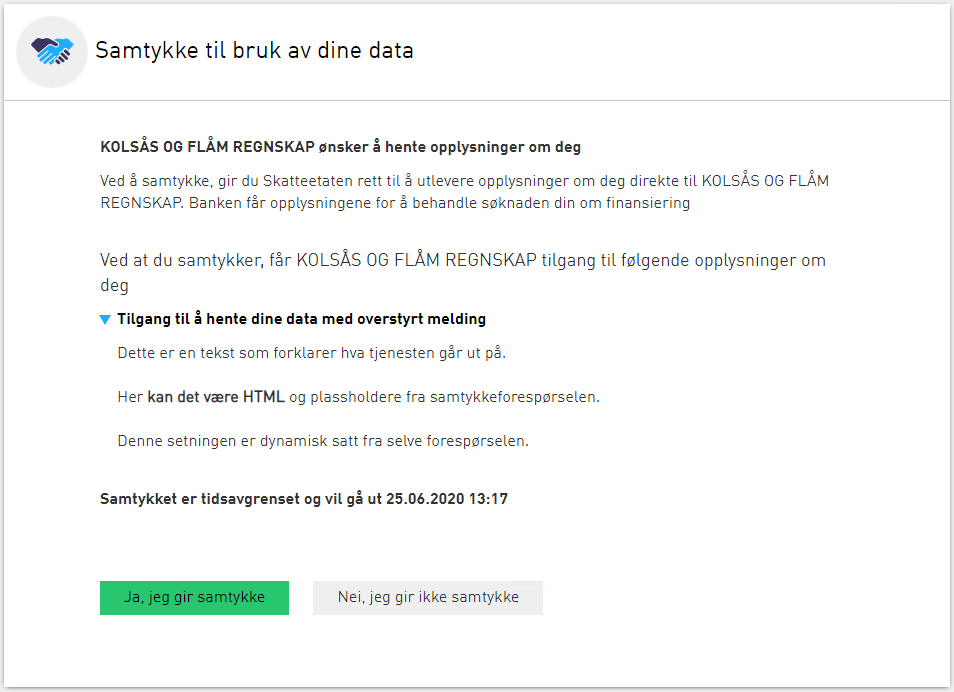
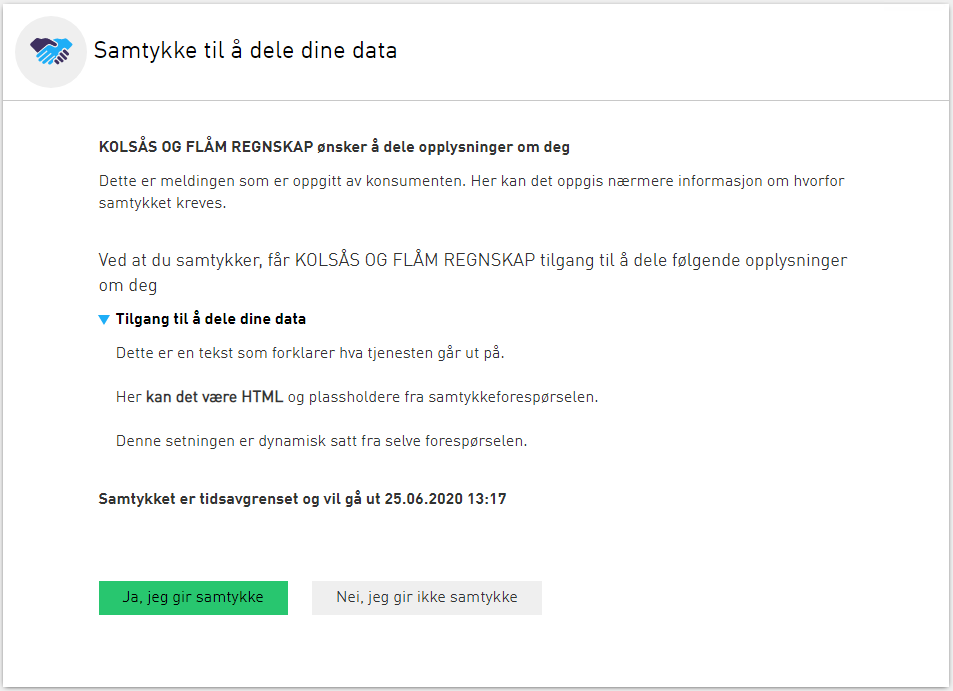
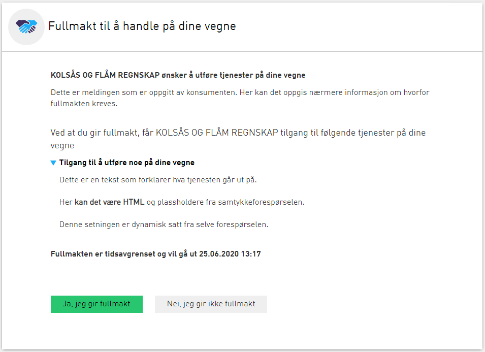

## Introduksjon

Maler definerer hvordan brukerdialogen presenteres, både i forbindelse med å gi et samtykke, se/trekke et eksisterende samtykke og hvordan logginnslagene ser ut i Avtaleloggen. 

## Malegenskaper

Det finnes to typer maler, samtykke og fullmakt. Disse er teknisk identiske, men påvirker ordlyden i dialogene og i loggene. På denne måten har du som datatilbyder stor fleksibilitet til å kunne sikre at brukerne blir tilstrekkelig informert før de inngår avtalen. 

En mal kan også definere en overstyrt melding, som i utgangspunktet kan styres av konsumenten (dette feltet kalles `requestMessage` i [den nye samtykkeløsningen](http://localhost:1313/docs/utviklingsguider/samtykke/datakonsument/be-om-samtykke/#opprette-en-samtykkeforespørsel-via-rest-og-få-tilbake-en-authorizationcode), og `DelegationContext` i den gamle lenkebaserte samtykkeløsningen). Når en tjeneste benytter en mal med overstyrt melding, vil ikke konsumenter kunne oppgi denne selv - i stedet vil meldingen definert i malen alltid benyttes.

## Bruk av maler på tjenester

Samtykkeforespørsler kan omfatte flere tjenester. Det er imidlertid ikke mulig å oppgi tjenester i én og samme samtykkeforespørsler som bruker ulike maler. Hvis dette forsøkes av konsument, vil dette gi en feilmelding og forespørsel vil ikke bli opprettet.

Hvis en tjeneste endrer mal og publiseres på nytt, vil dette ikke ha tilbakevirkende kraft. Eksisterende samtykke/fullmaktsdelegeringer vil altså ikke påvirkes, og vil fortsatt referere malen som var i bruk da samtykket ble gitt. Det samme gjelder om selve malen blir endret. Dette sikrer at eksisterende samtykker aldri vil kunne endres i forhold til hva brukeren så da han eller hun ga samtykket.

## Definerte maler

Under er malene som for øyeblikket er definert og kan tas i bruk:

### Samtykke til å hente data (standard)

Mal for samtykke til hente data. Dette er standardmalen, og slik samtykkedialogen opprinnelig ble utformet.

* Type dialog: **Samtykke** 
* Overstyrt melding? **Nei**

### Samtykkebasert lånesøknad
Som standardmal, men med overstyrt melding som brukt i samtykkebasert lånesøknad.

* Type dialog: **Samtykke** 
* Overstyrt melding? **Ja**

### Samtykke til å dele data
Mal for samtykke til å dele data. Brukes i sammenhenger hvor samtykket gis til datakilden til å kunne dele med andre (potensielt flere) på dine vegne

* Type dialog: **Samtykke** 
* Overstyrt melding? **Nei**

### Fullmakt til å utføre en tjeneste
Generisk mal for fullmaktsforespørsler.

* Type dialog: **Fullmakt** 
* Overstyrt melding? **Nei**

