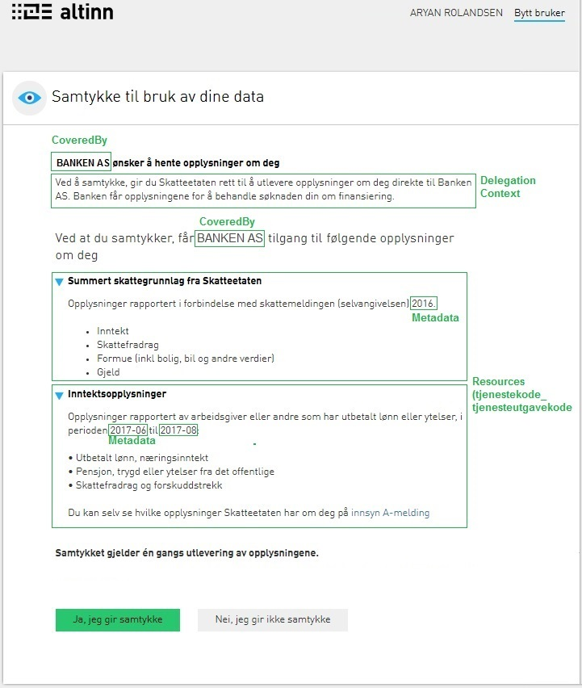

## Overordnet om løsningen

Samtykkeløsningen tilbyr to mekanismer for å innehente et samtykke fra en sluttbruker. I begge tilfellene skal brukeren videresendes til en adresse i Altinn, hvor samtykke blir innfridd.

Den foretrukne mekanismen er _forhåndsregistrerte samtykkeforespørsler_, som er beskrevet under. Den andre mekanismen er [lenkebaserte samtykker](), som er å regne som legacy og ikke vil bli videreutviklet. Alle nye integrasjoner mot samtykkeløsningen anbefales å bruke forhåndregistrerte samtykkeforespørsler.

Forhåndsregistrerte samtykkeforespørsler har en rekke fordeler over lenkebaserte samtykkeforespørsler:

* Mulighet for offline flyter som ikke er avhengige av at brukeren alltid er tilstede (f.eks. visning av innkommende samtykkeforespørsler i portal)
* Bruk av maler – høy fleksibilitet i hvordan dialogen presenteres
* Datakonsument kan sjekke status på en gitt samtykkeforespørsel (er den åpnet/innfridd/nektet/feilet?), uavhengig av redirect-URL-flyt

### Forhåndsregistrerte samtykkeforespørsler
For å be om et samtykke kreves det at datakonsument først oppretter en samtykkeforespørsel via REST, for så å sende sluttbrukeren til samtykkesiden.

{}
Merk at dette API-et krever <a href="../../../../api/rest/kom-i-gang/virksomhet/">virksomhetsautentisering</a> med virksomhetssertifikat eller Maskinporten-token. Hvis du skal administrere samtykker på vegne av en kunde, se <a href="../leverandor">leverandør-integrasjoner</a>.

Vær oppmerksom på at etternavn som oppgis må samvare med etternavn som er oppgitt hos Folkeregisteret. I noen tilfeller kan det oppstå feil i validering fordi man oppgir flere navn som etternavn i Request, f eks von der Lippe. I dette caset vil antagelig "Lippe" være korrekt etternavn. 
{}

{}
For mer informasjon om ConsentRequest-modellen, se våre [anbefalinger rundt bruken av samtykkeforespørsler]()
{}

Eksempel på forespørsel:
```HTTP
POST /api/consentRequests HTTP/1.1
Host: www.altinn.no
ApiKey: {ApiKey}
Accept: application/hal+json
Content-Type: application/hal+json
```
```
{
    "CoveredBy": "910514458",               --Orgnr til datakonsument
    "OfferedBy": "27042000537",             --Fnr/orgnr til den som gir samtykke
    "OfferedByName": "NORDMANN",            --Etternavn/orgnavn til samme
    "ValidTo": "2019-09-30T10:30:00.000",   --Gyldighetsdato for samtykke 
    "RedirectUrl": "https://www.altinn.no", --URL som bruker sendes til
    "RequestResources": [                   --Tjenestene med eventuelle metadata
        {
            "ServiceCode": "4628",
            "ServiceEditionCode": 210607,
            "Metadata": {
                "inntektsaar": "2016"
            }
        },
        {
            "ServiceCode": "4804",
            "ServiceEditionCode": 210607,
            "Metadata": {
                "fraOgMed": "2017-06",
                "tilOgMed": "2017-08"
            }
        }
    ],
    "RequestMessage": {     --Tidligere omtalt som DelegationContext
        "no-nb": "Ved å samtykke, gir du Skatteetaten rett til å utlevere...",
        "no-nn": "Ved å samtykka, gir du Skatteetaten rett til å utlevera...",
        "en": "By accepting the consent, you grant the Tax Authority the..."
    },
    "PortalViewMode": "Hide",               --Om den skal synes i portalen¹
    
}
```
{}
¹ `PortalViewMode` bestemmer om en samtykkeforespørsel skal være synlig i portalen for sluttbruker eller ikke. Forespørsler som besvares via portal vil ikke medføre at sluttbrukeren blir sendt til endepunkt oppgitt i `RedirectUrl`.
{}


Eksempel på svar:
```
{
    "AuthorizationCode": "c44f284f-b43b-4355-925a-2add17439659",
    "CoveredBy": "910514458",
    "OfferedBy": "27042000537",
    "ValidTo": "2019-09-30T10:30:00.000",
    "RedirectUrl": "https://www.altinn.no",
    "RequestResources": [
        {
            "ServiceCode": "4628",
            "ServiceEditionCode": 210607,
            "Metadata": {
                "inntektsaar": "2016"
            }
        },
        {
            "ServiceCode": "4804",
            "ServiceEditionCode": 210607,
            "Metadata": {
                "fraOgMed": "2017-06",
                "tilOgMed": "2017-08"
            }
        }
    ],
    "RequestMessage": {
        "no-nb": "Ved å samtykke, gir du Skatteetaten rett til å utlevere...",
        "no-nn": "Ved å samtykka, gir du Skatteetaten rett til å utlevera...",
        "en": "By accepting the consent, you grant the Tax Authority the..."
    },
    "PortalViewMode": "Hide",    
    "_links": {
        "self": {
            "href": "https://altinn.no/api/consentRequest/c44f284f-b43b-4355-925a-2add17439659"
        },
        "gui": {
            "href": "https://altinn.no/ui/AccessConsent/request?id=c44f284f-b43b-4355-925a-2add17439659"
        }
    }
}
```


### Sende brukeren til samtykkesiden med AuthorizationCode som input

Etter at en samtykkeforespørsel er registrert og man har fått tilbake en list med `_links` som inneholder `gui`-link. 

{}
Merk at det må oppgis <code>Accept: application/hal+json</code> som en header i requesten for at HAL-lenker som <code>_links</code> skal komme med i svaret. 
{}

Videre benytter man denne for å sende brukeren til samtykkesiden:
```
https://altinn.no/ui/AccessConsent/request?id=c44f284f-b43b-4355-925a-2add17439659
```

Det eksisterer også en valgfri parameter (`languageCode`) som kan benyttes for å laste samtykkesiden på et forhåndsbestemt språk (en, nb-NO, nn-NO):
```
https://altinn.no/ui/AccessConsent/request?id=c44f284f-b43b-4355-925a-2add17439659&languageCode=en
```
Dersom man ikke spesifiserer `languageCode` vil samtykkesiden bli lastet på det språket som brukeren har valgt i altinn.
I eksempelet over vil samtykkesiden lastes på engelsk.

I seksjonen lengre nede ser man eksempel på hvordan samtykkesiden vil se ut for en sluttbruker.


### Lenkebaserte samtykker (legacy)
Lenkebaserte samtykker anbefales ikke for nye integrasjoner. [Les mer om lenkebaserte samtykker]().

## Eksempel på en samtykkeside
I figuren nedenfor kan man se sammenhengen mellom det som ligger i url/json og det som presenteres for sluttbrukeren på samtykkesiden. Denne siden vil kunne lastes både gjennom en GUID dersom det foreligger en forhåndsregistrert samtykkeforespørsel, og via URL-parameter som definert i seksjonen over.



## Autorisasjonskode

Når sluttbruker har fått opp samtykkesiden og gitt samtykke vil han sendes tilbake til siden som er angitt i `RedirectUrl`.  
I denne url vil det sendes med **autorisasjonskode** og **status**. Ved bruk av forhåndsregistrerte samtykkeforespørsler er dette samme autorisasjonskode som ble
returnert ved opprettelse av forespørselen.

Eksempel på url hvor status er OK:

```
https://www.eksempel.no/?AuthorizationCode=0435d832-193b-4a13-a6d1-d172c18e18c7&Status=OK
```

Eksempel på url hvor sluttbruker har valgt å trykke på knappen for "Nei, jeg vil ikke gi samtykke":

```
https://www.eksempel.no/?Status=Failed&ErrorMessage=User%2520did%2520not%2520give%2520consent&FailedAuthorizationCode=435d832-193b-4a13-a6d1-d172c18e18c7
```

Dersom samtykkesiden ble lastet ved hjelp av `AuthorizationCode`, vil **autorisasjonskode** være den samme som sluttbrukeren lastet samtykkesiden med.

Merk at `FailedAuthorizationCode` ikke blir sendt med ved bruk av lenke-baserte samtykkeforespørsler, kun forhåndsregistrerte forespørsler. Det blir også sendt med en feilkode her som indikerer hva som gikk galt hos brukeren.
