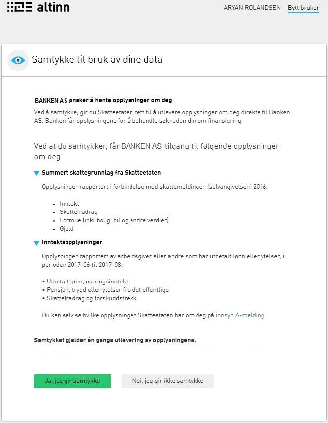

Etter innlogging vil sluttbrukeren bli presentert for en egen samtykkeside.  
Figurene under viser et eksempel på hvordan en samtykkeside kan se ut i et lånesøknadscase:

Tjenesteeier har fleksibilitet i hvordan denne siden utformes [gjennom bruk av maler](). 

Når sluttbruker har gitt samtykke blir rettighetsdelegeringen til datakonsumenten utført, vil brukeren kunne bli sendt tilbake til siden som er
angitt av datakonsument i redirect-URL. Sluttbruker kan også velge å ikke gi samtykke.
