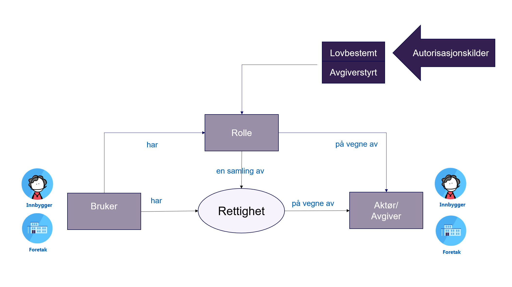

Altinn Autorisasjon kan benyttes av tjenesteeiere som ønsker å tilgjengeliggjøre informasjon og tjenester på egen plattform og nettsted, men ikke kan utføre en full autorisasjon av brukers tilganger. Roller og rettigheter kan være basert på mye informasjon som hver enkelt tjenesteeier ikke nødvedigvis har tilgang til. For å oppnå dette kan tjenesteeieren opprette en tjeneste av typen lenketjeneste i TUL. Tjenesten migreres til SBL på linje med andre tjeneste¬typer, slik at Altinn kan avgjøre om den aktuelle brukeren har nødvendig tilganger basert på de regler tjenesteeier har definert i TUL.

## Forholdet mellom Altinn Autorisasjon og IDporten
Altinn leverer autorisasjonstjenester mens ID-porten leverer tjenester for føderering av brukere (Single Sign On).

I forbindelse med autorisasjon i Altinn er det dermed tre aktører:

1. [ID-porten](https://samarbeid.digdir.no/id-porten/id-porten/18), som er Identity Provider og foretar autentisering av sluttbruker
2. Altinn Autorisasjon, som foretar autorisasjonskontroll
3. Tjenesteeier/offentlig virksomhet som tilbyr tjenesten til sluttbruker.

{}Vi anbefaler alle nye brukere av autorisasjon til å ta i bruk våre REST-API. Her finner dere dokumentasjon på hvordan man kan integere seg mot [REST-tjenestene](/docs/api/tjenesteeiere/rest/autorisasjon/). 
{}

Beskrivelse av legacy løsning som tilbyr SOAP-grensesnitt finnes [her](/docs/utviklingsguider/autorisasjon/aut_legacy/) 

## Overordnet om Altinn Autorisasjon og Styring av tilgang

Altinn Autorisasjon skal gi mulighet for å styre hvem som skal (kunne) gjøre hva og når med hvilke
data i det offentlige og i samspillet mellom offentlig og privat.

I Altinn opptrer bruker alltid på vegne av «noen eller noe» - enten seg selv, andre privatpersoner
eller andre virksomheter – f.eks. arbeidsgiveren din, lokalforeningen du er leder for eller en kunde du
er leverandør for. Det er avgiver som har en rett eller plikt til å utføre en tjeneste, benytte en ressurs
eller eier data som skal deles med andre.

Altinn Autorisasjon kan best illustreres med følgende figur:

En rettighet gir en identifisert og autentisert bruker tilgang til en definert ressurs eller tjeneste på
vegne av en identifisert avgiver, f.eks. å utføre en tjeneste eller tilgang til data om avgiver hos en
datakilde. Mellom bruker og avgiver foreligger det et representasjonsforhold som Altinn kjenner til.

En rettighet kan f.eks. være et samtykke til å dele data, en fullmakt til å utføre en handling eller en
tilgang til å utføre en tjeneste. En bruker kan får denne rettigheten ved at avgiver selv aktivt gir
denne til bruker, eller rettigheten kan hver hjemlet i lov, f.eks. daglig leders rett til å opptre på vegne
av et aksjeselskap.

Det er også mulig å beskrive vilkår for rettigheten i form av en avtaletekst som spesifiserer hva
rettigheten innebærer og vilkår for at denne trer i kraft. Dette kalles gjerne en samtykketekst eller
formålsbeskrivelse.

En rolle gir bruker en samling rettigheter som det er naturlig å knytte sammen. F eks gir rollen
“Regnskapsmedarbeider” rettigheter til tjenester som det er naturlig at en regnskapsmedarbeider
utfører. 

## Autorisasjonstjenesten har 4 hovedegenskaper:

**Autorisasjon:** Handler om å spesifisere rettigheter til å benytte en angitt ressurs (for eksempel en
nettside eller et API) eller tjeneste (for eksempel «Salgsmelding for motorvogn»), og formelt sett
betyr begrepet autorisere det å definere regler for tilgang.

**Tilgangsstyring:** Dette dreier seg om å gi videre rettigheter til å benytte en tjeneste til riktige personer eller
organisasjoner, for eksempel at daglig leder gir en ansatt rett til å sende inn A-meldingen på vegne av
sin virksomhet. Slike rettigheter er administrert av avgiver selv.

**Tilgangskontroll:** Gjør det mulig å kontrollere at en bruker har rettighet til å benytte angitt ressurs
eller tjeneste på vegne av en angitt avgiver.

**Autoritative kilder:** Altinn har fra starten basert seg på grunndata for autorisasjon fra
Enhetsregisteret (registrert rolle i organisasjon) og Det Sentrale folkeregisteret (privatperson og
familietilknytning). Vi har som uttalt mål å utvide dette med tilgang til flere grunndataregistre. Slike
rettigheter er lovbestemt.

## Beskrivelse andre funksjonelle egenskaper knyttet til autorisasjon og styring av tilgang
- [Be om tilgang](/docs/utviklingsguider/styring-av-tilgang/be-om-tilgang/)
- [Del og gi tilgang til enkeltmelding i innboks](/docs/utviklingsguider/digital-post-til-virksomheter/overorndet-funksjonalitet/del-tilgang-til-melding/#slik-fordeles-posten-videre-til-den-som-skal-behandle-meldingen)
- [Tjenesteeierstyrt rettighetsregister SRR](/docs/api/tjenesteeiere/funksjonelle-scenario/#tjenesteeierstyrt-rettighetsregister)