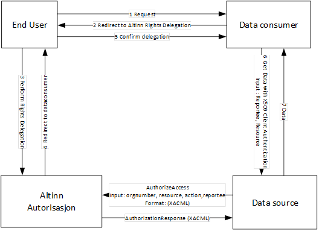



# Samtykkeløsningen
---
Samtykkeløsningen i Altinn gjør det mulig at sluttbruker kan samtykke til at 
data om dem kan deles mellom en datakilde (tjenesteeier) og en datakonsument (den som trenger data). 
___
 - Tidsbegrenset
 - Leserettighet
 - Kan trekkes / En gangs bruk
 - Oversikt
___
 - Ble introdusert i Altinn 16.1
 - Benyttes i dag for tilgang til skattedata
 - ca 50.000 personer ga samtykke til bankene i løpet av høsten
 - Kan benyttes til en rekke scenario. 
---
## Arkitektur
___
 - Bygger på Altinns autorisasjonsmodell
 - Enkeltrettigheter med tidsbegrensning
 - Lenktetjeneste eller innsynstjeneste
 - JSON Web Token
___

---
## Hvordan fungerer det
___

___
 - Blir registrert som rettighet i Altinn
 - Generes et Access Token
___
### 4 arbeidsflyter
- Selfcontained token utenfor Altinn
- Dataflyt gjennom Altinn
- Dataflyt utenom Altinn
- Dataflyt utenom Altinn med reference token
___

___

___

___

---

## Hva må til
___
### Tjenesteeier
- Tjeneste må defineres i Altinn (Lenke eller innsynstjeneste)
- Tjeneste må lages med samtykketekst som beskriver hva man samtykker
- Man må definere eventuelle parametre
- Man må definere hvem som kan be om samtykke og hvilken URL som er lovlig (SRR)
- Man må eksponere en tjeneste for å hente data
- Man må validere samtykke
___
### Datakilde
- Typisk tjenesteeier, men kan være annen aktør som tjenesteeier har avtale med
- Etablere grensesnitt for uthenting av data
- Validere token
___
### Datakonsument
- Etablere prosess hvor bruker blir sendt til samtykkeside med korrekt parametre
- Motta autorisasjonskode når bruker kommer i retur
- Veksle inn autorisasjonskode i token
- Kalle tjeneste hos tjenesteeier for å hente ut data. 
___
### Sluttbruker
- Logge inn på Altinn
- Akseptere samtykke
----
## Grensesnitt i Altinn
___
- XACML Grensesnitt (Web service)
- Token grensesnitt (REST)
- Innsyn (REST, WebService og Web)
- Samtykkesiden (Web)
- Føderering (For offentlige etater)
---
## The End

[Tilbake](../)

